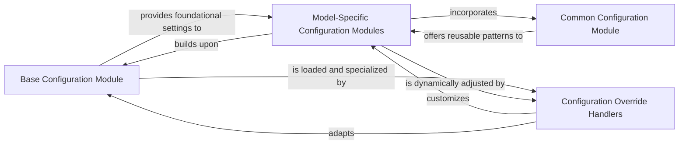

## Details

The mmdet.configs subsystem is central to configuring object detection and segmentation models within the MMDetection framework. It is structured around a hierarchical and modular approach, starting with a Base Configuration Module that provides fundamental settings for datasets, models, and training schedules. Building upon this foundation, Model-Specific Configuration Modules define complete setups for individual model architectures, often inheriting and composing elements from the base configurations. The Common Configuration Module further enhances reusability by offering shared patterns and utility settings applicable across various configurations. Finally, Configuration Override Handlers provide the capability to dynamically modify or specialize these configurations at runtime, enabling flexible adaptation for tasks like fine-tuning or category remapping without altering the original configuration files. This design promotes modularity, reusability, and adaptability in managing complex model configurations.

### Base Configuration Module
This module acts as the foundational layer, providing default and reusable configuration blocks for various aspects of the system. It includes base definitions for datasets, model architectures, training schedules, and runtime settings, serving as templates for more specific configurations.

**Related Classes/Methods**:

- <a href="https://github.com/open-mmlab/mmdetection/blob/main/mmdet/configs/_base_/default_runtime.py" target="_blank" rel="noopener noreferrer">`mmdet.configs._base_.default_runtime`</a>
- <a href="https://github.com/open-mmlab/mmdetection/blob/main/mmdet/configs/_base_/datasets/coco_detection.py" target="_blank" rel="noopener noreferrer">`mmdet.configs._base_.datasets.coco_detection`</a>

### Model-Specific Configuration Modules
These modules contain detailed configurations tailored for specific object detection and segmentation model architectures. Each file within these directories defines the complete setup for a particular model variant, often by inheriting from or composing elements from the Base Configuration Module and Common Configuration Module.

**Related Classes/Methods**:

- <a href="https://github.com/open-mmlab/mmdetection/blob/main/mmdet/configs/cascade_rcnn/cascade_rcnn_r50_fpn_1x_coco.py" target="_blank" rel="noopener noreferrer">`mmdet.configs.cascade_rcnn.cascade_rcnn_r50_fpn_1x_coco`</a>
- <a href="https://github.com/open-mmlab/mmdetection/blob/main/mmdet/configs/mask_rcnn/mask_rcnn_r50_fpn_1x_coco.py" target="_blank" rel="noopener noreferrer">`mmdet.configs.mask_rcnn.mask_rcnn_r50_fpn_1x_coco`</a>
- <a href="https://github.com/open-mmlab/mmdetection/blob/main/mmdet/configs/retinanet/retinanet_r50_fpn_1x_coco.py" target="_blank" rel="noopener noreferrer">`mmdet.configs.retinanet.retinanet_r50_fpn_1x_coco`</a>

### Common Configuration Module
This module houses shared configuration patterns, utility settings, or frequently used snippets that can be applied across multiple model or dataset configurations. Its purpose is to promote reusability and reduce redundancy across the configuration landscape.

**Related Classes/Methods**:

- <a href="https://github.com/open-mmlab/mmdetection/blob/main/mmdet/configs/common/ms_3x_coco.py" target="_blank" rel="noopener noreferrer">`mmdet.configs.common.ms_3x_coco`</a>

### Configuration Override Handlers
While residing outside the core mmdet.configs directory, these components represent the external interface and logic for dynamically modifying or specializing configurations at runtime. They are crucial for tasks like category remapping, fine-tuning, or adapting configurations without altering the original files.

**Related Classes/Methods**:

- <a href="https://github.com/open-mmlab/mmdetection/blob/main/configs/glip/odinw/override_category.py" target="_blank" rel="noopener noreferrer">`configs.glip.odinw.override_category`</a>

### [FAQ](https://github.com/CodeBoarding/GeneratedOnBoardings/tree/main?tab=readme-ov-file#faq)