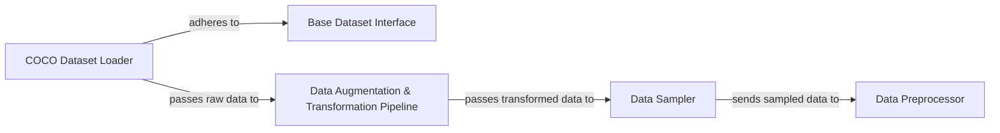

## Details

The Data Management subsystem in mmdetection is responsible for the entire data pipeline, from loading raw image and annotation data to pre-processing it into batched tensors suitable for model input. It is primarily defined by the `mmdet.datasets` and `mmdet.models.data_preprocessors` packages. The subsystem is structured as a clear pipeline, emphasizing modularity and configurability. The process begins with concrete dataset implementations (e.g., COCO Dataset Loader) that conform to a Base Dataset Interface, ensuring interchangeability. This raw data then flows into the Data Augmentation & Transformation Pipeline, where a series of configurable transformations are applied. Following augmentation, the Data Sampler strategically selects data samples to form batches. Finally, the Data Preprocessor takes these samples and performs the necessary tensorization and formatting, making the data ready for direct consumption by the model. This sequential flow, combined with distinct, interchangeable components, exemplifies the project's architectural bias towards a flexible and extensible ML toolkit.

### Base Dataset Interface
Defines the fundamental interface and common functionalities for all detection datasets. This abstract component ensures that various concrete datasets can be interchanged seamlessly within the framework, promoting modularity.

**Related Classes/Methods**:

- <a href="https://github.com/open-mmlab/mmdetection/blob/main/mmdet/datasets/base_det_dataset.py" target="_blank" rel="noopener noreferrer">`mmdet.datasets.base_det_dataset`</a>

### COCO Dataset Loader
Implements the specific logic for loading, parsing, and managing annotations for the COCO dataset format. It provides the raw image and annotation data, acting as a concrete data source that adheres to the Base Dataset Interface. It interacts with mmdet.datasets.api_wrappers.coco_api for efficient COCO API operations.

**Related Classes/Methods**:

- <a href="https://github.com/open-mmlab/mmdetection/blob/main/mmdet/datasets/coco.py" target="_blank" rel="noopener noreferrer">`mmdet.datasets.coco`</a>

### Data Augmentation & Transformation Pipeline
Manages and applies a sequence of configurable data augmentations and pre-processing steps (e.g., resizing, normalization, geometric transformations) to the loaded image and annotation data. This component orchestrates various sub-transformations like mmdet.datasets.transforms.loading and mmdet.datasets.transforms.geometric.

**Related Classes/Methods**:

- <a href="https://github.com/open-mmlab/mmdetection/blob/main/mmdet/datasets/transforms/transforms.py" target="_blank" rel="noopener noreferrer">`mmdet.datasets.transforms.transforms`</a>

### Data Sampler
Controls how data samples are drawn from the dataset to form batches. It can implement specific strategies, such as class-aware sampling, to optimize training by ensuring balanced class distribution, which is vital for robust model training.

**Related Classes/Methods**:

- <a href="https://github.com/open-mmlab/mmdetection/blob/main/mmdet/datasets/samplers/class_aware_sampler.py" target="_blank" rel="noopener noreferrer">`mmdet.datasets.samplers.class_aware_sampler`</a>

### Data Preprocessor
The final stage in the data pipeline, responsible for converting individual data samples into batched tensors suitable for direct input into the model. This includes operations like padding, normalization, and format adjustments. Specialized versions, such as mmdet.models.data_preprocessors.track_data_preprocessor, inherit from this base.

**Related Classes/Methods**:

- <a href="https://github.com/open-mmlab/mmdetection/blob/main/mmdet/models/data_preprocessors/data_preprocessor.py" target="_blank" rel="noopener noreferrer">`mmdet.models.data_preprocessors.data_preprocessor`</a>

### [FAQ](https://github.com/CodeBoarding/GeneratedOnBoardings/tree/main?tab=readme-ov-file#faq)