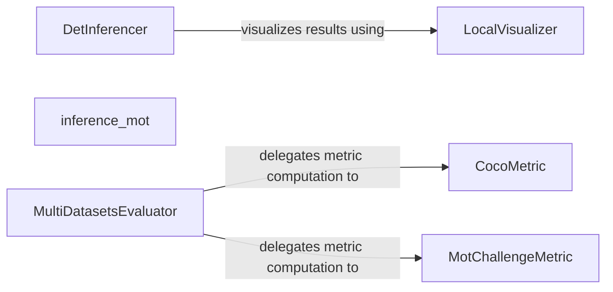

## Details

The `mmdetection` project's core inference and evaluation subsystem is designed around a modular architecture. The `DetInferencer` acts as the primary orchestrator for object detection inference, handling data flow from input to initial post-processing. For specialized multi-object tracking tasks, `inference_mot` provides a dedicated pipeline. The `MultiDatasetsEvaluator` is central to the evaluation process, managing the aggregation of results across various datasets and delegating the actual metric computation to specialized components like `CocoMetric` for COCO-standard evaluations and `MotChallengeMetric` for MOTChallenge-specific metrics. Finally, the `LocalVisualizer` provides crucial visualization capabilities, allowing for qualitative assessment of the inference and evaluation outputs. This structure ensures clear separation of concerns, enabling flexible and extensible handling of diverse detection and tracking tasks.

### DetInferencer
Manages the complete inference workflow from input data handling and preprocessing to model prediction and initial post-processing. It serves as the primary entry point for executing inference tasks.

**Related Classes/Methods**:

- <a href="https://github.com/open-mmlab/mmdetection/blob/main/mmdet/apis/det_inferencer.py#L45-L652" target="_blank" rel="noopener noreferrer">`mmdet.apis.det_inferencer.DetInferencer`:45-652</a>

### inference_mot
Provides a dedicated function for multi-object tracking inference, indicating a specialized pipeline or set of steps tailored for MOT tasks. It encapsulates the specific logic for MOT inference.

**Related Classes/Methods**:

- <a href="https://github.com/open-mmlab/mmdetection/blob/main/mmdet/apis/inference.py#L269-L302" target="_blank" rel="noopener noreferrer">`mmdet.apis.inference.inference_mot`:269-302</a>

### MultiDatasetsEvaluator
Orchestrates the evaluation process, particularly for complex scenarios involving multiple datasets. It aggregates results and delegates the actual metric computation to specialized metric components.

**Related Classes/Methods**:

- <a href="https://github.com/open-mmlab/mmdetection/blob/main/mmdet/evaluation/evaluator/multi_datasets_evaluator.py#L15-L111" target="_blank" rel="noopener noreferrer">`mmdet.evaluation.evaluator.multi_datasets_evaluator.MultiDatasetsEvaluator`:15-111</a>

### CocoMetric
A self-contained unit responsible for computing specific performance metrics relevant to object detection and instance segmentation, adhering to the COCO evaluation standard.

**Related Classes/Methods**:

- <a href="https://github.com/open-mmlab/mmdetection/blob/main/mmdet/evaluation/metrics/coco_metric.py#L22-L597" target="_blank" rel="noopener noreferrer">`mmdet.evaluation.metrics.coco_metric.CocoMetric`:22-597</a>

### MotChallengeMetric
A self-contained unit responsible for computing specific performance metrics relevant to multi-object tracking, following the MOTChallenge evaluation standard.

**Related Classes/Methods**:

- <a href="https://github.com/open-mmlab/mmdetection/blob/main/mmdet/evaluation/metrics/mot_challenge_metric.py#L40-L443" target="_blank" rel="noopener noreferrer">`mmdet.evaluation.metrics.mot_challenge_metric.MotChallengeMetric`:40-443</a>

### LocalVisualizer
Renders and visualizes the outputs of the inference and evaluation process, such as bounding boxes, masks, and panoptic segmentation results, facilitating qualitative assessment.

**Related Classes/Methods**:

- <a href="https://github.com/open-mmlab/mmdetection/blob/main/mmdet/visualization/local_visualizer.py" target="_blank" rel="noopener noreferrer">`mmdet.visualization.local_visualizer.LocalVisualizer`</a>

### [FAQ](https://github.com/CodeBoarding/GeneratedOnBoardings/tree/main?tab=readme-ov-file#faq)