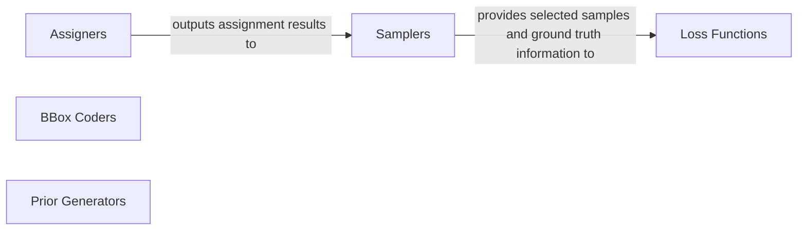

## Details

This analysis focuses on the 'Loss & Task Modules' subsystem within an ML Toolkit/Library, specifically covering core functionalities for training object detection models. It details the responsibilities and interactions of key components: Loss Functions, Assigners, Samplers, BBox Coders, and Prior Generators, highlighting their modularity and interchangeability in the training pipeline.

### Loss Functions
Quantify the discrepancy between model predictions and ground truth labels/boxes. They provide the error signal that guides the model's learning process during training.

**Related Classes/Methods**:

- <a href="https://github.com/open-mmlab/mmdetection/blob/main/mmdet/models/losses/cross_entropy_loss.py" target="_blank" rel="noopener noreferrer">`mmdet.models.losses.cross_entropy_loss`</a>
- <a href="https://github.com/open-mmlab/mmdetection/blob/main/mmdet/models/losses/iou_loss.py" target="_blank" rel="noopener noreferrer">`mmdet.models.losses.iou_loss`</a>
- <a href="https://github.com/open-mmlab/mmdetection/blob/main/mmdet/models/losses/smooth_l1_loss.py" target="_blank" rel="noopener noreferrer">`mmdet.models.losses.smooth_l1_loss`</a>
- <a href="https://github.com/open-mmlab/mmdetection/blob/main/mmdet/models/losses/gaussian_focal_loss.py" target="_blank" rel="noopener noreferrer">`mmdet.models.losses.gaussian_focal_loss`</a>
- <a href="https://github.com/open-mmlab/mmdetection/blob/main/mmdet/models/losses/mse_loss.py" target="_blank" rel="noopener noreferrer">`mmdet.models.losses.mse_loss`</a>
- <a href="https://github.com/open-mmlab/mmdetection/blob/main/mmdet/models/losses/seesaw_loss.py" target="_blank" rel="noopener noreferrer">`mmdet.models.losses.seesaw_loss`</a>

### Assigners
Establish correspondences between predicted bounding boxes/features and ground truth objects. They determine which predictions are considered positive, negative, or ignored samples for training.

**Related Classes/Methods**:

- <a href="https://github.com/open-mmlab/mmdetection/blob/main/mmdet/models/task_modules/assigners/max_iou_assigner.py" target="_blank" rel="noopener noreferrer">`mmdet.models.task_modules.assigners.max_iou_assigner`</a>
- <a href="https://github.com/open-mmlab/mmdetection/blob/main/mmdet/models/task_modules/assigners/atss_assigner.py" target="_blank" rel="noopener noreferrer">`mmdet.models.task_modules.assigners.atss_assigner`</a>
- <a href="https://github.com/open-mmlab/mmdetection/blob/main/mmdet/models/task_modules/assigners/sim_ota_assigner.py" target="_blank" rel="noopener noreferrer">`mmdet.models.task_modules.assigners.sim_ota_assigner`</a>
- <a href="https://github.com/open-mmlab/mmdetection/blob/main/mmdet/models/task_modules/assigners/center_region_assigner.py" target="_blank" rel="noopener noreferrer">`mmdet.models.task_modules.assigners.center_region_assigner`</a>

### Samplers
Select a balanced subset of positive and negative samples from the assigned predictions. This addresses class imbalance issues and ensures efficient training.

**Related Classes/Methods**:

- <a href="https://github.com/open-mmlab/mmdetection/blob/main/mmdet/models/task_modules/samplers/base_sampler.py" target="_blank" rel="noopener noreferrer">`mmdet.models.task_modules.samplers.base_sampler`</a>
- <a href="https://github.com/open-mmlab/mmdetection/blob/main/mmdet/models/task_modules/samplers/random_sampler.py" target="_blank" rel="noopener noreferrer">`mmdet.models.task_modules.samplers.random_sampler`</a>
- <a href="https://github.com/open-mmlab/mmdetection/blob/main/mmdet/models/task_modules/samplers/ohem_sampler.py" target="_blank" rel="noopener noreferrer">`mmdet.models.task_modules.samplers.ohem_sampler`</a>

### BBox Coders
Convert bounding box representations between different formats. This includes transforming ground truth boxes into regression targets for the model and converting predicted deltas back into absolute coordinates.

**Related Classes/Methods**:

- <a href="https://github.com/open-mmlab/mmdetection/blob/main/mmdet/models/task_modules/coders/delta_xywh_bbox_coder.py" target="_blank" rel="noopener noreferrer">`mmdet.models.task_modules.coders.delta_xywh_bbox_coder`</a>
- <a href="https://github.com/open-mmlab/mmdetection/blob/main/mmdet/models/task_modules/coders/bucketing_bbox_coder.py" target="_blank" rel="noopener noreferrer">`mmdet.models.task_modules.coders.bucketing_bbox_coder`</a>

### Prior Generators
Generate initial sets of reference bounding boxes (anchors) or points across feature maps. These serve as the base for the model's predictions.

**Related Classes/Methods**:

- <a href="https://github.com/open-mmlab/mmdetection/blob/main/mmdet/models/task_modules/prior_generators/anchor_generator.py" target="_blank" rel="noopener noreferrer">`mmdet.models.task_modules.prior_generators.anchor_generator`</a>
- <a href="https://github.com/open-mmlab/mmdetection/blob/main/mmdet/models/task_modules/prior_generators/point_generator.py" target="_blank" rel="noopener noreferrer">`mmdet.models.task_modules.prior_generators.point_generator`</a>

### [FAQ](https://github.com/CodeBoarding/GeneratedOnBoardings/tree/main?tab=readme-ov-file#faq)