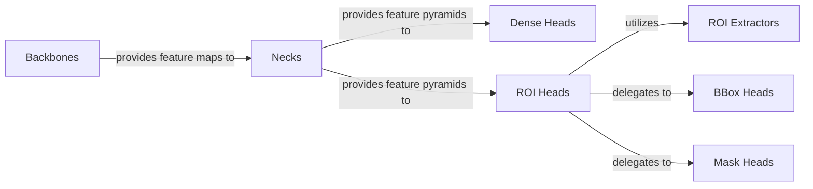

## Details

The `Model Architecture` subsystem in `mmdetection` encapsulates the core neural network components responsible for feature extraction, multi-scale feature aggregation, and prediction generation. It adheres to a highly modular and extensible design, allowing for interchangeability of different model parts.

### Backbones
Extracts hierarchical feature maps from raw input images. These form the foundational visual representations upon which subsequent stages build.

**Related Classes/Methods**:

- <a href="https://github.com/open-mmlab/mmdetection/blob/main/mmdet/models/backbones" target="_blank" rel="noopener noreferrer">`mmdet.models.backbones`</a>

### Necks
Aggregates and fuses multi-scale feature maps received from the Backbones, creating enriched feature pyramids. This enhances the representational power of features at various scales.

**Related Classes/Methods**:

- <a href="https://github.com/open-mmlab/mmdetection/blob/main/mmdet/models/necks" target="_blank" rel="noopener noreferrer">`mmdet.models.necks`</a>

### Dense Heads
Directly predicts bounding boxes, class scores, and potentially masks from the feature maps provided by Necks. This is characteristic of single-stage detectors.

**Related Classes/Methods**:

- <a href="https://github.com/open-mmlab/mmdetection/blob/main/mmdet/models/dense_heads" target="_blank" rel="noopener noreferrer">`mmdet.models.dense_heads`</a>

### ROI Heads
Refines region proposals (ROIs) and performs final classification, bounding box regression, and optional mask prediction. This is characteristic of two-stage detectors. It orchestrates the operations of its sub-components.

**Related Classes/Methods**:

- <a href="https://github.com/open-mmlab/mmdetection/blob/main/mmdet/models/roi_heads" target="_blank" rel="noopener noreferrer">`mmdet.models.roi_heads`</a>

### ROI Extractors
Orchestrates feature pooling from feature maps based on region proposals.

**Related Classes/Methods**:

- <a href="https://github.com/open-mmlab/mmdetection/blob/main/mmdet/models/roi_heads" target="_blank" rel="noopener noreferrer">`mmdet.models.roi_heads`</a>

### BBox Heads
Refines bounding box predictions and performs classification for region proposals.

**Related Classes/Methods**:

- <a href="https://github.com/open-mmlab/mmdetection/blob/main/mmdet/models/roi_heads" target="_blank" rel="noopener noreferrer">`mmdet.models.roi_heads`</a>

### Mask Heads
Performs instance mask prediction for region proposals.

**Related Classes/Methods**:

- <a href="https://github.com/open-mmlab/mmdetection/blob/main/mmdet/models/roi_heads" target="_blank" rel="noopener noreferrer">`mmdet.models.roi_heads`</a>

### [FAQ](https://github.com/CodeBoarding/GeneratedOnBoardings/tree/main?tab=readme-ov-file#faq)