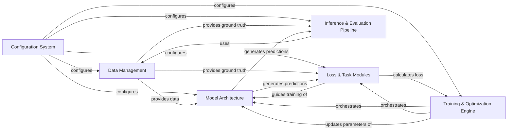

## Details

The `mmdetection` project is structured around a modular deep learning pipeline, primarily focused on object detection tasks. The `Configuration System` acts as the central control, defining and loading all operational parameters for the subsequent components. Data flows from the `Data Management` component, which handles data loading, augmentation, and preprocessing, supplying both raw data to the `Model Architecture` for inference and ground truth to the `Loss & Task Modules` for training supervision and the `Inference & Evaluation Pipeline` for performance assessment. The `Model Architecture`, comprising backbones, necks, and heads, processes the data to generate predictions. During training, these predictions are fed into the `Loss & Task Modules` to compute loss, which in turn guides the `Training & Optimization Engine`. This engine orchestrates the training loop, updating the `Model Architecture`'s parameters based on the calculated losses. Finally, the `Inference & Evaluation Pipeline` consumes the model's predictions and ground truth data to perform post-processing, metric computation, and visualization, providing comprehensive insights into the model's performance. This clear separation of concerns facilitates maintainability, extensibility, and efficient development of object detection models.

### Configuration System [[Expand]](./Configuration_System.md)
The central hub for defining the entire system's behavior, loading and managing configurations for models, datasets, training schedules, and runtime settings.

**Related Classes/Methods**:

- <a href="https://github.com/open-mmlab/mmdetection/blob/main/mmdet/configs" target="_blank" rel="noopener noreferrer">`mmdet.configs`</a>

### Data Management [[Expand]](./Data_Management.md)
Handles the entire data pipeline, from loading raw image and annotation data, applying augmentations, to pre-processing into batched tensors suitable for model input.

**Related Classes/Methods**:

- <a href="https://github.com/open-mmlab/mmdetection/blob/main/mmdet/datasets" target="_blank" rel="noopener noreferrer">`mmdet.datasets`</a>
- <a href="https://github.com/open-mmlab/mmdetection/blob/main/mmdet/models/data_preprocessors" target="_blank" rel="noopener noreferrer">`mmdet.models.data_preprocessors`</a>

### Model Architecture [[Expand]](./Model_Architecture.md)
Encapsulates the core neural network components, including feature extraction (backbones), multi-scale feature aggregation (necks), and prediction generation (detection/ROI heads).

**Related Classes/Methods**:

- <a href="https://github.com/open-mmlab/mmdetection/blob/main/mmdet/models/backbones" target="_blank" rel="noopener noreferrer">`mmdet.models.backbones`</a>
- <a href="https://github.com/open-mmlab/mmdetection/blob/main/mmdet/models/necks" target="_blank" rel="noopener noreferrer">`mmdet.models.necks`</a>
- <a href="https://github.com/open-mmlab/mmdetection/blob/main/mmdet/models/dense_heads" target="_blank" rel="noopener noreferrer">`mmdet.models.dense_heads`</a>
- <a href="https://github.com/open-mmlab/mmdetection/blob/main/mmdet/models/roi_heads" target="_blank" rel="noopener noreferrer">`mmdet.models.roi_heads`</a>

### Loss & Task Modules [[Expand]](./Loss_Task_Modules.md)
Contains various loss functions and task-specific modules (assigners, samplers) crucial for guiding the training process by matching predictions to ground truth and selecting relevant examples.

**Related Classes/Methods**:

- <a href="https://github.com/open-mmlab/mmdetection/blob/main/mmdet/models/losses" target="_blank" rel="noopener noreferrer">`mmdet.models.losses`</a>
- <a href="https://github.com/open-mmlab/mmdetection/blob/main/mmdet/models/task_modules" target="_blank" rel="noopener noreferrer">`mmdet.models.task_modules`</a>

### Training & Optimization Engine [[Expand]](./Training_Optimization_Engine.md)
Orchestrates the entire training process, including forward/backward passes, gradient accumulation, and managing optimization algorithms and learning rate schedules.

**Related Classes/Methods**:

- <a href="https://github.com/open-mmlab/mmdetection/blob/main/mmdet/engine/runner" target="_blank" rel="noopener noreferrer">`mmdet.engine.runner`</a>
- <a href="https://github.com/open-mmlab/mmdetection/blob/main/mmdet/engine/hooks" target="_blank" rel="noopener noreferrer">`mmdet.engine.hooks`</a>
- <a href="https://github.com/open-mmlab/mmdetection/blob/main/mmdet/engine/optimizers" target="_blank" rel="noopener noreferrer">`mmdet.engine.optimizers`</a>
- <a href="https://github.com/open-mmlab/mmdetection/blob/main/mmdet/engine/schedulers" target="_blank" rel="noopener noreferrer">`mmdet.engine.schedulers`</a>

### Inference & Evaluation Pipeline [[Expand]](./Inference_Evaluation_Pipeline.md)
Manages making predictions on new data, applying post-processing steps, computing performance metrics, and visualizing results for qualitative and quantitative assessment.

**Related Classes/Methods**:

- <a href="https://github.com/open-mmlab/mmdetection/blob/main/mmdet/apis/det_inferencer.py" target="_blank" rel="noopener noreferrer">`mmdet.apis.det_inferencer`</a>
- <a href="https://github.com/open-mmlab/mmdetection/blob/main/mmdet/apis/inference.py" target="_blank" rel="noopener noreferrer">`mmdet.apis.inference`</a>
- <a href="https://github.com/open-mmlab/mmdetection/blob/main/mmdet/evaluation/metrics" target="_blank" rel="noopener noreferrer">`mmdet.evaluation.metrics`</a>
- <a href="https://github.com/open-mmlab/mmdetection/blob/main/mmdet/evaluation/evaluator" target="_blank" rel="noopener noreferrer">`mmdet.evaluation.evaluator`</a>
- <a href="https://github.com/open-mmlab/mmdetection/blob/main/mmdet/visualization/local_visualizer.py" target="_blank" rel="noopener noreferrer">`mmdet.visualization.local_visualizer`</a>

### [FAQ](https://github.com/CodeBoarding/GeneratedOnBoardings/tree/main?tab=readme-ov-file#faq)