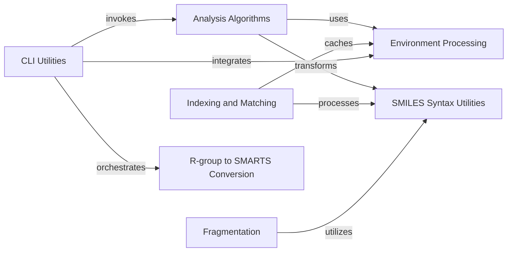

## Component Details

This overview details the 'Chemical Environment & SMARTS' subsystem within the mmpdb project, which focuses on the computational aspects of chemical environments, SMARTS pattern generation, and SMILES string manipulations. It encompasses components for identifying molecular centers, converting R-group definitions to SMARTS, and handling various SMILES syntax transformations. The system's core purpose is to provide robust tools for characterizing molecular structures and their transformations, supporting tasks like matched molecular pair analysis and fragmentation.

### Environment Processing
This component is responsible for identifying molecular centers, computing constant environments, and generating SMARTS representations of chemical environments. It plays a crucial role in defining and characterizing the structural context around specific atoms or bonds within a molecule.

**Related Classes/Methods**:

- <a href="https://github.com/rdkit/mmpdb/blob/master/mmpdblib/environment.py#L228-L302" target="_blank" rel="noopener noreferrer">`mmpdb.mmpdblib.environment.get_environment_smarts_list_for_center` (228:302)</a>
- <a href="https://github.com/rdkit/mmpdb/blob/master/mmpdblib/environment.py#L81-L121" target="_blank" rel="noopener noreferrer">`mmpdb.mmpdblib.environment.find_centers` (81:121)</a>
- <a href="https://github.com/rdkit/mmpdb/blob/master/mmpdblib/environment.py#L125-L126" target="_blank" rel="noopener noreferrer">`mmpdb.mmpdblib.environment.iter_num_atoms_for_radii` (125:126)</a>
- <a href="https://github.com/rdkit/mmpdb/blob/master/mmpdblib/environment.py#L130-L153" target="_blank" rel="noopener noreferrer">`mmpdb.mmpdblib.environment._iter_num_atoms_for_radii` (130:153)</a>
- <a href="https://github.com/rdkit/mmpdb/blob/master/mmpdblib/environment.py#L393-L405" target="_blank" rel="noopener noreferrer">`mmpdb.mmpdblib.environment.compute_constant_environment_from_centers` (393:405)</a>
- <a href="https://github.com/rdkit/mmpdb/blob/master/mmpdblib/environment.py#L435-L448" target="_blank" rel="noopener noreferrer">`mmpdb.mmpdblib.environment.compute_constant_center_smarts_list` (435:448)</a>
- <a href="https://github.com/rdkit/mmpdb/blob/master/mmpdblib/environment.py#L490-L551" target="_blank" rel="noopener noreferrer">`mmpdb.mmpdblib.environment.compute_possible_smarts_environments` (490:551)</a>
- <a href="https://github.com/rdkit/mmpdb/blob/master/mmpdblib/environment.py#L553-L558" target="_blank" rel="noopener noreferrer">`mmpdb.mmpdblib.environment.get_all_possible_smarts` (553:558)</a>

### Analysis Algorithms
This component provides core algorithms for analyzing molecular transformations, including making predictions based on matched molecular pairs, welding molecular fragments, and generating molecular transformations. It leverages environment information and SMILES syntax utilities to perform these operations.

**Related Classes/Methods**:

- <a href="https://github.com/rdkit/mmpdb/blob/master/mmpdblib/analysis_algorithms.py#L489-L649" target="_blank" rel="noopener noreferrer">`mmpdb.mmpdblib.analysis_algorithms.make_prediction` (489:649)</a>
- <a href="https://github.com/rdkit/mmpdb/blob/master/mmpdblib/analysis_algorithms.py#L1033-L1062" target="_blank" rel="noopener noreferrer">`mmpdb.mmpdblib.analysis_algorithms.weld_fragments` (1033:1062)</a>
- <a href="https://github.com/rdkit/mmpdb/blob/master/mmpdblib/analysis_algorithms.py#L1088-L1292" target="_blank" rel="noopener noreferrer">`mmpdb.mmpdblib.analysis_algorithms.make_transform` (1088:1292)</a>

### Indexing and Matching
This component is responsible for caching environment data and identifying matched molecular pairs (MMPs). It utilizes environment processing capabilities to efficiently store and retrieve molecular environment information, which is then used to find and analyze structural transformations between molecules.

**Related Classes/Methods**:

- <a href="https://github.com/rdkit/mmpdb/blob/master/mmpdblib/index_algorithm.py#L735-L740" target="_blank" rel="noopener noreferrer">`mmpdb.mmpdblib.index_algorithm.EnvironmentCache.get_or_compute_centers` (735:740)</a>
- <a href="https://github.com/rdkit/mmpdb/blob/master/mmpdblib/index_algorithm.py#L742-L749" target="_blank" rel="noopener noreferrer">`mmpdb.mmpdblib.index_algorithm.EnvironmentCache.get_or_compute_center_radii` (742:749)</a>
- <a href="https://github.com/rdkit/mmpdb/blob/master/mmpdblib/index_algorithm.py#L751-L771" target="_blank" rel="noopener noreferrer">`mmpdb.mmpdblib.index_algorithm.EnvironmentCache.get_or_compute_constant_environment` (751:771)</a>
- <a href="https://github.com/rdkit/mmpdb/blob/master/mmpdblib/index_algorithm.py#L861-L1050" target="_blank" rel="noopener noreferrer">`mmpdb.mmpdblib.index_algorithm.find_matched_molecular_pairs` (861:1050)</a>

### Fragmentation
This component handles the process of fragmenting molecules by making multiple cuts at specified atom pairs. It includes functionalities for managing chiral flags, enumerating permutations, and determining atom order and symmetry classes within the fragmented structures.

**Related Classes/Methods**:

- <a href="https://github.com/rdkit/mmpdb/blob/master/mmpdblib/fragment_algorithm.py#L590-L781" target="_blank" rel="noopener noreferrer">`mmpdb.mmpdblib.fragment_algorithm.make_multiple_cuts` (590:781)</a>

### SMILES Syntax Utilities
This component provides utility functions for manipulating SMILES strings, specifically for converting labeled and unlabeled wildcards into ring closures. These conversions are essential for standardizing and processing molecular representations within the mmpdb system.

**Related Classes/Methods**:

- <a href="https://github.com/rdkit/mmpdb/blob/master/mmpdblib/smiles_syntax.py#L176-L185" target="_blank" rel="noopener noreferrer">`mmpdb.mmpdblib.smiles_syntax.convert_labeled_wildcards_to_closures` (176:185)</a>
- <a href="https://github.com/rdkit/mmpdb/blob/master/mmpdblib/smiles_syntax.py#L69-L168" target="_blank" rel="noopener noreferrer">`mmpdb.mmpdblib.smiles_syntax.convert_wildcards_to_closures` (69:168)</a>

### R-group to SMARTS Conversion
This component is dedicated to parsing R-group definitions from files or lists and converting them into SMARTS (SMiles ARbitrary Target Specification) patterns. It supports the generation of recursive SMARTS, which are crucial for defining variable parts of molecules in a standardized format.

**Related Classes/Methods**:

- <a href="https://github.com/rdkit/mmpdb/blob/master/mmpdblib/rgroup2smarts.py#L310-L315" target="_blank" rel="noopener noreferrer">`mmpdb.mmpdblib.rgroup2smarts.get_recursive_smarts_from_cut_rgroups` (310:315)</a>
- <a href="https://github.com/rdkit/mmpdb/blob/master/mmpdblib/rgroup2smarts.py#L195-L226" target="_blank" rel="noopener noreferrer">`mmpdb.mmpdblib.rgroup2smarts.parse_rgroup_file` (195:226)</a>
- <a href="https://github.com/rdkit/mmpdb/blob/master/mmpdblib/rgroup2smarts.py#L248-L259" target="_blank" rel="noopener noreferrer">`mmpdb.mmpdblib.rgroup2smarts.iter_smiles_list` (248:259)</a>
- <a href="https://github.com/rdkit/mmpdb/blob/master/mmpdblib/rgroup2smarts.py#L262-L297" target="_blank" rel="noopener noreferrer">`mmpdb.mmpdblib.rgroup2smarts.iter_smiles_as_smarts` (262:297)</a>
- <a href="https://github.com/rdkit/mmpdb/blob/master/mmpdblib/rgroup2smarts.py#L318-L323" target="_blank" rel="noopener noreferrer">`mmpdb.mmpdblib.rgroup2smarts.get_recursive_smarts_from_cut_filename` (318:323)</a>

### CLI Utilities
This component provides functions that support the command-line interface of the mmpdb application. It includes utilities for handling command-line arguments, error reporting, and orchestrating the execution of various mmpdb functionalities, such as fragment generation and R-group to SMARTS conversion, based on user input.

**Related Classes/Methods**:

- <a href="https://github.com/rdkit/mmpdb/blob/master/mmpdblib/cli/proprulecat.py#L390-L400" target="_blank" rel="noopener noreferrer">`mmpdb.mmpdblib.cli.proprulecat.get_environment_smiles_up_to_radius` (390:400)</a>
- <a href="https://github.com/rdkit/mmpdb/blob/master/mmpdblib/cli/proprulecat.py#L407-L417" target="_blank" rel="noopener noreferrer">`mmpdb.mmpdblib.cli.proprulecat.EnvironmentSmilesLookup.get_environment_smiles` (407:417)</a>
- <a href="https://github.com/rdkit/mmpdb/blob/master/mmpdblib/cli/fragment_click.py#L224-L287" target="_blank" rel="noopener noreferrer">`mmpdb.mmpdblib.cli.fragment_click.make_fragment_options` (224:287)</a>
- <a href="https://github.com/rdkit/mmpdb/blob/master/mmpdblib/cli/rgroup2smarts.py#L110-L201" target="_blank" rel="noopener noreferrer">`mmpdb.mmpdblib.cli.rgroup2smarts.rgroup2smarts` (110:201)</a>
- <a href="https://github.com/rdkit/mmpdb/blob/master/mmpdblib/cli/generate.py#L803-L955" target="_blank" rel="noopener noreferrer">`mmpdb.mmpdblib.cli.generate.generate_unwelded_from_constant` (803:955)</a>

### [FAQ](https://github.com/CodeBoarding/GeneratedOnBoardings/tree/main?tab=readme-ov-file#faq)