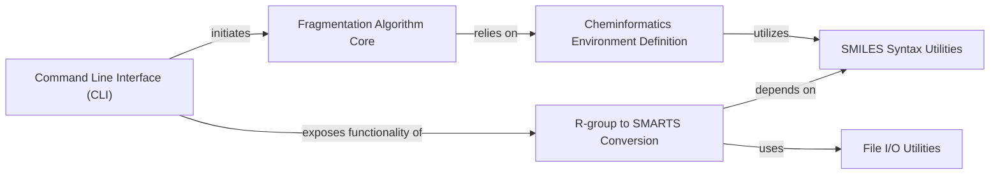

## Details

The `Cheminformatics Core` component serves as the foundational utility layer for `mmpdb`, providing essential operations for molecular processing and analysis. It encapsulates functionalities crucial for defining chemical environments, converting R-groups to SMARTS patterns, and handling SMILES string manipulations. These low-level operations are fundamental building blocks that support higher-level fragmentation, indexing, and analysis algorithms by ensuring accurate and consistent molecular representations.

### Cheminformatics Environment Definition
This module is responsible for defining and computing chemical environments around fragmentation sites. It's crucial for identifying and characterizing the context of molecular transformations, which is a cornerstone of matched molecular pair analysis.

**Related Classes/Methods**:

- <a href="https://github.com/rdkit/mmpdb/blob/master/mmpdblib/environment.py#L1-L1" target="_blank" rel="noopener noreferrer">`mmpdblib.environment` (1:1)</a>

### R-group to SMARTS Conversion
This module handles the conversion of R-groups (representing variable parts of molecules) into standardized SMARTS patterns. This is fundamental for standardizing and representing chemical transformations in a machine-readable and searchable format.

**Related Classes/Methods**:

- <a href="https://github.com/rdkit/mmpdb/blob/master/mmpdblib/rgroup2smarts.py#L1-L1" target="_blank" rel="noopener noreferrer">`mmpdblib.rgroup2smarts` (1:1)</a>

### SMILES Syntax Utilities
This component offers core utilities for manipulating, validating, and parsing SMILES strings. As SMILES is the primary input/output format for molecular data, its correct and robust handling is essential for data integrity and consistency across all cheminformatics operations.

**Related Classes/Methods**:

- <a href="https://github.com/rdkit/mmpdb/blob/master/mmpdblib/smiles_syntax.py#L1-L1" target="_blank" rel="noopener noreferrer">`mmpdblib.smiles_syntax` (1:1)</a>

### File I/O Utilities
This module provides generic file input/output operations, offering abstractions for reading chemical data from various sources. It's essential for processing large datasets and integrating with external data sources.

**Related Classes/Methods**:

- <a href="https://github.com/rdkit/mmpdb/blob/master/mmpdblib/fileio.py#L1-L1" target="_blank" rel="noopener noreferrer">`mmpdblib.fileio` (1:1)</a>

### Fragmentation Algorithm Core
This component implements the core logic for fragmenting molecules into matched molecular pairs. It's a foundational step in the MMP database generation process, directly leveraging the definitions from the `Cheminformatics Environment Definition`.

**Related Classes/Methods**:

- <a href="https://github.com/rdkit/mmpdb/blob/master/mmpdblib/fragment_algorithm.py#L1-L1" target="_blank" rel="noopener noreferrer">`mmpdblib.fragment_algorithm` (1:1)</a>

### Command Line Interface (CLI)
This component provides the command-line interface for the `mmpdb` application, serving as the primary user interaction point. It exposes the core cheminformatics functionalities, including those from the `Cheminformatics Core`, to end-users.

**Related Classes/Methods**:

- `mmpdblib.cli` (1:1)

### [FAQ](https://github.com/CodeBoarding/GeneratedOnBoardings/tree/main?tab=readme-ov-file#faq)