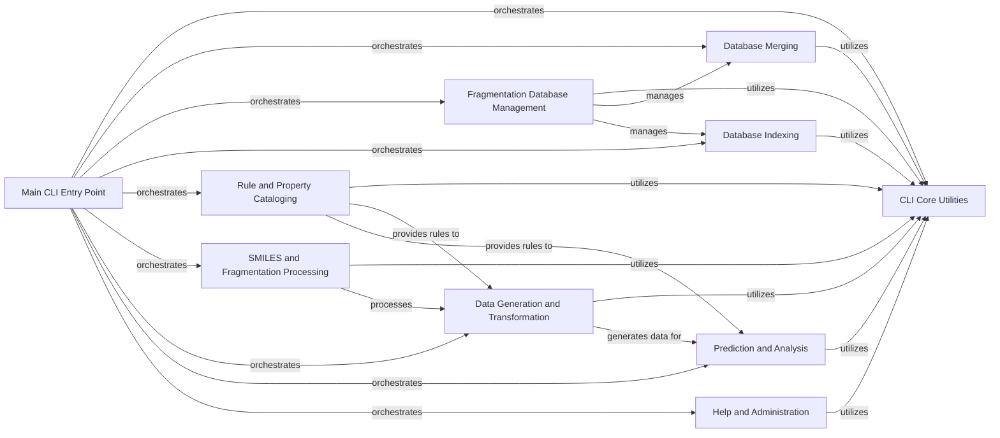

## Component Details

This graph illustrates the architecture of the Command Line Interface (CLI) subsystem within the MMPDB application. The CLI serves as the primary user interface, handling argument parsing, global configuration, and orchestrating various data operations (fragmentation, indexing, merging), analysis tasks (prediction, transformation, generation), and auxiliary functions (help, file splitting, R-group conversion, listing databases). The core utilities provide foundational support to all other CLI components, ensuring consistent argument handling and database interactions. Specific components manage database operations like merging, fragmentation, and indexing, while others focus on chemical data processing, rule cataloging, and analytical predictions. The main CLI entry point acts as the central dispatcher, directing user commands to the appropriate functional components.

### CLI Core Utilities
This component provides foundational utility functions for all command-line interface (CLI) commands within the mmpdb.mmpdblib.cli subsystem. It handles common tasks such as adding database parameters, parsing command-line arguments, managing file operations (like GzipFile), and providing error handling mechanisms (e.g., 'die' function for exiting on error). It acts as a central support system for other CLI components.

**Related Classes/Methods**:

- <a href="https://github.com/rdkit/mmpdb/blob/master/mmpdblib/cli/click_utils.py#L323-L343" target="_blank" rel="noopener noreferrer">`mmpdb.mmpdblib.cli.click_utils.add_single_database_parameters` (323:343)</a>
- <a href="https://github.com/rdkit/mmpdb/blob/master/mmpdblib/cli/click_utils.py#L346-L367" target="_blank" rel="noopener noreferrer">`mmpdb.mmpdblib.cli.click_utils.add_multiple_databases_parameters` (346:367)</a>
- <a href="https://github.com/rdkit/mmpdb/blob/master/mmpdblib/cli/click_utils.py#L406-L418" target="_blank" rel="noopener noreferrer">`mmpdb.mmpdblib.cli.click_utils.parse_where.convert` (406:418)</a>
- <a href="https://github.com/rdkit/mmpdb/blob/master/mmpdblib/cli/click_utils.py#L424-L435" target="_blank" rel="noopener noreferrer">`mmpdb.mmpdblib.cli.click_utils.parse_score.convert` (424:435)</a>
- <a href="https://github.com/rdkit/mmpdb/blob/master/mmpdblib/cli/click_utils.py#L480-L521" target="_blank" rel="noopener noreferrer">`mmpdb.mmpdblib.cli.click_utils.add_rule_selection_options` (480:521)</a>
- <a href="https://github.com/rdkit/mmpdb/blob/master/mmpdblib/cli/click_utils.py#L527-L553" target="_blank" rel="noopener noreferrer">`mmpdb.mmpdblib.cli.click_utils.get_property_names_or_error` (527:553)</a>
- <a href="https://github.com/rdkit/mmpdb/blob/master/mmpdblib/cli/click_utils.py#L556-L568" target="_blank" rel="noopener noreferrer">`mmpdb.mmpdblib.cli.click_utils.open_fragdb_from_options_or_exit` (556:568)</a>
- <a href="https://github.com/rdkit/mmpdb/blob/master/mmpdblib/cli/click_utils.py#L570-L580" target="_blank" rel="noopener noreferrer">`mmpdb.mmpdblib.cli.click_utils.open_database_from_options_or_exit` (570:580)</a>
- <a href="https://github.com/rdkit/mmpdb/blob/master/mmpdblib/cli/click_utils.py#L583-L589" target="_blank" rel="noopener noreferrer">`mmpdb.mmpdblib.cli.click_utils.open_dataset_from_options_or_exit` (583:589)</a>

### Database Merging
This component is responsible for merging multiple MMPDB databases into a single, consolidated database. It handles the intricate process of combining various tables such as compound, rule, rule SMILES, environment fingerprint, and pair tables, ensuring data consistency and integrity during the merge operation. It also includes verification steps to check for option mismatches and overall consistency before proceeding with the merge.

**Related Classes/Methods**:

- <a href="https://github.com/rdkit/mmpdb/blob/master/mmpdblib/cli/merge.py#L95-L107" target="_blank" rel="noopener noreferrer">`mmpdb.mmpdblib.cli.merge.progress` (95:107)</a>
- <a href="https://github.com/rdkit/mmpdb/blob/master/mmpdblib/cli/merge.py#L178-L201" target="_blank" rel="noopener noreferrer">`mmpdb.mmpdblib.cli.merge.process_compound_tables` (178:201)</a>
- <a href="https://github.com/rdkit/mmpdb/blob/master/mmpdblib/cli/merge.py#L257-L281" target="_blank" rel="noopener noreferrer">`mmpdb.mmpdblib.cli.merge.process_rule_smiles_tables` (257:281)</a>
- <a href="https://github.com/rdkit/mmpdb/blob/master/mmpdblib/cli/merge.py#L340-L364" target="_blank" rel="noopener noreferrer">`mmpdb.mmpdblib.cli.merge.process_rule_tables` (340:364)</a>
- <a href="https://github.com/rdkit/mmpdb/blob/master/mmpdblib/cli/merge.py#L431-L455" target="_blank" rel="noopener noreferrer">`mmpdb.mmpdblib.cli.merge.process_environment_fingerprint_tables` (431:455)</a>
- <a href="https://github.com/rdkit/mmpdb/blob/master/mmpdblib/cli/merge.py#L517-L543" target="_blank" rel="noopener noreferrer">`mmpdb.mmpdblib.cli.merge.process_rule_environment_tables` (517:543)</a>
- <a href="https://github.com/rdkit/mmpdb/blob/master/mmpdblib/cli/merge.py#L612-L638" target="_blank" rel="noopener noreferrer">`mmpdb.mmpdblib.cli.merge.process_pair_tables` (612:638)</a>
- <a href="https://github.com/rdkit/mmpdb/blob/master/mmpdblib/cli/merge.py#L691-L705" target="_blank" rel="noopener noreferrer">`mmpdb.mmpdblib.cli.merge._check_options_mismatch` (691:705)</a>
- <a href="https://github.com/rdkit/mmpdb/blob/master/mmpdblib/cli/merge.py#L708-L711" target="_blank" rel="noopener noreferrer">`mmpdb.mmpdblib.cli.merge.check_options_mismatch` (708:711)</a>
- <a href="https://github.com/rdkit/mmpdb/blob/master/mmpdblib/cli/merge.py#L714-L741" target="_blank" rel="noopener noreferrer">`mmpdb.mmpdblib.cli.merge.verify_options` (714:741)</a>
- <a href="https://github.com/rdkit/mmpdb/blob/master/mmpdblib/cli/merge.py#L743-L833" target="_blank" rel="noopener noreferrer">`mmpdb.mmpdblib.cli.merge.verify_consistency` (743:833)</a>
- <a href="https://github.com/rdkit/mmpdb/blob/master/mmpdblib/cli/merge.py#L837-L858" target="_blank" rel="noopener noreferrer">`mmpdb.mmpdblib.cli.merge.create_output_database` (837:858)</a>
- <a href="https://github.com/rdkit/mmpdb/blob/master/mmpdblib/cli/merge.py#L886-L969" target="_blank" rel="noopener noreferrer">`mmpdb.mmpdblib.cli.merge.merge` (886:969)</a>

### Fragmentation Database Management
This component encompasses various operations related to fragmentation databases, including partitioning, listing information, and handling constants. It provides functionalities to validate databases, subset data based on file size or weight, and manage the input/output of fragmentation data. It ensures the integrity and efficient management of fragmented chemical data.

**Related Classes/Methods**:

- <a href="https://github.com/rdkit/mmpdb/blob/master/mmpdblib/cli/fragdb_partition.py#L29-L36" target="_blank" rel="noopener noreferrer">`mmpdb.mmpdblib.cli.fragdb_partition.ValidityChecker.check` (29:36)</a>
- <a href="https://github.com/rdkit/mmpdb/blob/master/mmpdblib/cli/fragdb_partition.py#L38-L51" target="_blank" rel="noopener noreferrer">`mmpdb.mmpdblib.cli.fragdb_partition.ValidityChecker.check_for_bad_options` (38:51)</a>
- <a href="https://github.com/rdkit/mmpdb/blob/master/mmpdblib/cli/fragdb_partition.py#L54-L73" target="_blank" rel="noopener noreferrer">`mmpdb.mmpdblib.cli.fragdb_partition.ValidityChecker.check_for_duplicate_titles` (54:73)</a>
- <a href="https://github.com/rdkit/mmpdb/blob/master/mmpdblib/cli/fragdb_partition.py#L75-L80" target="_blank" rel="noopener noreferrer">`mmpdb.mmpdblib.cli.fragdb_partition.validate_databases` (75:80)</a>
- <a href="https://github.com/rdkit/mmpdb/blob/master/mmpdblib/cli/fragdb_partition.py#L82-L116" target="_blank" rel="noopener noreferrer">`mmpdb.mmpdblib.cli.fragdb_partition.get_all_constant_counts` (82:116)</a>
- <a href="https://github.com/rdkit/mmpdb/blob/master/mmpdblib/cli/fragdb_partition.py#L119-L165" target="_blank" rel="noopener noreferrer">`mmpdb.mmpdblib.cli.fragdb_partition.get_constant_counts_from_file` (119:165)</a>
- <a href="https://github.com/rdkit/mmpdb/blob/master/mmpdblib/cli/fragdb_partition.py#L168-L236" target="_blank" rel="noopener noreferrer">`mmpdb.mmpdblib.cli.fragdb_partition.get_specified_constant_counts` (168:236)</a>
- <a href="https://github.com/rdkit/mmpdb/blob/master/mmpdblib/cli/fragdb_partition.py#L249-L259" target="_blank" rel="noopener noreferrer">`mmpdb.mmpdblib.cli.fragdb_partition.subset_by_max_files` (249:259)</a>
- <a href="https://github.com/rdkit/mmpdb/blob/master/mmpdblib/cli/fragdb_partition.py#L263-L283" target="_blank" rel="noopener noreferrer">`mmpdb.mmpdblib.cli.fragdb_partition.subset_by_max_weight` (263:283)</a>
- <a href="https://github.com/rdkit/mmpdb/blob/master/mmpdblib/cli/fragdb_partition.py#L286-L307" target="_blank" rel="noopener noreferrer">`mmpdb.mmpdblib.cli.fragdb_partition.init_output_database` (286:307)</a>
- <a href="https://github.com/rdkit/mmpdb/blob/master/mmpdblib/cli/fragdb_partition.py#L310-L338" target="_blank" rel="noopener noreferrer">`mmpdb.mmpdblib.cli.fragdb_partition.check_for_duplicates` (310:338)</a>
- <a href="https://github.com/rdkit/mmpdb/blob/master/mmpdblib/cli/fragdb_partition.py#L345-L391" target="_blank" rel="noopener noreferrer">`mmpdb.mmpdblib.cli.fragdb_partition.export_subset` (345:391)</a>
- <a href="https://github.com/rdkit/mmpdb/blob/master/mmpdblib/cli/fragdb_partition.py#L594-L749" target="_blank" rel="noopener noreferrer">`mmpdb.mmpdblib.cli.fragdb_partition.fragdb_partition` (594:749)</a>
- <a href="https://github.com/rdkit/mmpdb/blob/master/mmpdblib/cli/fragdb_merge.py#L86-L100" target="_blank" rel="noopener noreferrer">`mmpdb.mmpdblib.cli.fragdb_merge.open_output_fragdb` (86:100)</a>
- <a href="https://github.com/rdkit/mmpdb/blob/master/mmpdblib/cli/fragdb_merge.py#L102-L113" target="_blank" rel="noopener noreferrer">`mmpdb.mmpdblib.cli.fragdb_merge.check_options_mismatch` (102:113)</a>
- <a href="https://github.com/rdkit/mmpdb/blob/master/mmpdblib/cli/fragdb_list.py#L34-L75" target="_blank" rel="noopener noreferrer">`mmpdb.mmpdblib.cli.fragdb_list.get_info` (34:75)</a>
- <a href="https://github.com/rdkit/mmpdb/blob/master/mmpdblib/cli/fragdb_list.py#L93-L148" target="_blank" rel="noopener noreferrer">`mmpdb.mmpdblib.cli.fragdb_list.fragdb_list` (93:148)</a>
- <a href="https://github.com/rdkit/mmpdb/blob/master/mmpdblib/cli/fragdb_constants.py#L27-L30" target="_blank" rel="noopener noreferrer">`mmpdb.mmpdblib.cli.fragdb_constants.SingleDatabase.__enter__` (27:30)</a>
- <a href="https://github.com/rdkit/mmpdb/blob/master/mmpdblib/cli/fragdb_constants.py#L32-L35" target="_blank" rel="noopener noreferrer">`mmpdb.mmpdblib.cli.fragdb_constants.SingleDatabase.__exit__` (32:35)</a>
- <a href="https://github.com/rdkit/mmpdb/blob/master/mmpdblib/cli/fragdb_constants.py#L37-L38" target="_blank" rel="noopener noreferrer">`mmpdb.mmpdblib.cli.fragdb_constants.SingleDatabase.get_num_fragmentations` (37:38)</a>
- <a href="https://github.com/rdkit/mmpdb/blob/master/mmpdblib/cli/fragdb_constants.py#L68-L79" target="_blank" rel="noopener noreferrer">`mmpdb.mmpdblib.cli.fragdb_constants.MultipleDatabases.get_num_fragmentations` (68:79)</a>
- <a href="https://github.com/rdkit/mmpdb/blob/master/mmpdblib/cli/fragdb_constants.py#L81-L105" target="_blank" rel="noopener noreferrer">`mmpdb.mmpdblib.cli.fragdb_constants.MultipleDatabases.iter_constants` (81:105)</a>
- <a href="https://github.com/rdkit/mmpdb/blob/master/mmpdblib/cli/fragdb_constants.py#L107-L114" target="_blank" rel="noopener noreferrer">`mmpdb.mmpdblib.cli.fragdb_constants.open_frag_dbs` (107:114)</a>
- <a href="https://github.com/rdkit/mmpdb/blob/master/mmpdblib/cli/fragdb_constants.py#L218-L290" target="_blank" rel="noopener noreferrer">`mmpdb.mmpdblib.cli.fragdb_constants.fragdb_constants` (218:290)</a>
- <a href="https://github.com/rdkit/mmpdb/blob/master/mmpdblib/cli/fragment.py#L292-L293" target="_blank" rel="noopener noreferrer">`mmpdb.mmpdblib.cli.fragment.fragdb_utils` (292:293)</a>

### Database Indexing
This component is responsible for creating, managing, and dropping indexes within the MMPDB databases. It includes functionalities to add index-specific options, check the validity of indexing parameters, and estimate memory usage during the indexing process. Efficient indexing is crucial for fast data retrieval and analysis within the database.

**Related Classes/Methods**:

- <a href="https://github.com/rdkit/mmpdb/blob/master/mmpdblib/cli/create_index.py#L54-L68" target="_blank" rel="noopener noreferrer">`mmpdb.mmpdblib.cli.create_index.create_index` (54:68)</a>
- <a href="https://github.com/rdkit/mmpdb/blob/master/mmpdblib/cli/index.py#L70-L179" target="_blank" rel="noopener noreferrer">`mmpdb.mmpdblib.cli.index.add_index_options` (70:179)</a>
- <a href="https://github.com/rdkit/mmpdb/blob/master/mmpdblib/cli/index.py#L206-L216" target="_blank" rel="noopener noreferrer">`mmpdb.mmpdblib.cli.index.get_memory_use` (206:216)</a>
- <a href="https://github.com/rdkit/mmpdb/blob/master/mmpdblib/cli/index.py#L404-L525" target="_blank" rel="noopener noreferrer">`mmpdb.mmpdblib.cli.index.index` (404:525)</a>
- <a href="https://github.com/rdkit/mmpdb/blob/master/mmpdblib/cli/drop_index.py#L52-L65" target="_blank" rel="noopener noreferrer">`mmpdb.mmpdblib.cli.drop_index.drop_index` (52:65)</a>

### Rule and Property Cataloging
This component focuses on cataloging and managing rules and properties within the MMPDB system. It provides functionalities to process and categorize chemical rules, including those related to properties and environments. This is essential for organizing and querying the relationships between chemical structures and their associated properties.

**Related Classes/Methods**:

- <a href="https://github.com/rdkit/mmpdb/blob/master/mmpdblib/cli/rulecat.py#L20-L35" target="_blank" rel="noopener noreferrer">`mmpdb.mmpdblib.cli.rulecat.rulecat` (20:35)</a>
- <a href="https://github.com/rdkit/mmpdb/blob/master/mmpdblib/cli/proprulecat.py#L180-L205" target="_blank" rel="noopener noreferrer">`mmpdb.mmpdblib.cli.proprulecat.check_from_smiles` (180:205)</a>
- <a href="https://github.com/rdkit/mmpdb/blob/master/mmpdblib/cli/proprulecat.py#L226-L259" target="_blank" rel="noopener noreferrer">`mmpdb.mmpdblib.cli.proprulecat.check_from_to_smiles` (226:259)</a>
- <a href="https://github.com/rdkit/mmpdb/blob/master/mmpdblib/cli/proprulecat.py#L272-L307" target="_blank" rel="noopener noreferrer">`mmpdb.mmpdblib.cli.proprulecat.create_labeled_cansmirks` (272:307)</a>
- <a href="https://github.com/rdkit/mmpdb/blob/master/mmpdblib/cli/proprulecat.py#L311-L355" target="_blank" rel="noopener noreferrer">`mmpdb.mmpdblib.cli.proprulecat.create_unlabeled_cansmirks` (311:355)</a>
- <a href="https://github.com/rdkit/mmpdb/blob/master/mmpdblib/cli/proprulecat.py#L390-L400" target="_blank" rel="noopener noreferrer">`mmpdb.mmpdblib.cli.proprulecat.get_environment_smiles_up_to_radius` (390:400)</a>
- <a href="https://github.com/rdkit/mmpdb/blob/master/mmpdblib/cli/proprulecat.py#L407-L417" target="_blank" rel="noopener noreferrer">`mmpdb.mmpdblib.cli.proprulecat.EnvironmentSmilesLookup.get_environment_smiles` (407:417)</a>
- <a href="https://github.com/rdkit/mmpdb/blob/master/mmpdblib/cli/proprulecat.py#L474-L557" target="_blank" rel="noopener noreferrer">`mmpdb.mmpdblib.cli.proprulecat.proprulecat` (474:557)</a>
- <a href="https://github.com/rdkit/mmpdb/blob/master/mmpdblib/cli/propcat.py#L105-L152" target="_blank" rel="noopener noreferrer">`mmpdb.mmpdblib.cli.propcat.propcat` (105:152)</a>
- <a href="https://github.com/rdkit/mmpdb/blob/master/mmpdblib/cli/ruleenvcat.py#L25-L46" target="_blank" rel="noopener noreferrer">`mmpdb.mmpdblib.cli.ruleenvcat.ruleenvcat` (25:46)</a>

### SMILES and Fragmentation Processing
This component handles the processing of SMILES strings, including fragmentation, splitting, and related utility operations. It provides functionalities to read SMILES input, perform chemical fragmentations, and manage the output of fragmented data. This is a core component for preparing and manipulating chemical structure data within the MMPDB system.

**Related Classes/Methods**:

- <a href="https://github.com/rdkit/mmpdb/blob/master/mmpdblib/cli/smi_utils.py#L46-L53" target="_blank" rel="noopener noreferrer">`mmpdb.mmpdblib.cli.smi_utils.SmiInputOptions.read_smiles_file` (46:53)</a>
- <a href="https://github.com/rdkit/mmpdb/blob/master/mmpdblib/cli/smi_utils.py#L56-L101" target="_blank" rel="noopener noreferrer">`mmpdb.mmpdblib.cli.smi_utils.add_input_options` (56:101)</a>
- <a href="https://github.com/rdkit/mmpdb/blob/master/mmpdblib/cli/fragment_click.py#L91-L218" target="_blank" rel="noopener noreferrer">`mmpdb.mmpdblib.cli.fragment_click.add_fragment_options` (91:218)</a>
- <a href="https://github.com/rdkit/mmpdb/blob/master/mmpdblib/cli/fragment_click.py#L224-L287" target="_blank" rel="noopener noreferrer">`mmpdb.mmpdblib.cli.fragment_click.make_fragment_options` (224:287)</a>
- <a href="https://github.com/rdkit/mmpdb/blob/master/mmpdblib/cli/smifrag.py#L64-L169" target="_blank" rel="noopener noreferrer">`mmpdb.mmpdblib.cli.smifrag.smifrag` (64:169)</a>
- <a href="https://github.com/rdkit/mmpdb/blob/master/mmpdblib/cli/smi_split.py#L112-L191" target="_blank" rel="noopener noreferrer">`mmpdb.mmpdblib.cli.smi_split.smi_split` (112:191)</a>
- <a href="https://github.com/rdkit/mmpdb/blob/master/mmpdblib/cli/fragment.py#L57-L65" target="_blank" rel="noopener noreferrer">`mmpdb.mmpdblib.cli.fragment.create_pool` (57:65)</a>
- <a href="https://github.com/rdkit/mmpdb/blob/master/mmpdblib/cli/fragment.py#L144-L156" target="_blank" rel="noopener noreferrer">`mmpdb.mmpdblib.cli.fragment.cannot_combine_with_fragment_options` (144:156)</a>
- <a href="https://github.com/rdkit/mmpdb/blob/master/mmpdblib/cli/fragment.py#L189-L285" target="_blank" rel="noopener noreferrer">`mmpdb.mmpdblib.cli.fragment.fragment` (189:285)</a>

### Data Generation and Transformation
This component is responsible for generating new chemical data and transforming existing data based on various inputs like SMILES, constants, or queries. It includes functionalities for parsing and sanitizing SMILES, handling molecular processing errors, and performing transformations on the dataset. This component is crucial for expanding and manipulating the chemical information within the MMPDB.

**Related Classes/Methods**:

- <a href="https://github.com/rdkit/mmpdb/blob/master/mmpdblib/cli/transform.py#L321-L447" target="_blank" rel="noopener noreferrer">`mmpdb.mmpdblib.cli.transform.transform` (321:447)</a>
- <a href="https://github.com/rdkit/mmpdb/blob/master/mmpdblib/cli/generate.py#L33-L34" target="_blank" rel="noopener noreferrer">`mmpdb.mmpdblib.cli.generate.add_label_1` (33:34)</a>
- <a href="https://github.com/rdkit/mmpdb/blob/master/mmpdblib/cli/generate.py#L36-L40" target="_blank" rel="noopener noreferrer">`mmpdb.mmpdblib.cli.generate._add_label` (36:40)</a>
- <a href="https://github.com/rdkit/mmpdb/blob/master/mmpdblib/cli/generate.py#L42-L51" target="_blank" rel="noopener noreferrer">`mmpdb.mmpdblib.cli.generate.parse_smiles_then_fragment` (42:51)</a>
- <a href="https://github.com/rdkit/mmpdb/blob/master/mmpdblib/cli/generate.py#L53-L56" target="_blank" rel="noopener noreferrer">`mmpdb.mmpdblib.cli.generate.check_no_wildcards` (53:56)</a>
- <a href="https://github.com/rdkit/mmpdb/blob/master/mmpdblib/cli/generate.py#L61-L127" target="_blank" rel="noopener noreferrer">`mmpdb.mmpdblib.cli.generate.sanitize_atom_properties` (61:127)</a>
- <a href="https://github.com/rdkit/mmpdb/blob/master/mmpdblib/cli/generate.py#L138-L157" target="_blank" rel="noopener noreferrer">`mmpdb.mmpdblib.cli.generate.SmilesType.convert` (138:157)</a>
- <a href="https://github.com/rdkit/mmpdb/blob/master/mmpdblib/cli/generate.py#L163-L179" target="_blank" rel="noopener noreferrer">`mmpdb.mmpdblib.cli.generate.ConstantType.convert` (163:179)</a>
- <a href="https://github.com/rdkit/mmpdb/blob/master/mmpdblib/cli/generate.py#L184-L236" target="_blank" rel="noopener noreferrer">`mmpdb.mmpdblib.cli.generate.QueryType.convert` (184:236)</a>
- <a href="https://github.com/rdkit/mmpdb/blob/master/mmpdblib/cli/generate.py#L300-L312" target="_blank" rel="noopener noreferrer">`mmpdb.mmpdblib.cli.generate.get_queries_from_smiles` (300:312)</a>
- <a href="https://github.com/rdkit/mmpdb/blob/master/mmpdblib/cli/generate.py#L327-L338" target="_blank" rel="noopener noreferrer">`mmpdb.mmpdblib.cli.generate.get_queries_from_smiles_and_query` (327:338)</a>
- <a href="https://github.com/rdkit/mmpdb/blob/master/mmpdblib/cli/generate.py#L340-L352" target="_blank" rel="noopener noreferrer">`mmpdb.mmpdblib.cli.generate.get_queries_from_smiles_and_constant` (340:352)</a>
- <a href="https://github.com/rdkit/mmpdb/blob/master/mmpdblib/cli/generate.py#L356-L440" target="_blank" rel="noopener noreferrer">`mmpdb.mmpdblib.cli.generate.get_subqueries` (356:440)</a>
- <a href="https://github.com/rdkit/mmpdb/blob/master/mmpdblib/cli/generate.py#L648-L773" target="_blank" rel="noopener noreferrer">`mmpdb.mmpdblib.cli.generate.generate` (648:773)</a>
- <a href="https://github.com/rdkit/mmpdb/blob/master/mmpdblib/cli/generate.py#L803-L955" target="_blank" rel="noopener noreferrer">`mmpdb.mmpdblib.cli.generate.generate_unwelded_from_constant` (803:955)</a>
- <a href="https://github.com/rdkit/mmpdb/blob/master/mmpdblib/cli/generate.py#L957-L967" target="_blank" rel="noopener noreferrer">`mmpdb.mmpdblib.cli.generate.weld_unwelded_result` (957:967)</a>
- <a href="https://github.com/rdkit/mmpdb/blob/master/mmpdblib/cli/generate.py#L970-L971" target="_blank" rel="noopener noreferrer">`mmpdb.mmpdblib.cli.generate.test_transform` (970:971)</a>

### Prediction and Analysis
This component is dedicated to performing predictions and various analyses on the chemical data within the MMPDB. It leverages the processed data and rules to derive insights and make predictions. It also includes functionalities for loading properties and listing database contents, supporting the analytical capabilities of the system.

**Related Classes/Methods**:

- <a href="https://github.com/rdkit/mmpdb/blob/master/mmpdblib/cli/predict.py#L181-L340" target="_blank" rel="noopener noreferrer">`mmpdb.mmpdblib.cli.predict.predict` (181:340)</a>
- <a href="https://github.com/rdkit/mmpdb/blob/master/mmpdblib/cli/loadprops.py#L87-L232" target="_blank" rel="noopener noreferrer">`mmpdb.mmpdblib.cli.loadprops.loadprops` (87:232)</a>
- <a href="https://github.com/rdkit/mmpdb/blob/master/mmpdblib/cli/list_.py#L130-L313" target="_blank" rel="noopener noreferrer">`mmpdb.mmpdblib.cli.list_.list_` (130:313)</a>

### Help and Administration
This component provides comprehensive help documentation for the MMPDB CLI commands and includes administrative utilities. It allows users to access detailed information about various functionalities, understand command-line arguments, and manage certain aspects of the system. This ensures user-friendliness and ease of maintenance for the MMPDB application.

**Related Classes/Methods**:

- <a href="https://github.com/rdkit/mmpdb/blob/master/mmpdblib/cli/help_.py#L107-L110" target="_blank" rel="noopener noreferrer">`mmpdb.mmpdblib.cli.help_.help_` (107:110)</a>
- <a href="https://github.com/rdkit/mmpdb/blob/master/mmpdblib/cli/help_.py#L117-L549" target="_blank" rel="noopener noreferrer">`mmpdb.mmpdblib.cli.help_.help_analysis` (117:549)</a>
- <a href="https://github.com/rdkit/mmpdb/blob/master/mmpdblib/cli/help_.py#L554-L1138" target="_blank" rel="noopener noreferrer">`mmpdb.mmpdblib.cli.help_.help_distributed` (554:1138)</a>
- <a href="https://github.com/rdkit/mmpdb/blob/master/mmpdblib/cli/help_.py#L1143-L1234" target="_blank" rel="noopener noreferrer">`mmpdb.mmpdblib.cli.help_.help_postgres` (1143:1234)</a>
- <a href="https://github.com/rdkit/mmpdb/blob/master/mmpdblib/cli/help_.py#L1242-L1294" target="_blank" rel="noopener noreferrer">`mmpdb.mmpdblib.cli.help_.help_smiles_format` (1242:1294)</a>
- <a href="https://github.com/rdkit/mmpdb/blob/master/mmpdblib/cli/help_.py#L1300-L1339" target="_blank" rel="noopener noreferrer">`mmpdb.mmpdblib.cli.help_.help_property_format` (1300:1339)</a>
- <a href="https://github.com/rdkit/mmpdb/blob/master/mmpdblib/cli/help_.py#L1342-L1368" target="_blank" rel="noopener noreferrer">`mmpdb.mmpdblib.cli.help_.help_admin` (1342:1368)</a>
- <a href="https://github.com/rdkit/mmpdb/blob/master/mmpdblib/cli/rgroup2smarts.py#L110-L201" target="_blank" rel="noopener noreferrer">`mmpdb.mmpdblib.cli.rgroup2smarts.rgroup2smarts` (110:201)</a>

### Main CLI Entry Point
This component serves as the primary entry point for the entire mmpdb command-line interface application. It initializes the command configuration and orchestrates the execution of various CLI commands based on user input. It acts as the central dispatcher, directing control to the appropriate sub-commands and their respective functionalities.

**Related Classes/Methods**:

- `mmpdb.mmpdblib.cli.CmdConfig.__init__` (full file reference)
- `mmpdb.mmpdblib.cli.CmdConfig.set_explain` (full file reference)
- `mmpdb.mmpdblib.cli.MultiCommand.format_commands` (full file reference)
- `mmpdb.mmpdblib.cli.main` (full file reference)

### [FAQ](https://github.com/CodeBoarding/GeneratedOnBoardings/tree/main?tab=readme-ov-file#faq)