```mermaid
graph LR
    Fragment_Definition_Configuration["Fragment Definition & Configuration"]
    Molecular_Fragmentation_Engine["Molecular Fragmentation Engine"]
    Fragment_Record_Management_Storage["Fragment Record Management & Storage"]
    MMP_Indexing_Matching_Core["MMP Indexing & Matching Core"]
    MMP_Data_Output_Aggregation["MMP Data Output & Aggregation"]
    Property_Analysis_Prediction["Property Analysis & Prediction"]
    Command_Line_Interface_CLI_Orchestrator["Command Line Interface (CLI) Orchestrator"]
    Chemical_Environment_SMILES_Utilities["Chemical Environment & SMILES Utilities"]
    Reporting_General_Utilities["Reporting & General Utilities"]
    Command_Line_Interface_CLI_Orchestrator -- "Configures fragmentation parameters for" --> Fragment_Definition_Configuration
    Command_Line_Interface_CLI_Orchestrator -- "Initiates fragment record processing and storage for" --> Fragment_Record_Management_Storage
    Command_Line_Interface_CLI_Orchestrator -- "Triggers MMP indexing and matching for" --> MMP_Indexing_Matching_Core
    Command_Line_Interface_CLI_Orchestrator -- "Orchestrates property analysis and prediction using" --> Property_Analysis_Prediction
    Fragment_Definition_Configuration -- "Provides fragmentation rules to" --> Molecular_Fragmentation_Engine
    Molecular_Fragmentation_Engine -- "Generates fragment data for" --> Fragment_Record_Management_Storage
    Fragment_Record_Management_Storage -- "Supplies fragment records to" --> MMP_Indexing_Matching_Core
    MMP_Indexing_Matching_Core -- "Produces matched pairs for" --> MMP_Data_Output_Aggregation
    MMP_Indexing_Matching_Core -- "Utilizes chemical environment and SMILES utilities from" --> Chemical_Environment_SMILES_Utilities
    MMP_Data_Output_Aggregation -- "Provides aggregated data for" --> Property_Analysis_Prediction
    Property_Analysis_Prediction -- "May use SMILES utilities for" --> Chemical_Environment_SMILES_Utilities
    Chemical_Environment_SMILES_Utilities -- "Assists in fragmentation by providing SMILES/environment data to" --> Molecular_Fragmentation_Engine
```

## Component Details

The Core Processing component of mmpdb encompasses the fundamental algorithms for molecular fragmentation and the generation and processing of matched molecular pairs. It handles the breaking down of molecules into fragments and the subsequent identification and indexing of matched pairs, providing the core computational capabilities for the mmpdb project.

### Fragment Definition & Configuration
This component is responsible for defining and managing the rules and options used during the molecular fragmentation process. It handles parameters such as maximum heavy atoms, rotatable bonds, and specific cut patterns, ensuring that molecules are fragmented according to user-defined criteria.

**Related Classes/Methods**:

- <a href="https://github.com/rdkit/mmpdb/blob/master/mmpdblib/fragment_types.py#L63-L87" target="_blank" rel="noopener noreferrer">`mmpdb.mmpdblib.fragment_types.FragmentOptions` (63:87)</a>
- <a href="https://github.com/rdkit/mmpdb/blob/master/mmpdblib/fragment_types.py#L86-L87" target="_blank" rel="noopener noreferrer">`mmpdb.mmpdblib.fragment_types.FragmentOptions.get_fragment_filter` (86:87)</a>
- <a href="https://github.com/rdkit/mmpdb/blob/master/mmpdblib/fragment_types.py#L228-L325" target="_blank" rel="noopener noreferrer">`mmpdb.mmpdblib.fragment_types.FragmentFilter` (228:325)</a>
- <a href="https://github.com/rdkit/mmpdb/blob/master/mmpdblib/fragment_types.py#L310-L325" target="_blank" rel="noopener noreferrer">`mmpdb.mmpdblib.fragment_types.FragmentFilter.get_cut_lists` (310:325)</a>
- <a href="https://github.com/rdkit/mmpdb/blob/master/mmpdblib/fragment_types.py#L328-L366" target="_blank" rel="noopener noreferrer">`mmpdb.mmpdblib.fragment_types.get_fragment_filter` (328:366)</a>
- <a href="https://github.com/rdkit/mmpdb/blob/master/mmpdblib/index_types.py#L114-L133" target="_blank" rel="noopener noreferrer">`mmpdb.mmpdblib.index_types.IndexOptions.get_fragment_filter` (114:133)</a>
- <a href="https://github.com/rdkit/mmpdb/blob/master/mmpdblib/rgroup2smarts.py#L318-L323" target="_blank" rel="noopener noreferrer">`mmpdb.mmpdblib.rgroup2smarts.get_recursive_smarts_from_cut_filename` (318:323)</a>
- <a href="https://github.com/rdkit/mmpdb/blob/master/mmpdblib/rgroup2smarts.py#L310-L315" target="_blank" rel="noopener noreferrer">`mmpdb.mmpdblib.rgroup2smarts.get_recursive_smarts_from_cut_rgroups` (310:315)</a>

### Molecular Fragmentation Engine
This component contains the core algorithms for breaking down chemical molecules into smaller fragments. It handles various fragmentation scenarios, including single and multiple bond cuts, and ensures correct stereochemical handling during the fragmentation process.

**Related Classes/Methods**:

- <a href="https://github.com/rdkit/mmpdb/blob/master/mmpdblib/fragment_algorithm.py#L283-L425" target="_blank" rel="noopener noreferrer">`mmpdb.mmpdblib.fragment_algorithm.make_single_cut` (283:425)</a>
- <a href="https://github.com/rdkit/mmpdb/blob/master/mmpdblib/fragment_algorithm.py#L590-L781" target="_blank" rel="noopener noreferrer">`mmpdb.mmpdblib.fragment_algorithm.make_multiple_cuts` (590:781)</a>
- <a href="https://github.com/rdkit/mmpdb/blob/master/mmpdblib/fragment_algorithm.py#L784-L816" target="_blank" rel="noopener noreferrer">`mmpdb.mmpdblib.fragment_algorithm.fragment_mol` (784:816)</a>
- <a href="https://github.com/rdkit/mmpdb/blob/master/mmpdblib/fragment_algorithm.py#L915-L963" target="_blank" rel="noopener noreferrer">`mmpdb.mmpdblib.fragment_algorithm.fragment_molecule_on_explicit_hydrogens` (915:963)</a>
- <a href="https://github.com/rdkit/mmpdb/blob/master/mmpdblib/fragment_algorithm.py#L246-L256" target="_blank" rel="noopener noreferrer">`mmpdb.mmpdblib.fragment_algorithm.get_chiral_flags` (246:256)</a>
- <a href="https://github.com/rdkit/mmpdb/blob/master/mmpdblib/fragment_algorithm.py#L538-L562" target="_blank" rel="noopener noreferrer">`mmpdb.mmpdblib.fragment_algorithm.up_enumerate` (538:562)</a>
- <a href="https://github.com/rdkit/mmpdb/blob/master/mmpdblib/fragment_algorithm.py#L466-L502" target="_blank" rel="noopener noreferrer">`mmpdb.mmpdblib.fragment_algorithm._init_canonical_order` (466:502)</a>
- <a href="https://github.com/rdkit/mmpdb/blob/master/mmpdblib/fragment_algorithm.py#L828-L888" target="_blank" rel="noopener noreferrer">`mmpdb.mmpdblib.fragment_algorithm.get_hydrogen_fragmentations` (828:888)</a>

### Fragment Record Management & Storage
This component is responsible for the creation, processing, and persistent storage of molecular fragment records. It manages the input of SMILES strings, generates fragment records, and handles their writing to and reading from fragment databases.

**Related Classes/Methods**:

- <a href="https://github.com/rdkit/mmpdb/blob/master/mmpdblib/fragment_records.py#L135-L219" target="_blank" rel="noopener noreferrer">`mmpdb.mmpdblib.fragment_records.make_fragment_records` (135:219)</a>
- <a href="https://github.com/rdkit/mmpdb/blob/master/mmpdblib/fragment_records.py#L236-L245" target="_blank" rel="noopener noreferrer">`mmpdb.mmpdblib.fragment_records.make_fragment_record_from_smiles` (236:245)</a>
- <a href="https://github.com/rdkit/mmpdb/blob/master/mmpdblib/fragment_records.py#L91-L105" target="_blank" rel="noopener noreferrer">`mmpdb.mmpdblib.fragment_records.make_hydrogen_fragment_record` (91:105)</a>
- <a href="https://github.com/rdkit/mmpdb/blob/master/mmpdblib/fragment_records.py#L65-L88" target="_blank" rel="noopener noreferrer">`mmpdb.mmpdblib.fragment_records.parse_record` (65:88)</a>
- <a href="https://github.com/rdkit/mmpdb/blob/master/mmpdblib/fragment_records.py#L110-L111" target="_blank" rel="noopener noreferrer">`mmpdb.mmpdblib.fragment_records.SingleProcessPool.apply_async` (110:111)</a>
- <a href="https://github.com/rdkit/mmpdb/blob/master/mmpdblib/fragment_db.py#L96-L120" target="_blank" rel="noopener noreferrer">`mmpdb.mmpdblib.fragment_db.open_fragdb` (96:120)</a>
- <a href="https://github.com/rdkit/mmpdb/blob/master/mmpdblib/fragment_db.py#L308-L316" target="_blank" rel="noopener noreferrer">`mmpdb.mmpdblib.fragment_db.FragDBWriter.write_records` (308:316)</a>

### MMP Indexing & Matching Core
This is the central component for identifying Matched Molecular Pairs (MMPs) within a dataset. It includes algorithms for canonicalizing SMIRKS, caching relabeling information, managing chemical environments, and reducing variable fragments to efficiently find pairs.

**Related Classes/Methods**:

- <a href="https://github.com/rdkit/mmpdb/blob/master/mmpdblib/index_algorithm.py#L861-L1050" target="_blank" rel="noopener noreferrer">`mmpdb.mmpdblib.index_algorithm.find_matched_molecular_pairs` (861:1050)</a>
- <a href="https://github.com/rdkit/mmpdb/blob/master/mmpdblib/index_algorithm.py#L414-L422" target="_blank" rel="noopener noreferrer">`mmpdb.mmpdblib.index_algorithm.RelabelCache` (414:422)</a>
- <a href="https://github.com/rdkit/mmpdb/blob/master/mmpdblib/index_algorithm.py#L415-L422" target="_blank" rel="noopener noreferrer">`mmpdb.mmpdblib.index_algorithm.RelabelCache.__missing__` (415:422)</a>
- <a href="https://github.com/rdkit/mmpdb/blob/master/mmpdblib/index_algorithm.py#L428-L476" target="_blank" rel="noopener noreferrer">`mmpdb.mmpdblib.index_algorithm.cansmirks` (428:476)</a>
- <a href="https://github.com/rdkit/mmpdb/blob/master/mmpdblib/index_algorithm.py#L725-L771" target="_blank" rel="noopener noreferrer">`mmpdb.mmpdblib.index_algorithm.EnvironmentCache` (725:771)</a>
- <a href="https://github.com/rdkit/mmpdb/blob/master/mmpdblib/index_algorithm.py#L735-L740" target="_blank" rel="noopener noreferrer">`mmpdb.mmpdblib.index_algorithm.EnvironmentCache.get_or_compute_centers` (735:740)</a>
- <a href="https://github.com/rdkit/mmpdb/blob/master/mmpdblib/index_algorithm.py#L742-L749" target="_blank" rel="noopener noreferrer">`mmpdb.mmpdblib.index_algorithm.EnvironmentCache.get_or_compute_center_radii` (742:749)</a>
- <a href="https://github.com/rdkit/mmpdb/blob/master/mmpdblib/index_algorithm.py#L751-L771" target="_blank" rel="noopener noreferrer">`mmpdb.mmpdblib.index_algorithm.EnvironmentCache.get_or_compute_constant_environment` (751:771)</a>
- <a href="https://github.com/rdkit/mmpdb/blob/master/mmpdblib/index_algorithm.py#L774-L858" target="_blank" rel="noopener noreferrer">`mmpdb.mmpdblib.index_algorithm.VariableFragmentsReducer` (774:858)</a>
- <a href="https://github.com/rdkit/mmpdb/blob/master/mmpdblib/index_algorithm.py#L789-L840" target="_blank" rel="noopener noreferrer">`mmpdb.mmpdblib.index_algorithm.VariableFragmentsReducer.get_or_compute_variable_fragments` (789:840)</a>
- <a href="https://github.com/rdkit/mmpdb/blob/master/mmpdblib/index_algorithm.py#L842-L858" target="_blank" rel="noopener noreferrer">`mmpdb.mmpdblib.index_algorithm.VariableFragmentsReducer.transformation_is_reducible` (842:858)</a>
- <a href="https://github.com/rdkit/mmpdb/blob/master/mmpdblib/index_algorithm.py#L508-L582" target="_blank" rel="noopener noreferrer">`mmpdb.mmpdblib.index_algorithm.load_fragment_index` (508:582)</a>
- <a href="https://github.com/rdkit/mmpdb/blob/master/mmpdblib/index_algorithm.py#L227-L243" target="_blank" rel="noopener noreferrer">`mmpdb.mmpdblib.index_algorithm._check_sym_funcs` (227:243)</a>
- <a href="https://github.com/rdkit/mmpdb/blob/master/mmpdblib/index_algorithm.py#L282-L336" target="_blank" rel="noopener noreferrer">`mmpdb.mmpdblib.index_algorithm._get_smirks_order` (282:336)</a>
- <a href="https://github.com/rdkit/mmpdb/blob/master/mmpdblib/index_algorithm.py#L339-L373" target="_blank" rel="noopener noreferrer">`mmpdb.mmpdblib.index_algorithm._init_cansmirks_table` (339:373)</a>
- <a href="https://github.com/rdkit/mmpdb/blob/master/mmpdblib/index_algorithm.py#L639-L642" target="_blank" rel="noopener noreferrer">`mmpdb.mmpdblib.index_algorithm._NumHeaviesCache.__missing__` (639:642)</a>
- <a href="https://github.com/rdkit/mmpdb/blob/master/mmpdblib/index_algorithm.py#L1163-L1179" target="_blank" rel="noopener noreferrer">`mmpdb.mmpdblib.index_algorithm.RuleEnvironmentTable.__missing__` (1163:1179)</a>

### MMP Data Output & Aggregation
This component handles the output of processed Matched Molecular Pair data, including writing to specific file formats. It also performs statistical aggregation of property values associated with the identified MMP rules, such as computing quartiles and variances.

**Related Classes/Methods**:

- <a href="https://github.com/rdkit/mmpdb/blob/master/mmpdblib/index_algorithm.py#L1248-L1357" target="_blank" rel="noopener noreferrer">`mmpdb.mmpdblib.index_algorithm.MMPWriter` (1248:1357)</a>
- <a href="https://github.com/rdkit/mmpdb/blob/master/mmpdblib/index_algorithm.py#L1249-L1267" target="_blank" rel="noopener noreferrer">`mmpdb.mmpdblib.index_algorithm.MMPWriter.start` (1249:1267)</a>
- <a href="https://github.com/rdkit/mmpdb/blob/master/mmpdblib/index_algorithm.py#L1269-L1290" target="_blank" rel="noopener noreferrer">`mmpdb.mmpdblib.index_algorithm.MMPWriter.end` (1269:1290)</a>
- <a href="https://github.com/rdkit/mmpdb/blob/master/mmpdblib/index_algorithm.py#L1292-L1336" target="_blank" rel="noopener noreferrer">`mmpdb.mmpdblib.index_algorithm.MMPWriter.write_matched_molecule_pairs` (1292:1336)</a>
- <a href="https://github.com/rdkit/mmpdb/blob/master/mmpdblib/index_algorithm.py#L1338-L1357" target="_blank" rel="noopener noreferrer">`mmpdb.mmpdblib.index_algorithm.MMPWriter._get_rule_environments` (1338:1357)</a>
- <a href="https://github.com/rdkit/mmpdb/blob/master/mmpdblib/index_algorithm.py#L1368-L1388" target="_blank" rel="noopener noreferrer">`mmpdb.mmpdblib.index_algorithm.open_mmpa_writer` (1368:1388)</a>
- <a href="https://github.com/rdkit/mmpdb/blob/master/mmpdblib/index_writers.py#L1208-L1245" target="_blank" rel="noopener noreferrer">`mmpdb.mmpdblib.index_writers.open_mmpa_writer` (1208:1245)</a>
- <a href="https://github.com/rdkit/mmpdb/blob/master/mmpdblib/index_algorithm.py#L1530-L1618" target="_blank" rel="noopener noreferrer">`mmpdb.mmpdblib.index_algorithm.compute_aggregate_values` (1530:1618)</a>
- <a href="https://github.com/rdkit/mmpdb/blob/master/mmpdblib/index_algorithm.py#L1471-L1492" target="_blank" rel="noopener noreferrer">`mmpdb.mmpdblib.index_algorithm.compute_quartiles` (1471:1492)</a>
- <a href="https://github.com/rdkit/mmpdb/blob/master/mmpdblib/index_algorithm.py#L1621-L1648" target="_blank" rel="noopener noreferrer">`mmpdb.mmpdblib.index_algorithm.test_aggregate_values` (1621:1648)</a>
- <a href="https://github.com/rdkit/mmpdb/blob/master/mmpdblib/dbutils.py#L347-L410" target="_blank" rel="noopener noreferrer">`mmpdb.mmpdblib.dbutils.reaggregate_properties` (347:410)</a>

### Property Analysis & Prediction
This component provides functionalities for analyzing the properties associated with matched molecular pairs and making predictions based on these relationships. It also manages the loading and handling of property data from various sources.

**Related Classes/Methods**:

- <a href="https://github.com/rdkit/mmpdb/blob/master/mmpdblib/analysis_algorithms.py#L489-L649" target="_blank" rel="noopener noreferrer">`mmpdb.mmpdblib.analysis_algorithms.make_prediction` (489:649)</a>
- <a href="https://github.com/rdkit/mmpdb/blob/master/mmpdblib/analysis_algorithms.py#L1033-L1062" target="_blank" rel="noopener noreferrer">`mmpdb.mmpdblib.analysis_algorithms.weld_fragments` (1033:1062)</a>
- <a href="https://github.com/rdkit/mmpdb/blob/master/mmpdblib/properties_io.py#L62-L112" target="_blank" rel="noopener noreferrer">`mmpdb.mmpdblib.properties_io.load_properties` (62:112)</a>
- <a href="https://github.com/rdkit/mmpdb/blob/master/mmpdblib/schema.py#L404-L1147" target="_blank" rel="noopener noreferrer">`mmpdb.mmpdblib.schema.MMPDataset` (404:1147)</a>

### Command Line Interface (CLI) Orchestrator
This component serves as the primary user interface, orchestrating the execution of various mmpdb functionalities. It parses command-line arguments, validates inputs, and coordinates calls to the underlying fragmentation, indexing, and generation components.

**Related Classes/Methods**:

- <a href="https://github.com/rdkit/mmpdb/blob/master/mmpdblib/cli/smifrag.py#L64-L169" target="_blank" rel="noopener noreferrer">`mmpdb.mmpdblib.cli.smifrag.smifrag` (64:169)</a>
- <a href="https://github.com/rdkit/mmpdb/blob/master/mmpdblib/cli/index.py#L404-L525" target="_blank" rel="noopener noreferrer">`mmpdb.mmpdblib.cli.index.index` (404:525)</a>
- <a href="https://github.com/rdkit/mmpdb/blob/master/mmpdblib/cli/generate.py#L648-L773" target="_blank" rel="noopener noreferrer">`mmpdb.mmpdblib.cli.generate.generate` (648:773)</a>
- <a href="https://github.com/rdkit/mmpdb/blob/master/mmpdblib/cli/fragment.py#L189-L285" target="_blank" rel="noopener noreferrer">`mmpdb.mmpdblib.cli.fragment.fragment` (189:285)</a>
- <a href="https://github.com/rdkit/mmpdb/blob/master/mmpdblib/cli/click_utils.py#L73-L76" target="_blank" rel="noopener noreferrer">`mmpdb.mmpdblib.cli.click_utils.command` (73:76)</a>
- <a href="https://github.com/rdkit/mmpdb/blob/master/mmpdblib/cli/click_utils.py#L247-L250" target="_blank" rel="noopener noreferrer">`mmpdb.mmpdblib.cli.click_utils.die` (247:250)</a>

### Chemical Environment & SMILES Utilities
This component provides a set of utility functions for handling chemical environments, generating and parsing SMARTS patterns, and performing various manipulations on SMILES strings, including wildcard conversions.

**Related Classes/Methods**:

- <a href="https://github.com/rdkit/mmpdb/blob/master/mmpdblib/environment.py#L435-L448" target="_blank" rel="noopener noreferrer">`mmpdb.mmpdblib.environment.compute_constant_center_smarts_list` (435:448)</a>
- <a href="https://github.com/rdkit/mmpdb/blob/master/mmpdblib/environment.py#L81-L121" target="_blank" rel="noopener noreferrer">`mmpdb.mmpdblib.environment.find_centers` (81:121)</a>
- <a href="https://github.com/rdkit/mmpdb/blob/master/mmpdblib/smiles_syntax.py#L176-L185" target="_blank" rel="noopener noreferrer">`mmpdb.mmpdblib.smiles_syntax.convert_labeled_wildcards_to_closures` (176:185)</a>
- <a href="https://github.com/rdkit/mmpdb/blob/master/mmpdblib/smiles_syntax.py#L69-L168" target="_blank" rel="noopener noreferrer">`mmpdb.mmpdblib.smiles_syntax.convert_wildcards_to_closures` (69:168)</a>

### Reporting & General Utilities
This component encompasses general utility functions and mechanisms for reporting progress and status updates to the user during long-running operations.

**Related Classes/Methods**:

- <a href="https://github.com/rdkit/mmpdb/blob/master/mmpdblib/reporters.py#L38-L47" target="_blank" rel="noopener noreferrer">`mmpdb.mmpdblib.reporters.get_reporter` (38:47)</a>
- <a href="https://github.com/rdkit/mmpdb/blob/master/mmpdblib/reporters.py#L59-L61" target="_blank" rel="noopener noreferrer">`mmpdb.mmpdblib.reporters.BaseReporter.progress` (59:61)</a>

### [FAQ](https://github.com/CodeBoarding/GeneratedOnBoardings/tree/main?tab=readme-ov-file#faq)