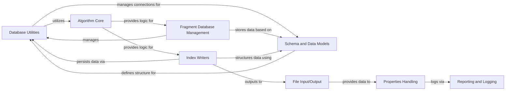

## Component Details

The Data Management & I/O component in MMPDB is a comprehensive subsystem responsible for all aspects of persistent data handling and external file interactions. It encompasses functionalities for managing various database types (SQLite, PostgreSQL, and specialized fragment databases), defining and enforcing database schemas, writing indexed data in multiple formats, and handling general file input/output operations. Additionally, it includes utilities for reporting and logging, and for loading molecular property data. This component ensures data integrity, efficient storage, and seamless data exchange within the MMPDB ecosystem.

### Database Utilities
This component provides a set of utility functions for interacting with various database types, including SQLite and PostgreSQL. It handles database connections, schema validation, and discovery of MMPDB databases.

**Related Classes/Methods**:

- <a href="https://github.com/rdkit/mmpdb/blob/master/mmpdblib/dbutils.py#L336-L341" target="_blank" rel="noopener noreferrer">`mmpdb.mmpdblib.dbutils.open_database` (336:341)</a>
- <a href="https://github.com/rdkit/mmpdb/blob/master/mmpdblib/dbutils.py#L52-L56" target="_blank" rel="noopener noreferrer">`mmpdb.mmpdblib.dbutils.get_default_sqlite_adapter` (52:56)</a>
- <a href="https://github.com/rdkit/mmpdb/blob/master/mmpdblib/dbutils.py#L66-L87" target="_blank" rel="noopener noreferrer">`mmpdb.mmpdblib.dbutils.open_as_schema_database` (66:87)</a>
- <a href="https://github.com/rdkit/mmpdb/blob/master/mmpdblib/dbutils.py#L151-L163" target="_blank" rel="noopener noreferrer">`mmpdb.mmpdblib.dbutils.DBFile.open_database` (151:163)</a>
- <a href="https://github.com/rdkit/mmpdb/blob/master/mmpdblib/dbutils.py#L173-L180" target="_blank" rel="noopener noreferrer">`mmpdb.mmpdblib.dbutils.DBUrl.open_database` (173:180)</a>
- <a href="https://github.com/rdkit/mmpdb/blob/master/mmpdblib/dbutils.py#L183-L197" target="_blank" rel="noopener noreferrer">`mmpdb.mmpdblib.dbutils.get_database_server` (183:197)</a>
- <a href="https://github.com/rdkit/mmpdb/blob/master/mmpdblib/dbutils.py#L205-L217" target="_blank" rel="noopener noreferrer">`mmpdb.mmpdblib.dbutils.PostgresServer.get_mmpdb_databases` (205:217)</a>
- <a href="https://github.com/rdkit/mmpdb/blob/master/mmpdblib/dbutils.py#L255-L261" target="_blank" rel="noopener noreferrer">`mmpdb.mmpdblib.dbutils.get_dbinfo` (255:261)</a>
- <a href="https://github.com/rdkit/mmpdb/blob/master/mmpdblib/dbutils.py#L270-L271" target="_blank" rel="noopener noreferrer">`mmpdb.mmpdblib.dbutils.get_mmpdb_filenames_in_current_directory` (270:271)</a>
- `mmpdb.mmpdblib.dbutils` (full file reference)
- <a href="https://github.com/rdkit/mmpdb/blob/master/mmpdblib/dbutils.py#L286-L310" target="_blank" rel="noopener noreferrer">`mmpdb.mmpdblib.dbutils.iter_dbinfo` (286:310)</a>
- <a href="https://github.com/rdkit/mmpdb/blob/master/mmpdblib/dbutils.py#L313-L333" target="_blank" rel="noopener noreferrer">`mmpdb.mmpdblib.dbutils.iter_dbinfo_and_dataset` (313:333)</a>
- <a href="https://github.com/rdkit/mmpdb/blob/master/mmpdblib/dbutils.py#L347-L410" target="_blank" rel="noopener noreferrer">`mmpdb.mmpdblib.dbutils.reaggregate_properties` (347:410)</a>

### Schema and Data Models
This component defines the database schema for MMPDB and provides data models for interacting with the stored information. It includes functions for creating and managing the schema, as well as classes representing various entities like compounds, rules, and properties.

**Related Classes/Methods**:

- <a href="https://github.com/rdkit/mmpdb/blob/master/mmpdblib/schema.py#L161-L163" target="_blank" rel="noopener noreferrer">`mmpdb.mmpdblib.schema.create_schema` (161:163)</a>
- <a href="https://github.com/rdkit/mmpdb/blob/master/mmpdblib/schema.py#L96-L104" target="_blank" rel="noopener noreferrer">`mmpdb.mmpdblib.schema.get_schema_for_database` (96:104)</a>
- <a href="https://github.com/rdkit/mmpdb/blob/master/mmpdblib/schema.py#L125-L135" target="_blank" rel="noopener noreferrer">`mmpdb.mmpdblib.schema._execute_sql` (125:135)</a>
- <a href="https://github.com/rdkit/mmpdb/blob/master/mmpdblib/schema.py#L154-L158" target="_blank" rel="noopener noreferrer">`mmpdb.mmpdblib.schema.create_schema_for_sqlite` (154:158)</a>
- <a href="https://github.com/rdkit/mmpdb/blob/master/mmpdblib/schema.py#L165-L166" target="_blank" rel="noopener noreferrer">`mmpdb.mmpdblib.schema.create_index` (165:166)</a>
- <a href="https://github.com/rdkit/mmpdb/blob/master/mmpdblib/schema.py#L169-L170" target="_blank" rel="noopener noreferrer">`mmpdb.mmpdblib.schema.drop_index` (169:170)</a>
- <a href="https://github.com/rdkit/mmpdb/blob/master/mmpdblib/schema.py#L243-L244" target="_blank" rel="noopener noreferrer">`mmpdb.mmpdblib.schema.MMPDatabase.__exit__` (243:244)</a>
- <a href="https://github.com/rdkit/mmpdb/blob/master/mmpdblib/schema.py#L273-L324" target="_blank" rel="noopener noreferrer">`mmpdb.mmpdblib.schema.MMPDatabase.get_dataset` (273:324)</a>
- <a href="https://github.com/rdkit/mmpdb/blob/master/mmpdblib/schema.py#L368-L374" target="_blank" rel="noopener noreferrer">`mmpdb.mmpdblib.schema.RuleEnvironment.iter_pairs` (368:374)</a>
- <a href="https://github.com/rdkit/mmpdb/blob/master/mmpdblib/schema.py#L429-L439" target="_blank" rel="noopener noreferrer">`mmpdb.mmpdblib.schema.MMPDataset.get_table_sizes` (429:439)</a>
- <a href="https://github.com/rdkit/mmpdb/blob/master/mmpdblib/schema.py#L441-L443" target="_blank" rel="noopener noreferrer">`mmpdb.mmpdblib.schema.MMPDataset.get_property_name_rows` (441:443)</a>
- <a href="https://github.com/rdkit/mmpdb/blob/master/mmpdblib/schema.py#L449-L450" target="_blank" rel="noopener noreferrer">`mmpdb.mmpdblib.schema.MMPDataset.get_property_name_id` (449:450)</a>
- <a href="https://github.com/rdkit/mmpdb/blob/master/mmpdblib/schema.py#L452-L459" target="_blank" rel="noopener noreferrer">`mmpdb.mmpdblib.schema.MMPDataset.get_property_names_table` (452:459)</a>
- <a href="https://github.com/rdkit/mmpdb/blob/master/mmpdblib/schema.py#L461-L462" target="_blank" rel="noopener noreferrer">`mmpdb.mmpdblib.schema.MMPDataset.get_num_compounds` (461:462)</a>
- <a href="https://github.com/rdkit/mmpdb/blob/master/mmpdblib/schema.py#L464-L471" target="_blank" rel="noopener noreferrer">`mmpdb.mmpdblib.schema.MMPDataset.get_num_compound_properties` (464:471)</a>
- <a href="https://github.com/rdkit/mmpdb/blob/master/mmpdblib/schema.py#L473-L474" target="_blank" rel="noopener noreferrer">`mmpdb.mmpdblib.schema.MMPDataset.get_num_rules` (473:474)</a>
- <a href="https://github.com/rdkit/mmpdb/blob/master/mmpdblib/schema.py#L476-L477" target="_blank" rel="noopener noreferrer">`mmpdb.mmpdblib.schema.MMPDataset.get_num_pairs` (476:477)</a>
- <a href="https://github.com/rdkit/mmpdb/blob/master/mmpdblib/schema.py#L479-L480" target="_blank" rel="noopener noreferrer">`mmpdb.mmpdblib.schema.MMPDataset.get_num_rule_environments` (479:480)</a>
- <a href="https://github.com/rdkit/mmpdb/blob/master/mmpdblib/schema.py#L482-L483" target="_blank" rel="noopener noreferrer">`mmpdb.mmpdblib.schema.MMPDataset.get_num_rule_environment_stats` (482:483)</a>
- <a href="https://github.com/rdkit/mmpdb/blob/master/mmpdblib/schema.py#L485-L486" target="_blank" rel="noopener noreferrer">`mmpdb.mmpdblib.schema.MMPDataset.get_num_rule_smiles` (485:486)</a>
- <a href="https://github.com/rdkit/mmpdb/blob/master/mmpdblib/schema.py#L488-L489" target="_blank" rel="noopener noreferrer">`mmpdb.mmpdblib.schema.MMPDataset.get_num_constant_smiles` (488:489)</a>
- <a href="https://github.com/rdkit/mmpdb/blob/master/mmpdblib/schema.py#L491-L498" target="_blank" rel="noopener noreferrer">`mmpdb.mmpdblib.schema.MMPDataset.get_smallest_constant_smiles` (491:498)</a>
- <a href="https://github.com/rdkit/mmpdb/blob/master/mmpdblib/schema.py#L516-L534" target="_blank" rel="noopener noreferrer">`mmpdb.mmpdblib.schema.MMPDataset.get_or_add_property_name` (516:534)</a>
- <a href="https://github.com/rdkit/mmpdb/blob/master/mmpdblib/schema.py#L536-L552" target="_blank" rel="noopener noreferrer">`mmpdb.mmpdblib.schema.MMPDataset.get_fragment_options` (536:552)</a>
- <a href="https://github.com/rdkit/mmpdb/blob/master/mmpdblib/schema.py#L554-L562" target="_blank" rel="noopener noreferrer">`mmpdb.mmpdblib.schema.MMPDataset.get_index_options` (554:562)</a>
- <a href="https://github.com/rdkit/mmpdb/blob/master/mmpdblib/schema.py#L564-L566" target="_blank" rel="noopener noreferrer">`mmpdb.mmpdblib.schema.MMPDataset.get_rule_smiles_id` (564:566)</a>
- <a href="https://github.com/rdkit/mmpdb/blob/master/mmpdblib/schema.py#L618-L625" target="_blank" rel="noopener noreferrer">`mmpdb.mmpdblib.schema.MMPDataset.iter_rules` (618:625)</a>
- <a href="https://github.com/rdkit/mmpdb/blob/master/mmpdblib/schema.py#L627-L644" target="_blank" rel="noopener noreferrer">`mmpdb.mmpdblib.schema.MMPDataset.iter_rule_environments` (627:644)</a>
- <a href="https://github.com/rdkit/mmpdb/blob/master/mmpdblib/schema.py#L646-L660" target="_blank" rel="noopener noreferrer">`mmpdb.mmpdblib.schema.MMPDataset.iter_selected_property_rules` (646:660)</a>
- <a href="https://github.com/rdkit/mmpdb/blob/master/mmpdblib/schema.py#L662-L723" target="_blank" rel="noopener noreferrer">`mmpdb.mmpdblib.schema.MMPDataset._iter_selected_property_rules_both_smiles` (662:723)</a>
- <a href="https://github.com/rdkit/mmpdb/blob/master/mmpdblib/schema.py#L725-L778" target="_blank" rel="noopener noreferrer">`mmpdb.mmpdblib.schema.MMPDataset._iter_selected_property_rules_no_smiles` (725:778)</a>
- <a href="https://github.com/rdkit/mmpdb/blob/master/mmpdblib/schema.py#L780-L835" target="_blank" rel="noopener noreferrer">`mmpdb.mmpdblib.schema.MMPDataset._iter_selected_property_rules_one_smiles` (780:835)</a>
- <a href="https://github.com/rdkit/mmpdb/blob/master/mmpdblib/schema.py#L847-L932" target="_blank" rel="noopener noreferrer">`mmpdb.mmpdblib.schema.MMPDataset.get_property_rule` (847:932)</a>
- <a href="https://github.com/rdkit/mmpdb/blob/master/mmpdblib/schema.py#L1070-L1079" target="_blank" rel="noopener noreferrer">`mmpdb.mmpdblib.schema.MMPDataset.iter_pairs` (1070:1079)</a>
- <a href="https://github.com/rdkit/mmpdb/blob/master/mmpdblib/schema.py#L1081-L1138" target="_blank" rel="noopener noreferrer">`mmpdb.mmpdblib.schema.MMPDataset.get_property_rule_pairs` (1081:1138)</a>
- <a href="https://github.com/rdkit/mmpdb/blob/master/mmpdblib/schema.py#L1140-L1147" target="_blank" rel="noopener noreferrer">`mmpdb.mmpdblib.schema.MMPDataset.iter_compounds` (1140:1147)</a>

### Fragment Database Management
This component manages the creation, opening, and querying of the fragment database. It handles the storage and retrieval of fragment records, fragmentations, and associated errors.

**Related Classes/Methods**:

- <a href="https://github.com/rdkit/mmpdb/blob/master/mmpdblib/fragment_db.py#L96-L120" target="_blank" rel="noopener noreferrer">`mmpdb.mmpdblib.fragment_db.open_fragdb` (96:120)</a>
- <a href="https://github.com/rdkit/mmpdb/blob/master/mmpdblib/fragment_db.py#L72-L93" target="_blank" rel="noopener noreferrer">`mmpdb.mmpdblib.fragment_db.init_fragdb` (72:93)</a>
- <a href="https://github.com/rdkit/mmpdb/blob/master/mmpdblib/fragment_db.py#L142-L159" target="_blank" rel="noopener noreferrer">`mmpdb.mmpdblib.fragment_db.select_options` (142:159)</a>
- <a href="https://github.com/rdkit/mmpdb/blob/master/mmpdblib/fragment_db.py#L186-L198" target="_blank" rel="noopener noreferrer">`mmpdb.mmpdblib.fragment_db.select_fragment_record_by_title` (186:198)</a>
- <a href="https://github.com/rdkit/mmpdb/blob/master/mmpdblib/fragment_db.py#L213-L216" target="_blank" rel="noopener noreferrer">`mmpdb.mmpdblib.fragment_db.select_fragmentations_by_record_id` (213:216)</a>
- <a href="https://github.com/rdkit/mmpdb/blob/master/mmpdblib/fragment_db.py#L222-L230" target="_blank" rel="noopener noreferrer">`mmpdb.mmpdblib.fragment_db.iter_fragment_records` (222:230)</a>
- <a href="https://github.com/rdkit/mmpdb/blob/master/mmpdblib/fragment_db.py#L236-L244" target="_blank" rel="noopener noreferrer">`mmpdb.mmpdblib.fragment_db.iter_fragment_error_records` (236:244)</a>
- <a href="https://github.com/rdkit/mmpdb/blob/master/mmpdblib/fragment_db.py#L266-L271" target="_blank" rel="noopener noreferrer">`mmpdb.mmpdblib.fragment_db.select_fragment_error_record_by_title` (266:271)</a>
- <a href="https://github.com/rdkit/mmpdb/blob/master/mmpdblib/fragment_db.py#L284-L291" target="_blank" rel="noopener noreferrer">`mmpdb.mmpdblib.fragment_db.FragDBWriter.close` (284:291)</a>
- <a href="https://github.com/rdkit/mmpdb/blob/master/mmpdblib/fragment_db.py#L296-L297" target="_blank" rel="noopener noreferrer">`mmpdb.mmpdblib.fragment_db.FragDBWriter.__exit__` (296:297)</a>
- <a href="https://github.com/rdkit/mmpdb/blob/master/mmpdblib/fragment_db.py#L308-L316" target="_blank" rel="noopener noreferrer">`mmpdb.mmpdblib.fragment_db.FragDBWriter.write_records` (308:316)</a>
- <a href="https://github.com/rdkit/mmpdb/blob/master/mmpdblib/fragment_db.py#L329-L334" target="_blank" rel="noopener noreferrer">`mmpdb.mmpdblib.fragment_db.FragDB.get` (329:334)</a>
- <a href="https://github.com/rdkit/mmpdb/blob/master/mmpdblib/fragment_db.py#L339-L340" target="_blank" rel="noopener noreferrer">`mmpdb.mmpdblib.fragment_db.FragDB.__exit__` (339:340)</a>
- <a href="https://github.com/rdkit/mmpdb/blob/master/mmpdblib/fragment_db.py#L349-L350" target="_blank" rel="noopener noreferrer">`mmpdb.mmpdblib.fragment_db.FragDB.__iter__` (349:350)</a>
- <a href="https://github.com/rdkit/mmpdb/blob/master/mmpdblib/fragment_db.py#L352-L353" target="_blank" rel="noopener noreferrer">`mmpdb.mmpdblib.fragment_db.FragDB.iter_error_records` (352:353)</a>
- <a href="https://github.com/rdkit/mmpdb/blob/master/mmpdblib/fragment_db.py#L361-L372" target="_blank" rel="noopener noreferrer">`mmpdb.mmpdblib.fragment_db.open_fragment_writer` (361:372)</a>

### Index Writers
This component is responsible for writing various types of index files, including database-backed indexes (SQLite, PostgreSQL) and flat file formats (CSV, MMPA). It provides interfaces for adding different types of data (compounds, rules, properties) and managing transactions (commit, rollback).

**Related Classes/Methods**:

- <a href="https://github.com/rdkit/mmpdb/blob/master/mmpdblib/index_writers.py#L153-L154" target="_blank" rel="noopener noreferrer">`mmpdb.mmpdblib.index_writers.open_table_index_writer` (153:154)</a>
- <a href="https://github.com/rdkit/mmpdb/blob/master/mmpdblib/index_writers.py#L101-L103" target="_blank" rel="noopener noreferrer">`mmpdb.mmpdblib.index_writers.TableIndexWriter.rollback` (101:103)</a>
- <a href="https://github.com/rdkit/mmpdb/blob/master/mmpdblib/index_writers.py#L105-L107" target="_blank" rel="noopener noreferrer">`mmpdb.mmpdblib.index_writers.TableIndexWriter.commit` (105:107)</a>
- <a href="https://github.com/rdkit/mmpdb/blob/master/mmpdblib/index_writers.py#L230-L236" target="_blank" rel="noopener noreferrer">`mmpdb.mmpdblib.index_writers.BaseRDBMSIndexWriter.__init__` (230:236)</a>
- <a href="https://github.com/rdkit/mmpdb/blob/master/mmpdblib/index_writers.py#L238-L252" target="_blank" rel="noopener noreferrer">`mmpdb.mmpdblib.index_writers.BaseRDBMSIndexWriter.prepare_sql_statements` (238:252)</a>
- <a href="https://github.com/rdkit/mmpdb/blob/master/mmpdblib/index_writers.py#L254-L256" target="_blank" rel="noopener noreferrer">`mmpdb.mmpdblib.index_writers.BaseRDBMSIndexWriter.prepare_single` (254:256)</a>
- <a href="https://github.com/rdkit/mmpdb/blob/master/mmpdblib/index_writers.py#L258-L260" target="_blank" rel="noopener noreferrer">`mmpdb.mmpdblib.index_writers.BaseRDBMSIndexWriter.prepare_many` (258:260)</a>
- <a href="https://github.com/rdkit/mmpdb/blob/master/mmpdblib/index_writers.py#L296-L313" target="_blank" rel="noopener noreferrer">`mmpdb.mmpdblib.index_writers.BaseRDBMSIndexWriter.end` (296:313)</a>
- <a href="https://github.com/rdkit/mmpdb/blob/master/mmpdblib/index_writers.py#L328-L330" target="_blank" rel="noopener noreferrer">`mmpdb.mmpdblib.index_writers.SingleIndexWriterMixin.add_rule_smiles` (328:330)</a>
- <a href="https://github.com/rdkit/mmpdb/blob/master/mmpdblib/index_writers.py#L393-L405" target="_blank" rel="noopener noreferrer">`mmpdb.mmpdblib.index_writers.BatchIndexWriterMixin.__init__` (393:405)</a>
- <a href="https://github.com/rdkit/mmpdb/blob/master/mmpdblib/index_writers.py#L410-L414" target="_blank" rel="noopener noreferrer">`mmpdb.mmpdblib.index_writers.BatchIndexWriterMixin.add_property_name` (410:414)</a>
- <a href="https://github.com/rdkit/mmpdb/blob/master/mmpdblib/index_writers.py#L416-L420" target="_blank" rel="noopener noreferrer">`mmpdb.mmpdblib.index_writers.BatchIndexWriterMixin.add_rule_smiles` (416:420)</a>
- <a href="https://github.com/rdkit/mmpdb/blob/master/mmpdblib/index_writers.py#L423-L427" target="_blank" rel="noopener noreferrer">`mmpdb.mmpdblib.index_writers.BatchIndexWriterMixin.add_rule` (423:427)</a>
- <a href="https://github.com/rdkit/mmpdb/blob/master/mmpdblib/index_writers.py#L429-L435" target="_blank" rel="noopener noreferrer">`mmpdb.mmpdblib.index_writers.BatchIndexWriterMixin.add_environment_fingerprint` (429:435)</a>
- <a href="https://github.com/rdkit/mmpdb/blob/master/mmpdblib/index_writers.py#L437-L442" target="_blank" rel="noopener noreferrer">`mmpdb.mmpdblib.index_writers.BatchIndexWriterMixin.add_rule_environment` (437:442)</a>
- <a href="https://github.com/rdkit/mmpdb/blob/master/mmpdblib/index_writers.py#L444-L450" target="_blank" rel="noopener noreferrer">`mmpdb.mmpdblib.index_writers.BatchIndexWriterMixin.add_compound` (444:450)</a>
- <a href="https://github.com/rdkit/mmpdb/blob/master/mmpdblib/index_writers.py#L452-L456" target="_blank" rel="noopener noreferrer">`mmpdb.mmpdblib.index_writers.BatchIndexWriterMixin.add_constant_smiles` (452:456)</a>
- <a href="https://github.com/rdkit/mmpdb/blob/master/mmpdblib/index_writers.py#L458-L462" target="_blank" rel="noopener noreferrer">`mmpdb.mmpdblib.index_writers.BatchIndexWriterMixin.add_rule_environment_pair` (458:462)</a>
- <a href="https://github.com/rdkit/mmpdb/blob/master/mmpdblib/index_writers.py#L465-L469" target="_blank" rel="noopener noreferrer">`mmpdb.mmpdblib.index_writers.BatchIndexWriterMixin.add_compound_property` (465:469)</a>
- <a href="https://github.com/rdkit/mmpdb/blob/master/mmpdblib/index_writers.py#L471-L475" target="_blank" rel="noopener noreferrer">`mmpdb.mmpdblib.index_writers.BatchIndexWriterMixin.add_rule_environment_statistics` (471:475)</a>
- <a href="https://github.com/rdkit/mmpdb/blob/master/mmpdblib/index_writers.py#L478-L498" target="_blank" rel="noopener noreferrer">`mmpdb.mmpdblib.index_writers.BatchIndexWriterMixin.flush` (478:498)</a>
- <a href="https://github.com/rdkit/mmpdb/blob/master/mmpdblib/index_writers.py#L541-L542" target="_blank" rel="noopener noreferrer">`mmpdb.mmpdblib.index_writers.BaseSQLiteIndexWriter.create_schema` (541:542)</a>
- <a href="https://github.com/rdkit/mmpdb/blob/master/mmpdblib/index_writers.py#L618-L642" target="_blank" rel="noopener noreferrer">`mmpdb.mmpdblib.index_writers.PostgresIndexWriter.create_schema` (618:642)</a>
- <a href="https://github.com/rdkit/mmpdb/blob/master/mmpdblib/index_writers.py#L664-L665" target="_blank" rel="noopener noreferrer">`mmpdb.mmpdblib.index_writers.FlatSQLFile.cursor` (664:665)</a>
- <a href="https://github.com/rdkit/mmpdb/blob/master/mmpdblib/index_writers.py#L670-L671" target="_blank" rel="noopener noreferrer">`mmpdb.mmpdblib.index_writers.FlatSQLFile.commit` (670:671)</a>
- <a href="https://github.com/rdkit/mmpdb/blob/master/mmpdblib/index_writers.py#L673-L674" target="_blank" rel="noopener noreferrer">`mmpdb.mmpdblib.index_writers.FlatSQLFile.rollback` (673:674)</a>
- <a href="https://github.com/rdkit/mmpdb/blob/master/mmpdblib/index_writers.py#L752-L753" target="_blank" rel="noopener noreferrer">`mmpdb.mmpdblib.index_writers.SQLiteSQLWriter.create_schema` (752:753)</a>
- <a href="https://github.com/rdkit/mmpdb/blob/master/mmpdblib/index_writers.py#L756-L757" target="_blank" rel="noopener noreferrer">`mmpdb.mmpdblib.index_writers.PostgresSQLWriter.create_schema` (756:757)</a>
- <a href="https://github.com/rdkit/mmpdb/blob/master/mmpdblib/index_writers.py#L760-L773" target="_blank" rel="noopener noreferrer">`mmpdb.mmpdblib.index_writers.open_sql_writer` (760:773)</a>
- <a href="https://github.com/rdkit/mmpdb/blob/master/mmpdblib/index_writers.py#L777-L827" target="_blank" rel="noopener noreferrer">`mmpdb.mmpdblib.index_writers.open_rdbms_index_writer` (777:827)</a>
- <a href="https://github.com/rdkit/mmpdb/blob/master/mmpdblib/index_writers.py#L836-L841" target="_blank" rel="noopener noreferrer">`mmpdb.mmpdblib.index_writers._open_output` (836:841)</a>
- <a href="https://github.com/rdkit/mmpdb/blob/master/mmpdblib/index_writers.py#L845-L850" target="_blank" rel="noopener noreferrer">`mmpdb.mmpdblib.index_writers._open_csv` (845:850)</a>
- <a href="https://github.com/rdkit/mmpdb/blob/master/mmpdblib/index_writers.py#L853-L855" target="_blank" rel="noopener noreferrer">`mmpdb.mmpdblib.index_writers._open_mmpa` (853:855)</a>
- <a href="https://github.com/rdkit/mmpdb/blob/master/mmpdblib/index_writers.py#L858-L861" target="_blank" rel="noopener noreferrer">`mmpdb.mmpdblib.index_writers._open_mmpdb` (858:861)</a>
- <a href="https://github.com/rdkit/mmpdb/blob/master/mmpdblib/index_writers.py#L864-L865" target="_blank" rel="noopener noreferrer">`mmpdb.mmpdblib.index_writers._open_sqlite_sql` (864:865)</a>
- <a href="https://github.com/rdkit/mmpdb/blob/master/mmpdblib/index_writers.py#L868-L869" target="_blank" rel="noopener noreferrer">`mmpdb.mmpdblib.index_writers._open_postgres_sql` (868:869)</a>
- <a href="https://github.com/rdkit/mmpdb/blob/master/mmpdblib/index_writers.py#L908-L912" target="_blank" rel="noopener noreferrer">`mmpdb.mmpdblib.index_writers.write_index_files` (908:912)</a>
- <a href="https://github.com/rdkit/mmpdb/blob/master/mmpdblib/index_writers.py#L941-L955" target="_blank" rel="noopener noreferrer">`mmpdb.mmpdblib.index_writers.write_sqlite_files` (941:955)</a>
- <a href="https://github.com/rdkit/mmpdb/blob/master/mmpdblib/index_writers.py#L998-L1017" target="_blank" rel="noopener noreferrer">`mmpdb.mmpdblib.index_writers.write_postgres_files` (998:1017)</a>
- <a href="https://github.com/rdkit/mmpdb/blob/master/mmpdblib/index_writers.py#L1053-L1058" target="_blank" rel="noopener noreferrer">`mmpdb.mmpdblib.index_writers.CSVDWriter.start` (1053:1058)</a>
- <a href="https://github.com/rdkit/mmpdb/blob/master/mmpdblib/index_writers.py#L1061-L1063" target="_blank" rel="noopener noreferrer">`mmpdb.mmpdblib.index_writers.CSVDWriter.rollback` (1061:1063)</a>
- <a href="https://github.com/rdkit/mmpdb/blob/master/mmpdblib/index_writers.py#L1068-L1069" target="_blank" rel="noopener noreferrer">`mmpdb.mmpdblib.index_writers.CSVDWriter.commit` (1068:1069)</a>
- <a href="https://github.com/rdkit/mmpdb/blob/master/mmpdblib/index_writers.py#L1084-L1089" target="_blank" rel="noopener noreferrer">`mmpdb.mmpdblib.index_writers.CSVDWriter.add_dataset` (1084:1089)</a>
- <a href="https://github.com/rdkit/mmpdb/blob/master/mmpdblib/index_writers.py#L1091-L1092" target="_blank" rel="noopener noreferrer">`mmpdb.mmpdblib.index_writers.CSVDWriter.add_property_name` (1091:1092)</a>
- <a href="https://github.com/rdkit/mmpdb/blob/master/mmpdblib/index_writers.py#L1094-L1096" target="_blank" rel="noopener noreferrer">`mmpdb.mmpdblib.index_writers.CSVDWriter.add_rule_smiles` (1094:1096)</a>
- <a href="https://github.com/rdkit/mmpdb/blob/master/mmpdblib/index_writers.py#L1110-L1114" target="_blank" rel="noopener noreferrer">`mmpdb.mmpdblib.index_writers.CSVDWriter.add_compound` (1110:1114)</a>
- <a href="https://github.com/rdkit/mmpdb/blob/master/mmpdblib/index_writers.py#L1116-L1117" target="_blank" rel="noopener noreferrer">`mmpdb.mmpdblib.index_writers.CSVDWriter.add_constant_smiles` (1116:1117)</a>
- <a href="https://github.com/rdkit/mmpdb/blob/master/mmpdblib/index_writers.py#L1128-L1135" target="_blank" rel="noopener noreferrer">`mmpdb.mmpdblib.index_writers.CSVDWriter.add_rule_environment_statistics` (1128:1135)</a>
- <a href="https://github.com/rdkit/mmpdb/blob/master/mmpdblib/index_writers.py#L1138-L1155" target="_blank" rel="noopener noreferrer">`mmpdb.mmpdblib.index_writers._open_csvd` (1138:1155)</a>
- <a href="https://github.com/rdkit/mmpdb/blob/master/mmpdblib/index_writers.py#L1178-L1183" target="_blank" rel="noopener noreferrer">`mmpdb.mmpdblib.index_writers.FormatInfo.open` (1178:1183)</a>

### File Input/Output
This component provides core functionalities for reading from and writing to files, specifically handling SMILES files and general output streams. It manages file formats and error handling during I/O operations.

**Related Classes/Methods**:

- <a href="https://github.com/rdkit/mmpdb/blob/master/mmpdblib/fileio.py#L531-L578" target="_blank" rel="noopener noreferrer">`mmpdb.mmpdblib.fileio.read_smiles_file` (531:578)</a>
- <a href="https://github.com/rdkit/mmpdb/blob/master/mmpdblib/fileio.py#L54-L55" target="_blank" rel="noopener noreferrer">`mmpdb.mmpdblib.fileio.Outfile.__exit__` (54:55)</a>
- <a href="https://github.com/rdkit/mmpdb/blob/master/mmpdblib/fileio.py#L79-L102" target="_blank" rel="noopener noreferrer">`mmpdb.mmpdblib.fileio.open_output` (79:102)</a>
- <a href="https://github.com/rdkit/mmpdb/blob/master/mmpdblib/fileio.py#L206-L218" target="_blank" rel="noopener noreferrer">`mmpdb.mmpdblib.fileio.Location.from_source` (206:218)</a>
- <a href="https://github.com/rdkit/mmpdb/blob/master/mmpdblib/fileio.py#L221-L233" target="_blank" rel="noopener noreferrer">`mmpdb.mmpdblib.fileio.Location.from_destination` (221:233)</a>
- <a href="https://github.com/rdkit/mmpdb/blob/master/mmpdblib/fileio.py#L387-L420" target="_blank" rel="noopener noreferrer">`mmpdb.mmpdblib.fileio._read_smiles_file` (387:420)</a>
- <a href="https://github.com/rdkit/mmpdb/blob/master/mmpdblib/fileio.py#L427-L435" target="_blank" rel="noopener noreferrer">`mmpdb.mmpdblib.fileio._read_whitespace` (427:435)</a>
- <a href="https://github.com/rdkit/mmpdb/blob/master/mmpdblib/fileio.py#L444-L452" target="_blank" rel="noopener noreferrer">`mmpdb.mmpdblib.fileio._read_tab` (444:452)</a>
- <a href="https://github.com/rdkit/mmpdb/blob/master/mmpdblib/fileio.py#L461-L469" target="_blank" rel="noopener noreferrer">`mmpdb.mmpdblib.fileio._read_space` (461:469)</a>
- <a href="https://github.com/rdkit/mmpdb/blob/master/mmpdblib/fileio.py#L478-L486" target="_blank" rel="noopener noreferrer">`mmpdb.mmpdblib.fileio._read_comma` (478:486)</a>
- <a href="https://github.com/rdkit/mmpdb/blob/master/mmpdblib/fileio.py#L495-L503" target="_blank" rel="noopener noreferrer">`mmpdb.mmpdblib.fileio._read_to_eol` (495:503)</a>

### Reporting and Logging
This component provides mechanisms for reporting progress, warnings, and general information to the user, with different verbosity levels.

**Related Classes/Methods**:

- <a href="https://github.com/rdkit/mmpdb/blob/master/mmpdblib/reporters.py#L38-L47" target="_blank" rel="noopener noreferrer">`mmpdb.mmpdblib.reporters.get_reporter` (38:47)</a>
- <a href="https://github.com/rdkit/mmpdb/blob/master/mmpdblib/reporters.py#L59-L61" target="_blank" rel="noopener noreferrer">`mmpdb.mmpdblib.reporters.BaseReporter.progress` (59:61)</a>
- <a href="https://github.com/rdkit/mmpdb/blob/master/mmpdblib/reporters.py#L67-L71" target="_blank" rel="noopener noreferrer">`mmpdb.mmpdblib.reporters.BaseReporter.explain` (67:71)</a>
- <a href="https://github.com/rdkit/mmpdb/blob/master/mmpdblib/reporters.py#L101-L105" target="_blank" rel="noopener noreferrer">`mmpdb.mmpdblib.reporters.Verbose.warning` (101:105)</a>
- <a href="https://github.com/rdkit/mmpdb/blob/master/mmpdblib/reporters.py#L107-L112" target="_blank" rel="noopener noreferrer">`mmpdb.mmpdblib.reporters.Verbose.report` (107:112)</a>
- <a href="https://github.com/rdkit/mmpdb/blob/master/mmpdblib/reporters.py#L114-L145" target="_blank" rel="noopener noreferrer">`mmpdb.mmpdblib.reporters.Verbose.progress` (114:145)</a>

### Properties Handling
This component is specifically designed to load and parse property data from input files, preparing it for further processing within the MMPDB system.

**Related Classes/Methods**:

- <a href="https://github.com/rdkit/mmpdb/blob/master/mmpdblib/properties_io.py#L62-L112" target="_blank" rel="noopener noreferrer">`mmpdb.mmpdblib.properties_io.load_properties` (62:112)</a>

### Algorithm Core
This component contains core algorithms for molecular fragmentation and index-related computations, such as calculating heavy atoms and aggregating values.

**Related Classes/Methods**:

- `mmpdb.mmpdblib.fragment_algorithm` (full file reference)
- `mmpdb.mmpdblib.index_algorithm` (full file reference)

### [FAQ](https://github.com/CodeBoarding/GeneratedOnBoardings/tree/main?tab=readme-ov-file#faq)