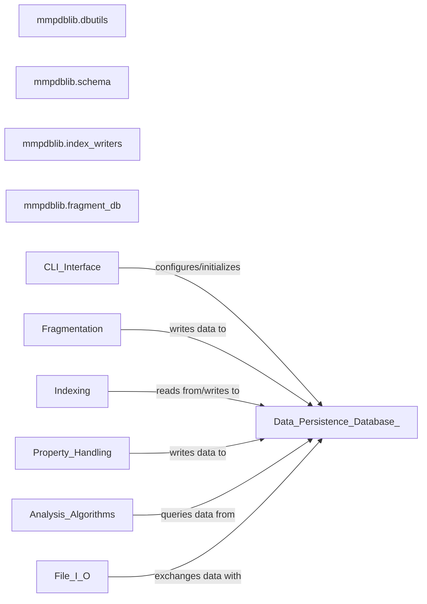

## Details

This component is the backbone for all persistent data storage and retrieval in mmpdb. It defines the database schema using the Peewee ORM, manages connections to various database backends (e.g., SQLite, PostgreSQL), and provides the mechanisms for writing and querying the matched molecular pair (MMP) data, including compounds, fragments, rules, and properties. It ensures data integrity and provides an abstraction layer over different database implementations.

### mmpdblib.dbutils
This module provides foundational utilities for abstracting database connection information. It defines classes that represent different ways to specify a database (e.g., file path for SQLite, URL for PostgreSQL).

**Related Classes/Methods**:

- <a href="https://github.com/rdkit/mmpdb/blob/master/mmpdblib/dbutils.py#L133-L141" target="_blank" rel="noopener noreferrer">`mmpdblib.dbutils.DBInfo` (133:141)</a>
- <a href="https://github.com/rdkit/mmpdb/blob/master/mmpdblib/dbutils.py#L144-L163" target="_blank" rel="noopener noreferrer">`mmpdblib.dbutils.DBFile` (144:163)</a>
- <a href="https://github.com/rdkit/mmpdb/blob/master/mmpdblib/dbutils.py#L166-L180" target="_blank" rel="noopener noreferrer">`mmpdblib.dbutils.DBUrl` (166:180)</a>

### mmpdblib.schema
This module is responsible for defining the entire database schema using Peewee ORM models. It establishes the structure for storing compounds, fragments, rules, rule environments, and associated properties. It also includes classes for managing the database connection and operations.

**Related Classes/Methods**:

- <a href="https://github.com/rdkit/mmpdb/blob/master/mmpdblib/schema.py#L229-L324" target="_blank" rel="noopener noreferrer">`mmpdblib.schema.MMPDatabase` (229:324)</a>
- <a href="https://github.com/rdkit/mmpdb/blob/master/mmpdblib/schema.py#L326-L337" target="_blank" rel="noopener noreferrer">`mmpdblib.schema.PostgresMMPDatabase` (326:337)</a>
- <a href="https://github.com/rdkit/mmpdb/blob/master/mmpdblib/schema.py" target="_blank" rel="noopener noreferrer">`mmpdblib.schema.Compound`</a>
- <a href="https://github.com/rdkit/mmpdb/blob/master/mmpdblib/schema.py" target="_blank" rel="noopener noreferrer">`mmpdblib.schema.Fragment`</a>
- <a href="https://github.com/rdkit/mmpdb/blob/master/mmpdblib/schema.py#L348-L354" target="_blank" rel="noopener noreferrer">`mmpdblib.schema.Rule` (348:354)</a>
- <a href="https://github.com/rdkit/mmpdb/blob/master/mmpdblib/schema.py#L357-L374" target="_blank" rel="noopener noreferrer">`mmpdblib.schema.RuleEnvironment` (357:374)</a>
- <a href="https://github.com/rdkit/mmpdb/blob/master/mmpdblib/schema.py" target="_blank" rel="noopener noreferrer">`mmpdblib.schema.Property`</a>
- <a href="https://github.com/rdkit/mmpdb/blob/master/mmpdblib/schema.py#L376-L382" target="_blank" rel="noopener noreferrer">`mmpdblib.schema.Pair` (376:382)</a>

### mmpdblib.index_writers
This module provides specialized classes for writing the results of the indexing process (matched molecular pairs, rules, compounds, fragments) into the database. It handles the specifics of inserting data into different database types (SQLite, PostgreSQL) and manages transactional operations to ensure data consistency during bulk writes.

**Related Classes/Methods**:

- <a href="https://github.com/rdkit/mmpdb/blob/master/mmpdblib/index_writers.py#L228-L319" target="_blank" rel="noopener noreferrer">`mmpdblib.index_writers.BaseRDBMSIndexWriter` (228:319)</a>
- <a href="https://github.com/rdkit/mmpdb/blob/master/mmpdblib/index_writers.py#L544-L545" target="_blank" rel="noopener noreferrer">`mmpdblib.index_writers.SQLiteIndexWriter` (544:545)</a>
- <a href="https://github.com/rdkit/mmpdb/blob/master/mmpdblib/index_writers.py#L572-L657" target="_blank" rel="noopener noreferrer">`mmpdblib.index_writers.PostgresIndexWriter` (572:657)</a>
- <a href="https://github.com/rdkit/mmpdb/blob/master/mmpdblib/index_writers.py#L518-L536" target="_blank" rel="noopener noreferrer">`mmpdblib.index_writers.TransactionMixin` (518:536)</a>

### mmpdblib.fragment_db
This module specifically manages the database related to molecular fragments. It provides functionalities for storing and retrieving fragment-related information, which is crucial for the fragmentation and indexing processes.

**Related Classes/Methods**:

- <a href="https://github.com/rdkit/mmpdb/blob/master/mmpdblib/fragment_db.py#L322-L356" target="_blank" rel="noopener noreferrer">`mmpdblib.fragment_db.FragDB` (322:356)</a>

### [FAQ](https://github.com/CodeBoarding/GeneratedOnBoardings/tree/main?tab=readme-ov-file#faq)