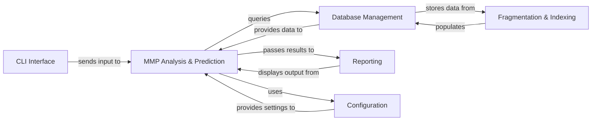

## Details

This document outlines the component overview for `MMP Analysis & Prediction`, including its structure, flow, and purpose, along with other fundamental components of the system.

### MMP Analysis & Prediction [[Expand]](./MMP_Analysis_Prediction.md)
This component serves as the central computational engine for applying Matched Molecular Pair (MMP) rules. Its primary purpose is to perform various analyses based on the indexed MMP data, including predicting properties for new compounds and transforming molecules by applying specific rule sets. It orchestrates the retrieval of relevant MMP data from the database and executes the algorithms necessary for these predictive and transformative tasks.

**Related Classes/Methods**:

- <a href="https://github.com/rdkit/mmpdb/blob/master/mmpdblib/analysis_algorithms.py#L416-L473" target="_blank" rel="noopener noreferrer">`mmpdblib.analysis_algorithms.PredictTool` (416:473)</a>
- <a href="https://github.com/rdkit/mmpdb/blob/master/mmpdblib/analysis_algorithms.py#L847-L968" target="_blank" rel="noopener noreferrer">`mmpdblib.analysis_algorithms.TransformTool` (847:968)</a>
- <a href="https://github.com/rdkit/mmpdb/blob/master/mmpdblib/analysis_algorithms.py#L390-L409" target="_blank" rel="noopener noreferrer">`mmpdblib.analysis_algorithms.Tool` (390:409)</a>
- <a href="https://github.com/rdkit/mmpdb/blob/master/mmpdblib/analysis_algorithms.py" target="_blank" rel="noopener noreferrer">`mmpdblib.analysis_algorithms.predict`</a>
- <a href="https://github.com/rdkit/mmpdb/blob/master/mmpdblib/analysis_algorithms.py" target="_blank" rel="noopener noreferrer">`mmpdblib.analysis_algorithms.transform`</a>

### Database Management
Manages the storage and retrieval of MMP rules, compound information, and associated properties. It provides the interface for the application to interact with the underlying database, ensuring data integrity and efficient access.

**Related Classes/Methods**:

- <a href="https://github.com/rdkit/mmpdb/blob/master/mmpdblib/schema.py#L229-L324" target="_blank" rel="noopener noreferrer">`mmpdblib.schema.MMPDatabase` (229:324)</a>
- <a href="https://github.com/rdkit/mmpdb/blob/master/mmpdblib/schema.py#L326-L337" target="_blank" rel="noopener noreferrer">`mmpdblib.schema.PostgresMMPDatabase` (326:337)</a>

### CLI Interface
Provides a command-line interface for user interaction, allowing users to initiate various tasks such as fragmentation, indexing, transformation, and prediction. It parses user commands and arguments, translating them into calls to the core business logic.

**Related Classes/Methods**:

- `mmpdblib.cli.MultiCommand`
- <a href="https://github.com/rdkit/mmpdb/blob/master/mmpdblib/cli/click_utils.py#L69-L70" target="_blank" rel="noopener noreferrer">`mmpdblib.cli.click_utils.Command` (69:70)</a>
- <a href="https://github.com/rdkit/mmpdb/blob/master/mmpdblib/cli/click_utils.py#L59-L66" target="_blank" rel="noopener noreferrer">`mmpdblib.cli.click_utils.OrderedGroup` (59:66)</a>

### Reporting
Handles the formatting and output of computed results from various analyses and predictions. It ensures that the information is presented clearly and concisely to the user, potentially supporting different output formats.

**Related Classes/Methods**:

- <a href="https://github.com/rdkit/mmpdb/blob/master/mmpdblib/reporters.py#L50-L71" target="_blank" rel="noopener noreferrer">`mmpdblib.reporters.BaseReporter` (50:71)</a>
- <a href="https://github.com/rdkit/mmpdb/blob/master/mmpdblib/reporters.py#L74-L75" target="_blank" rel="noopener noreferrer">`mmpdblib.reporters.Quiet` (74:75)</a>
- <a href="https://github.com/rdkit/mmpdb/blob/master/mmpdblib/reporters.py#L95-L152" target="_blank" rel="noopener noreferrer">`mmpdblib.reporters.Verbose` (95:152)</a>

### Configuration
Manages application-wide configuration settings, including database connection details, analysis parameters (e.g., prediction models, similarity thresholds), and output preferences. It provides a centralized mechanism for accessing and managing these settings.

**Related Classes/Methods**:

- `mmpdblib.cli.CmdConfig`

### Fragmentation & Indexing
Responsible for the initial processing of molecular data. This includes fragmenting molecules into their constituent parts and then identifying and indexing matched molecular pairs to build the core MMP database. This component is a prerequisite for any MMP analysis.

**Related Classes/Methods**:

- <a href="https://github.com/rdkit/mmpdb/blob/master/mmpdblib/index_algorithm.py#L1248-L1357" target="_blank" rel="noopener noreferrer">`mmpdblib.index_algorithm.MMPWriter` (1248:1357)</a>
- <a href="https://github.com/rdkit/mmpdb/blob/master/mmpdblib/index_writers.py#L228-L319" target="_blank" rel="noopener noreferrer">`mmpdblib.index_writers.BaseRDBMSIndexWriter` (228:319)</a>
- <a href="https://github.com/rdkit/mmpdb/blob/master/mmpdblib/index_writers.py#L544-L545" target="_blank" rel="noopener noreferrer">`mmpdblib.index_writers.SQLiteIndexWriter` (544:545)</a>
- <a href="https://github.com/rdkit/mmpdb/blob/master/mmpdblib/index_writers.py#L572-L657" target="_blank" rel="noopener noreferrer">`mmpdblib.index_writers.PostgresIndexWriter` (572:657)</a>

### [FAQ](https://github.com/CodeBoarding/GeneratedOnBoardings/tree/main?tab=readme-ov-file#faq)