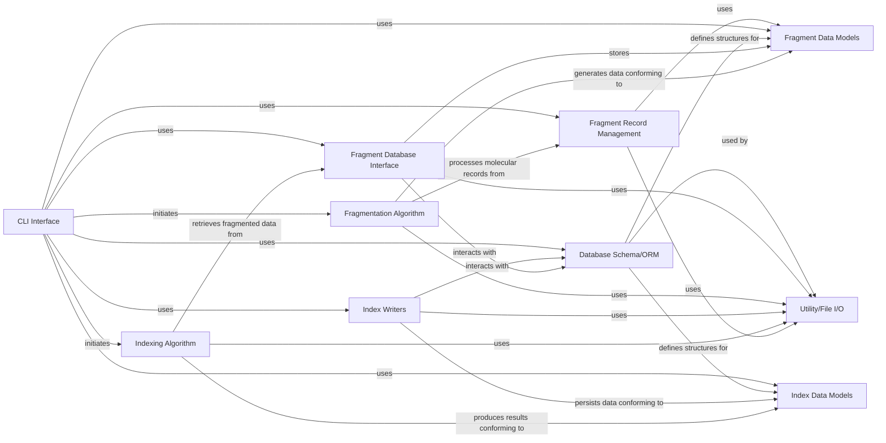

## Details

The previous analysis of the `mmpdblib` project has been updated to address the feedback regarding the `Utility/File I/O` component and the accuracy of component relationships. The primary issues identified were: 1. An invalid reference to `mmpdblib.utils`, as the file `mmpdblib/utils.py` does not exist. 2. The `Utility/File I/O` component was incomplete, missing references to other relevant utility files like `dbutils.py` and `properties_io.py`. 3. Several relationships between components were either incorrect in direction or not supported by actual package dependencies, and some new relationships were missing. Based on the file structure analysis, `mmpdblib.utils` has been removed. `mmpdblib.dbutils` and `mmpdblib.properties_io` have been incorporated into the `Utility/File I/O` component, as they align with its purpose of handling database utilities and property file I/O, respectively. The component relationships have been thoroughly re-evaluated using package dependency information. Incorrect relationships have been rectified, and newly identified dependencies have been added to ensure the architectural overview accurately reflects the project's structure and flow.

### CLI Interface
This component serves as the primary user entry point for initiating fragmentation and indexing operations. It parses command-line arguments and orchestrates the execution flow of the entire pipeline.

**Related Classes/Methods**:

- <a href="https://github.com/rdkit/mmpdb/blob/master/mmpdblib/cli/fragment.py#L189-L285" target="_blank" rel="noopener noreferrer">`mmpdblib.cli.fragment` (189:285)</a>
- <a href="https://github.com/rdkit/mmpdb/blob/master/mmpdblib/cli/index.py#L404-L525" target="_blank" rel="noopener noreferrer">`mmpdblib.cli.index` (404:525)</a>

### Fragment Record Management
Responsible for reading raw molecular input (e.g., SMILES strings) and preparing it for the fragmentation process. It manages the creation and handling of individual molecular records.

**Related Classes/Methods**:

- <a href="https://github.com/rdkit/mmpdb/blob/master/mmpdblib/fragment_records.py#L1-L100" target="_blank" rel="noopener noreferrer">`mmpdblib.fragment_records` (1:100)</a>

### Fragmentation Algorithm
Implements the core algorithms for breaking down molecules into their constituent fragments based on defined rules or methods. It generates the fragmented molecular structures.

**Related Classes/Methods**:

- <a href="https://github.com/rdkit/mmpdb/blob/master/mmpdblib/fragment_algorithm.py#L1-L100" target="_blank" rel="noopener noreferrer">`mmpdblib.fragment_algorithm` (1:100)</a>

### Fragment Data Models
Defines the data structures and types used to represent molecular fragments, their associated properties, and the results of the fragmentation process.

**Related Classes/Methods**:

- <a href="https://github.com/rdkit/mmpdb/blob/master/mmpdblib/fragment_types.py#L1-L100" target="_blank" rel="noopener noreferrer">`mmpdblib.fragment_types` (1:100)</a>

### Fragment Database Interface
Manages the storage and retrieval of fragmented molecular data. It acts as an abstraction layer for interacting with the underlying database where fragments are persisted.

**Related Classes/Methods**:

- <a href="https://github.com/rdkit/mmpdb/blob/master/mmpdblib/fragment_db.py#L1-L100" target="_blank" rel="noopener noreferrer">`mmpdblib.fragment_db` (1:100)</a>

### Indexing Algorithm
Contains the sophisticated algorithms for identifying Matched Molecular Pairs (MMPs) from the fragmented data. It also calculates rule environments, aggregates statistical data, and identifies the transformations between pairs.

**Related Classes/Methods**:

- <a href="https://github.com/rdkit/mmpdb/blob/master/mmpdblib/index_algorithm.py#L1-L100" target="_blank" rel="noopener noreferrer">`mmpdblib.index_algorithm` (1:100)</a>

### Index Data Models
Defines the data structures and types used to represent the output of the indexing process, including Matched Molecular Pairs, derived rules, and their associated chemical environments.

**Related Classes/Methods**:

- <a href="https://github.com/rdkit/mmpdb/blob/master/mmpdblib/index_types.py#L1-L100" target="_blank" rel="noopener noreferrer">`mmpdblib.index_types` (1:100)</a>

### Index Writers
Provides classes and methods for persisting the generated MMP index data (MMPs, rules, environments) into various database formats (e.g., SQLite, PostgreSQL) or file formats (e.g., CSV).

**Related Classes/Methods**:

- <a href="https://github.com/rdkit/mmpdb/blob/master/mmpdblib/index_writers.py#L1-L100" target="_blank" rel="noopener noreferrer">`mmpdblib.index_writers` (1:100)</a>

### Database Schema/ORM
Defines the relational database schema using an Object-Relational Mapper (ORM, likely Peewee as per context). It specifies the tables (e.g., Compound, Fragment, Rule, RuleEnvironment, Pair) and their relationships for storing all processed data.

**Related Classes/Methods**:

- <a href="https://github.com/rdkit/mmpdb/blob/master/mmpdblib/schema.py#L1-L100" target="_blank" rel="noopener noreferrer">`mmpdblib.schema` (1:100)</a>

### Utility/File I/O
A collection of shared utility functions, including file input/output operations (e.g., reading SMILES files), database utility functions, and property file handling.

**Related Classes/Methods**:

- <a href="https://github.com/rdkit/mmpdb/blob/master/mmpdblib/fileio.py#L1-L100" target="_blank" rel="noopener noreferrer">`mmpdblib.fileio` (1:100)</a>
- <a href="https://github.com/rdkit/mmpdb/blob/master/mmpdblib/dbutils.py#L1-L100" target="_blank" rel="noopener noreferrer">`mmpdblib.dbutils` (1:100)</a>
- <a href="https://github.com/rdkit/mmpdb/blob/master/mmpdblib/properties_io.py#L1-L100" target="_blank" rel="noopener noreferrer">`mmpdblib.properties_io` (1:100)</a>

### [FAQ](https://github.com/CodeBoarding/GeneratedOnBoardings/tree/main?tab=readme-ov-file#faq)