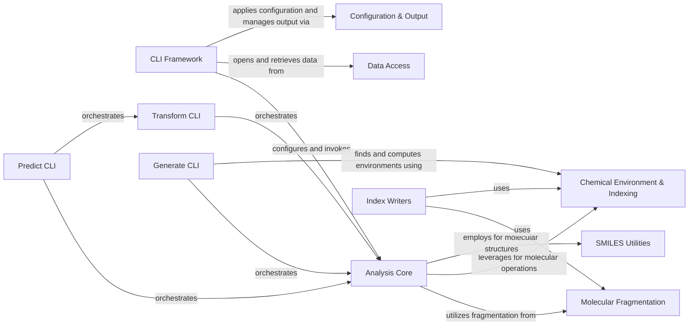

## Component Details

This architecture outlines the core components of the `mmpdb` project, focusing on molecular property analysis and transformation. The central `Analysis Core` component performs predictions and transformations, relying on `Molecular Fragmentation`, `Chemical Environment & Indexing`, and `SMILES Utilities` for chemical operations. Various `CLI` components (`Transform CLI`, `Predict CLI`, `Generate CLI`) orchestrate these analysis tasks, utilizing a common `CLI Framework` for argument parsing and interaction with `Data Access` and `Configuration & Output` for database operations and reporting. `Index Writers` also interact with fragmentation and environment components to persist data.

### Analysis Core
This component provides the core logic for analyzing matched molecular pairs, predicting properties, and transforming molecules. It includes functions for defining rule selection criteria, performing predictions based on chemical environments, and generating molecular transformations.

**Related Classes/Methods**:

- <a href="https://github.com/rdkit/mmpdb/blob/master/mmpdblib/analysis_algorithms.py#L489-L649" target="_blank" rel="noopener noreferrer">`mmpdb.mmpdblib.analysis_algorithms.make_prediction` (489:649)</a>
- <a href="https://github.com/rdkit/mmpdb/blob/master/mmpdblib/analysis_algorithms.py#L1088-L1292" target="_blank" rel="noopener noreferrer">`mmpdb.mmpdblib.analysis_algorithms.make_transform` (1088:1292)</a>
- <a href="https://github.com/rdkit/mmpdb/blob/master/mmpdblib/analysis_algorithms.py#L130-L161" target="_blank" rel="noopener noreferrer">`mmpdb.mmpdblib.analysis_algorithms.get_where_function` (130:161)</a>
- <a href="https://github.com/rdkit/mmpdb/blob/master/mmpdblib/analysis_algorithms.py#L186-L220" target="_blank" rel="noopener noreferrer">`mmpdb.mmpdblib.analysis_algorithms.get_score_function` (186:220)</a>
- <a href="https://github.com/rdkit/mmpdb/blob/master/mmpdblib/analysis_algorithms.py#L247-L273" target="_blank" rel="noopener noreferrer">`mmpdb.mmpdblib.analysis_algorithms.RuleSelectionFunction.__call__` (247:273)</a>
- <a href="https://github.com/rdkit/mmpdb/blob/master/mmpdblib/analysis_algorithms.py#L339-L347" target="_blank" rel="noopener noreferrer">`mmpdb.mmpdblib.analysis_algorithms.get_rule_selection_function` (339:347)</a>
- <a href="https://github.com/rdkit/mmpdb/blob/master/mmpdblib/analysis_algorithms.py#L350-L363" target="_blank" rel="noopener noreferrer">`mmpdb.mmpdblib.analysis_algorithms.get_rule_selection_function_from_args` (350:363)</a>
- <a href="https://github.com/rdkit/mmpdb/blob/master/mmpdblib/analysis_algorithms.py#L412-L413" target="_blank" rel="noopener noreferrer">`mmpdb.mmpdblib.analysis_algorithms.get_predict_tool` (412:413)</a>
- <a href="https://github.com/rdkit/mmpdb/blob/master/mmpdblib/analysis_algorithms.py#L417-L434" target="_blank" rel="noopener noreferrer">`mmpdb.mmpdblib.analysis_algorithms.PredictTool.fragment_predict_smiles` (417:434)</a>
- <a href="https://github.com/rdkit/mmpdb/blob/master/mmpdblib/analysis_algorithms.py#L436-L449" target="_blank" rel="noopener noreferrer">`mmpdb.mmpdblib.analysis_algorithms.PredictTool.fragment_reference_smiles` (436:449)</a>
- <a href="https://github.com/rdkit/mmpdb/blob/master/mmpdblib/analysis_algorithms.py#L451-L473" target="_blank" rel="noopener noreferrer">`mmpdb.mmpdblib.analysis_algorithms.PredictTool.predict` (451:473)</a>
- <a href="https://github.com/rdkit/mmpdb/blob/master/mmpdblib/analysis_algorithms.py#L704-L705" target="_blank" rel="noopener noreferrer">`mmpdb.mmpdblib.analysis_algorithms._format_object_attributes_to_string` (704:705)</a>
- <a href="https://github.com/rdkit/mmpdb/blob/master/mmpdblib/analysis_algorithms.py#L759-L771" target="_blank" rel="noopener noreferrer">`mmpdb.mmpdblib.analysis_algorithms.PredictResult.format_property_rule` (759:771)</a>
- <a href="https://github.com/rdkit/mmpdb/blob/master/mmpdblib/analysis_algorithms.py#L773-L790" target="_blank" rel="noopener noreferrer">`mmpdb.mmpdblib.analysis_algorithms.PredictResult.write_property_rules` (773:790)</a>
- <a href="https://github.com/rdkit/mmpdb/blob/master/mmpdblib/analysis_algorithms.py#L800-L803" target="_blank" rel="noopener noreferrer">`mmpdb.mmpdblib.analysis_algorithms.PredictResult.format_property_rule_pair` (800:803)</a>
- <a href="https://github.com/rdkit/mmpdb/blob/master/mmpdblib/analysis_algorithms.py#L805-L816" target="_blank" rel="noopener noreferrer">`mmpdb.mmpdblib.analysis_algorithms.PredictResult.write_property_rule_pairs` (805:816)</a>
- <a href="https://github.com/rdkit/mmpdb/blob/master/mmpdblib/analysis_algorithms.py#L819-L837" target="_blank" rel="noopener noreferrer">`mmpdb.mmpdblib.analysis_algorithms.test_predict` (819:837)</a>
- <a href="https://github.com/rdkit/mmpdb/blob/master/mmpdblib/analysis_algorithms.py#L843-L844" target="_blank" rel="noopener noreferrer">`mmpdb.mmpdblib.analysis_algorithms.get_transform_tool` (843:844)</a>
- <a href="https://github.com/rdkit/mmpdb/blob/master/mmpdblib/analysis_algorithms.py#L848-L857" target="_blank" rel="noopener noreferrer">`mmpdb.mmpdblib.analysis_algorithms.TransformTool.fragment_transform_smiles` (848:857)</a>
- <a href="https://github.com/rdkit/mmpdb/blob/master/mmpdblib/analysis_algorithms.py#L859-L895" target="_blank" rel="noopener noreferrer">`mmpdb.mmpdblib.analysis_algorithms.TransformTool.transform` (859:895)</a>
- <a href="https://github.com/rdkit/mmpdb/blob/master/mmpdblib/analysis_algorithms.py#L1033-L1062" target="_blank" rel="noopener noreferrer">`mmpdb.mmpdblib.analysis_algorithms.weld_fragments` (1033:1062)</a>
- <a href="https://github.com/rdkit/mmpdb/blob/master/mmpdblib/analysis_algorithms.py#L1065-L1085" target="_blank" rel="noopener noreferrer">`mmpdb.mmpdblib.analysis_algorithms._weld_and_filter` (1065:1085)</a>
- <a href="https://github.com/rdkit/mmpdb/blob/master/mmpdblib/analysis_algorithms.py#L1301-L1370" target="_blank" rel="noopener noreferrer">`mmpdb.mmpdblib.analysis_algorithms.iter_transform_products` (1301:1370)</a>
- <a href="https://github.com/rdkit/mmpdb/blob/master/mmpdblib/analysis_algorithms.py#L1410-L1437" target="_blank" rel="noopener noreferrer">`mmpdb.mmpdblib.analysis_algorithms.TransformResult.write_products` (1410:1437)</a>
- <a href="https://github.com/rdkit/mmpdb/blob/master/mmpdblib/analysis_algorithms.py#L1440-L1449" target="_blank" rel="noopener noreferrer">`mmpdb.mmpdblib.analysis_algorithms.test_transform` (1440:1449)</a>
- <a href="https://github.com/rdkit/mmpdb/blob/master/mmpdblib/config.py#L240-L256" target="_blank" rel="noopener noreferrer">`mmpdb.mmpdblib.config.RuleSelectionOptions.get_rule_selection_function` (240:256)</a>
- <a href="https://github.com/rdkit/mmpdb/blob/master/mmpdblib/analysis_algorithms.py#L223-L239" target="_blank" rel="noopener noreferrer">`mmpdb.mmpdblib.analysis_algorithms.ComputeRuleKey` (223:239)</a>
- <a href="https://github.com/rdkit/mmpdb/blob/master/mmpdblib/analysis_algorithms.py#L50-L51" target="_blank" rel="noopener noreferrer">`mmpdb.mmpdblib.analysis_algorithms.EvalError` (50:51)</a>
- <a href="https://github.com/rdkit/mmpdb/blob/master/mmpdblib/analysis_algorithms.py#L121-L127" target="_blank" rel="noopener noreferrer">`mmpdb.mmpdblib.analysis_algorithms.check_eval_names` (121:127)</a>
- <a href="https://github.com/rdkit/mmpdb/blob/master/mmpdblib/analysis_algorithms.py#L316-L334" target="_blank" rel="noopener noreferrer">`mmpdb.mmpdblib.analysis_algorithms._explain_choice` (316:334)</a>
- <a href="https://github.com/rdkit/mmpdb/blob/master/mmpdblib/analysis_algorithms.py#L376-L387" target="_blank" rel="noopener noreferrer">`mmpdb.mmpdblib.analysis_algorithms._get_tool` (376:387)</a>
- <a href="https://github.com/rdkit/mmpdb/blob/master/mmpdblib/analysis_algorithms.py#L484-L486" target="_blank" rel="noopener noreferrer">`mmpdb.mmpdblib.analysis_algorithms.get_attachment_order` (484:486)</a>
- <a href="https://github.com/rdkit/mmpdb/blob/master/mmpdblib/analysis_algorithms.py#L691-L701" target="_blank" rel="noopener noreferrer">`mmpdb.mmpdblib.analysis_algorithms._format_object_attributes` (691:701)</a>
- <a href="https://github.com/rdkit/mmpdb/blob/master/mmpdblib/analysis_algorithms.py#L653-L656" target="_blank" rel="noopener noreferrer">`mmpdb.mmpdblib.analysis_algorithms._get_column_names` (653:656)</a>
- <a href="https://github.com/rdkit/mmpdb/blob/master/mmpdblib/analysis_algorithms.py#L978-L1024" target="_blank" rel="noopener noreferrer">`mmpdb.mmpdblib.analysis_algorithms.enumerate_permutations` (978:1024)</a>
- <a href="https://github.com/rdkit/mmpdb/blob/master/mmpdblib/analysis_algorithms.py#L1295-L1298" target="_blank" rel="noopener noreferrer">`mmpdb.mmpdblib.analysis_algorithms.TransformProduct` (1295:1298)</a>
- <a href="https://github.com/rdkit/mmpdb/blob/master/mmpdblib/analysis_algorithms.py#L390-L409" target="_blank" rel="noopener noreferrer">`mmpdb.mmpdblib.analysis_algorithms.Tool` (390:409)</a>

### CLI Framework
Provides common utilities and decorators for building command-line interfaces using Click, handling argument parsing, and common CLI functionalities.

**Related Classes/Methods**:

- <a href="https://github.com/rdkit/mmpdb/blob/master/mmpdblib/cli/click_utils.py#L403-L418" target="_blank" rel="noopener noreferrer">`mmpdb.mmpdblib.cli.click_utils.parse_where` (403:418)</a>
- <a href="https://github.com/rdkit/mmpdb/blob/master/mmpdblib/cli/click_utils.py#L421-L435" target="_blank" rel="noopener noreferrer">`mmpdb.mmpdblib.cli.click_utils.parse_score` (421:435)</a>
- <a href="https://github.com/rdkit/mmpdb/blob/master/mmpdblib/cli/click_utils.py#L480-L521" target="_blank" rel="noopener noreferrer">`mmpdb.mmpdblib.cli.click_utils.add_rule_selection_options` (480:521)</a>
- <a href="https://github.com/rdkit/mmpdb/blob/master/mmpdblib/cli/click_utils.py#L73-L76" target="_blank" rel="noopener noreferrer">`mmpdb.mmpdblib.cli.click_utils.command` (73:76)</a>
- <a href="https://github.com/rdkit/mmpdb/blob/master/mmpdblib/cli/click_utils.py#L323-L343" target="_blank" rel="noopener noreferrer">`mmpdb.mmpdblib.cli.click_utils.add_single_database_parameters` (323:343)</a>
- <a href="https://github.com/rdkit/mmpdb/blob/master/mmpdblib/cli/click_utils.py#L149-L161" target="_blank" rel="noopener noreferrer">`mmpdb.mmpdblib.cli.click_utils.nonnegative_int` (149:161)</a>
- <a href="https://github.com/rdkit/mmpdb/blob/master/mmpdblib/cli/click_utils.py#L180-L184" target="_blank" rel="noopener noreferrer">`mmpdb.mmpdblib.cli.click_utils.radius_type` (180:184)</a>
- <a href="https://github.com/rdkit/mmpdb/blob/master/mmpdblib/cli/click_utils.py#L165-L177" target="_blank" rel="noopener noreferrer">`mmpdb.mmpdblib.cli.click_utils.positive_int` (165:177)</a>
- <a href="https://github.com/rdkit/mmpdb/blob/master/mmpdblib/cli/click_utils.py#L583-L589" target="_blank" rel="noopener noreferrer">`mmpdb.mmpdblib.cli.click_utils.open_dataset_from_options_or_exit` (583:589)</a>
- <a href="https://github.com/rdkit/mmpdb/blob/master/mmpdblib/cli/click_utils.py#L527-L553" target="_blank" rel="noopener noreferrer">`mmpdb.mmpdblib.cli.click_utils.get_property_names_or_error` (527:553)</a>
- <a href="https://github.com/rdkit/mmpdb/blob/master/mmpdblib/cli/click_utils.py#L247-L250" target="_blank" rel="noopener noreferrer">`mmpdb.mmpdblib.cli.click_utils.die` (247:250)</a>
- <a href="https://github.com/rdkit/mmpdb/blob/master/mmpdblib/cli/click_utils.py#L438-L477" target="_blank" rel="noopener noreferrer">`mmpdb.mmpdblib.cli.click_utils.parse_cutoff_list` (438:477)</a>
- <a href="https://github.com/rdkit/mmpdb/blob/master/mmpdblib/cli/click_utils.py#L229-L232" target="_blank" rel="noopener noreferrer">`mmpdb.mmpdblib.cli.click_utils.set_click_attrs` (229:232)</a>

### Transform CLI
Implements the command-line interface for the 'transform' operation, orchestrating the molecular transformation process and managing output.

**Related Classes/Methods**:

- <a href="https://github.com/rdkit/mmpdb/blob/master/mmpdblib/cli/transform.py#L321-L447" target="_blank" rel="noopener noreferrer">`mmpdb.mmpdblib.cli.transform.transform` (321:447)</a>
- <a href="https://github.com/rdkit/mmpdb/blob/master/mmpdblib/cli/transform.py#L51-L63" target="_blank" rel="noopener noreferrer">`mmpdb.mmpdblib.cli.transform.parse_smarts` (51:63)</a>
- <a href="https://github.com/rdkit/mmpdb/blob/master/mmpdblib/cli/transform.py#L69-L77" target="_blank" rel="noopener noreferrer">`mmpdb.mmpdblib.cli.transform.get_time_delta_formatter` (69:77)</a>

### Predict CLI
Implements the command-line interface for the 'predict' operation, managing the prediction workflow and result reporting.

**Related Classes/Methods**:

- <a href="https://github.com/rdkit/mmpdb/blob/master/mmpdblib/cli/predict.py#L181-L340" target="_blank" rel="noopener noreferrer">`mmpdb.mmpdblib.cli.predict.predict` (181:340)</a>

### Generate CLI
Implements the command-line interface for generating unwelded fragments from constant environments and welding the results.

**Related Classes/Methods**:

- <a href="https://github.com/rdkit/mmpdb/blob/master/mmpdblib/cli/generate.py#L803-L955" target="_blank" rel="noopener noreferrer">`mmpdb.mmpdblib.cli.generate.generate_unwelded_from_constant` (803:955)</a>
- <a href="https://github.com/rdkit/mmpdb/blob/master/mmpdblib/cli/generate.py#L957-L967" target="_blank" rel="noopener noreferrer">`mmpdb.mmpdblib.cli.generate.weld_unwelded_result` (957:967)</a>
- <a href="https://github.com/rdkit/mmpdb/blob/master/mmpdblib/cli/generate.py#L33-L34" target="_blank" rel="noopener noreferrer">`mmpdb.mmpdblib.cli.generate.add_label_1` (33:34)</a>

### Data Access
Manages interactions with the MMP database, including opening database connections and retrieving datasets based on schema definitions.

**Related Classes/Methods**:

- <a href="https://github.com/rdkit/mmpdb/blob/master/mmpdblib/dbutils.py#L336-L341" target="_blank" rel="noopener noreferrer">`mmpdb.mmpdblib.dbutils.open_database` (336:341)</a>
- <a href="https://github.com/rdkit/mmpdb/blob/master/mmpdblib/schema.py#L273-L324" target="_blank" rel="noopener noreferrer">`mmpdb.mmpdblib.schema.MMPDatabase.get_dataset` (273:324)</a>

### Molecular Fragmentation
Handles the process of fragmenting molecules, creating fragment records, and managing hydrogen fragmentations.

**Related Classes/Methods**:

- <a href="https://github.com/rdkit/mmpdb/blob/master/mmpdblib/fragment_records.py#L91-L105" target="_blank" rel="noopener noreferrer">`mmpdb.mmpdblib.fragment_records.make_hydrogen_fragment_record` (91:105)</a>
- <a href="https://github.com/rdkit/mmpdb/blob/master/mmpdblib/fragment_records.py#L236-L245" target="_blank" rel="noopener noreferrer">`mmpdb.mmpdblib.fragment_records.make_fragment_record_from_smiles` (236:245)</a>
- <a href="https://github.com/rdkit/mmpdb/blob/master/mmpdblib/fragment_algorithm.py#L828-L888" target="_blank" rel="noopener noreferrer">`mmpdb.mmpdblib.fragment_algorithm.get_hydrogen_fragmentations` (828:888)</a>

### Chemical Environment & Indexing
Deals with defining chemical environments using SMARTS patterns, finding centers, computing constant environments, and managing indexing caches.

**Related Classes/Methods**:

- <a href="https://github.com/rdkit/mmpdb/blob/master/mmpdblib/environment.py#L435-L448" target="_blank" rel="noopener noreferrer">`mmpdb.mmpdblib.environment.compute_constant_center_smarts_list` (435:448)</a>
- <a href="https://github.com/rdkit/mmpdb/blob/master/mmpdblib/environment.py#L553-L558" target="_blank" rel="noopener noreferrer">`mmpdb.mmpdblib.environment.get_all_possible_smarts` (553:558)</a>
- <a href="https://github.com/rdkit/mmpdb/blob/master/mmpdblib/environment.py#L81-L121" target="_blank" rel="noopener noreferrer">`mmpdb.mmpdblib.environment.find_centers` (81:121)</a>
- <a href="https://github.com/rdkit/mmpdb/blob/master/mmpdblib/environment.py#L393-L405" target="_blank" rel="noopener noreferrer">`mmpdb.mmpdblib.environment.compute_constant_environment_from_centers` (393:405)</a>
- <a href="https://github.com/rdkit/mmpdb/blob/master/mmpdblib/index_algorithm.py#L414-L422" target="_blank" rel="noopener noreferrer">`mmpdb.mmpdblib.index_algorithm.RelabelCache` (414:422)</a>
- <a href="https://github.com/rdkit/mmpdb/blob/master/mmpdblib/index_algorithm.py#L428-L476" target="_blank" rel="noopener noreferrer">`mmpdb.mmpdblib.index_algorithm.cansmirks` (428:476)</a>

### SMILES Utilities
Provides helper functions for manipulating SMILES strings, specifically for converting wildcards and labeled wildcards to closures.

**Related Classes/Methods**:

- <a href="https://github.com/rdkit/mmpdb/blob/master/mmpdblib/smiles_syntax.py#L69-L168" target="_blank" rel="noopener noreferrer">`mmpdb.mmpdblib.smiles_syntax.convert_wildcards_to_closures` (69:168)</a>
- <a href="https://github.com/rdkit/mmpdb/blob/master/mmpdblib/smiles_syntax.py#L176-L185" target="_blank" rel="noopener noreferrer">`mmpdb.mmpdblib.smiles_syntax.convert_labeled_wildcards_to_closures` (176:185)</a>

### Configuration & Output
Manages application configuration options, particularly for rule selection, and handles various aspects of output reporting.

**Related Classes/Methods**:

- <a href="https://github.com/rdkit/mmpdb/blob/master/mmpdblib/config.py#L234-L256" target="_blank" rel="noopener noreferrer">`mmpdb.mmpdblib.config.RuleSelectionOptions` (234:256)</a>
- <a href="https://github.com/rdkit/mmpdb/blob/master/mmpdblib/reporters.py#L210-L211" target="_blank" rel="noopener noreferrer">`mmpdb.mmpdblib.reporters.no_explain` (210:211)</a>
- <a href="https://github.com/rdkit/mmpdb/blob/master/mmpdblib/fileio.py#L79-L102" target="_blank" rel="noopener noreferrer">`mmpdb.mmpdblib.fileio.open_output` (79:102)</a>

### Index Writers
Handles the writing of index data to the database.

**Related Classes/Methods**:

- `mmpdb.mmpdblib.index_writers` (full file reference)

### [FAQ](https://github.com/CodeBoarding/GeneratedOnBoardings/tree/main?tab=readme-ov-file#faq)