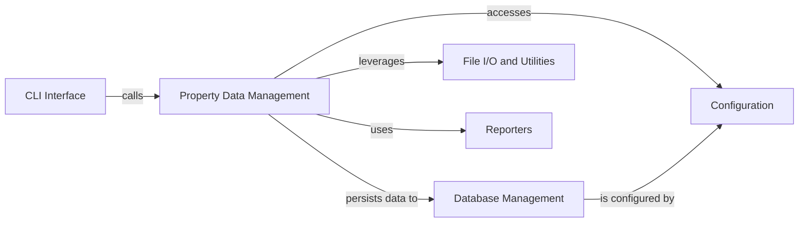

## Details

Analysis of Property Data Management within the MMP framework, focusing on components for loading, parsing, and storing external property data.

### Property Data Management [[Expand]](./Property_Data_Management.md)
This component is responsible for loading, parsing, and associating external property data with compounds. It handles reading various property file formats and structuring the data for database storage and retrieval.

**Related Classes/Methods**:

- <a href="https://github.com/rdkit/mmpdb/blob/master/mmpdblib/properties_io.py#L1-L1000" target="_blank" rel="noopener noreferrer">`mmpdblib.properties_io` (1:1000)</a>

### CLI Interface
Provides the command-line interface for interacting with the Property Data Management component, allowing users to trigger property loading operations.

**Related Classes/Methods**:

- <a href="https://github.com/rdkit/mmpdb/blob/master/mmpdblib/cli/loadprops.py#L87-L232" target="_blank" rel="noopener noreferrer">`mmpdblib.cli.loadprops` (87:232)</a>

### Database Management
Manages the database schema, connections, and persistence of property data. It provides the interface for storing and retrieving structured property information.

**Related Classes/Methods**:

- <a href="https://github.com/rdkit/mmpdb/blob/master/mmpdblib/schema.py#L1-L1000" target="_blank" rel="noopener noreferrer">`mmpdblib.schema` (1:1000)</a>
- <a href="https://github.com/rdkit/mmpdb/blob/master/mmpdblib/dbutils.py#L1-L1000" target="_blank" rel="noopener noreferrer">`mmpdblib.dbutils` (1:1000)</a>

### File I/O and Utilities
Provides general utility functions for file operations, data parsing, and potentially cheminformatics helpers used by the Property Data Management component.

**Related Classes/Methods**:

- <a href="https://github.com/rdkit/mmpdb/blob/master/mmpdblib/fileio.py#L1-L1000" target="_blank" rel="noopener noreferrer">`mmpdblib.fileio` (1:1000)</a>
- `mmpdblib.utils` (1:1000)

### Reporters
Handles reporting and logging of progress, errors, and results during the property data loading process.

**Related Classes/Methods**:

- <a href="https://github.com/rdkit/mmpdb/blob/master/mmpdblib/reporters.py#L1-L1000" target="_blank" rel="noopener noreferrer">`mmpdblib.reporters` (1:1000)</a>

### Configuration
Manages application-wide configuration settings, which might include database connection details, file paths, or parsing options relevant to property data loading.

**Related Classes/Methods**:

- <a href="https://github.com/rdkit/mmpdb/blob/master/mmpdblib/config.py#L1-L1000" target="_blank" rel="noopener noreferrer">`mmpdblib.config` (1:1000)</a>

### [FAQ](https://github.com/CodeBoarding/GeneratedOnBoardings/tree/main?tab=readme-ov-file#faq)