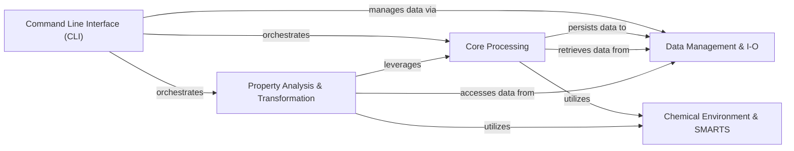

## Component Details

The MMPDB project is designed for managing and analyzing Matched Molecular Pairs (MMPs). Its core functionality revolves around fragmenting molecules, identifying and indexing MMPs, and then using these pairs for property prediction and molecular transformations. The system integrates robust database management for persistent storage and provides a comprehensive command-line interface for users to interact with its various capabilities, from data loading and indexing to advanced chemical analysis.

### Data Management & I-O
This component manages all persistent storage for MMPDB, including interactions with SQLite and PostgreSQL databases, fragment databases, and index writers. It also handles general file input/output operations and user reporting.

**Related Classes/Methods**:

- <a href="https://github.com/rdkit/mmpdb/blob/master/mmpdblib/dbutils.py#L336-L341" target="_blank" rel="noopener noreferrer">`mmpdb.mmpdblib.dbutils.open_database` (336:341)</a>
- <a href="https://github.com/rdkit/mmpdb/blob/master/mmpdblib/schema.py#L161-L163" target="_blank" rel="noopener noreferrer">`mmpdb.mmpdblib.schema.create_schema` (161:163)</a>
- <a href="https://github.com/rdkit/mmpdb/blob/master/mmpdblib/fragment_db.py#L96-L120" target="_blank" rel="noopener noreferrer">`mmpdb.mmpdblib.fragment_db.open_fragdb` (96:120)</a>
- <a href="https://github.com/rdkit/mmpdb/blob/master/mmpdblib/index_writers.py#L153-L154" target="_blank" rel="noopener noreferrer">`mmpdb.mmpdblib.index_writers.open_table_index_writer` (153:154)</a>
- <a href="https://github.com/rdkit/mmpdb/blob/master/mmpdblib/fileio.py#L531-L578" target="_blank" rel="noopener noreferrer">`mmpdb.mmpdblib.fileio.read_smiles_file` (531:578)</a>
- <a href="https://github.com/rdkit/mmpdb/blob/master/mmpdblib/reporters.py#L38-L47" target="_blank" rel="noopener noreferrer">`mmpdb.mmpdblib.reporters.get_reporter` (38:47)</a>
- <a href="https://github.com/rdkit/mmpdb/blob/master/mmpdblib/dbutils.py#L52-L56" target="_blank" rel="noopener noreferrer">`mmpdb.mmpdblib.dbutils.get_default_sqlite_adapter` (52:56)</a>
- <a href="https://github.com/rdkit/mmpdb/blob/master/mmpdblib/dbutils.py#L66-L87" target="_blank" rel="noopener noreferrer">`mmpdb.mmpdblib.dbutils.open_as_schema_database` (66:87)</a>
- <a href="https://github.com/rdkit/mmpdb/blob/master/mmpdblib/dbutils.py#L151-L163" target="_blank" rel="noopener noreferrer">`mmpdb.mmpdblib.dbutils.DBFile.open_database` (151:163)</a>
- <a href="https://github.com/rdkit/mmpdb/blob/master/mmpdblib/dbutils.py#L173-L180" target="_blank" rel="noopener noreferrer">`mmpdb.mmpdblib.dbutils.DBUrl.open_database` (173:180)</a>
- <a href="https://github.com/rdkit/mmpdb/blob/master/mmpdblib/dbutils.py#L183-L197" target="_blank" rel="noopener noreferrer">`mmpdb.mmpdblib.dbutils.get_database_server` (183:197)</a>
- <a href="https://github.com/rdkit/mmpdb/blob/master/mmpdblib/dbutils.py#L205-L217" target="_blank" rel="noopener noreferrer">`mmpdb.mmpdblib.dbutils.PostgresServer.get_mmpdb_databases` (205:217)</a>
- <a href="https://github.com/rdkit/mmpdb/blob/master/mmpdblib/dbutils.py#L255-L261" target="_blank" rel="noopener noreferrer">`mmpdb.mmpdblib.dbutils.get_dbinfo` (255:261)</a>
- <a href="https://github.com/rdkit/mmpdb/blob/master/mmpdblib/dbutils.py#L270-L271" target="_blank" rel="noopener noreferrer">`mmpdb.mmpdblib.dbutils.get_mmpdb_filenames_in_current_directory` (270:271)</a>
- `mmpdb.mmpdblib.dbutils.get_mmpdblib_filenames_in_directory` (full file reference)
- <a href="https://github.com/rdkit/mmpdb/blob/master/mmpdblib/dbutils.py#L286-L310" target="_blank" rel="noopener noreferrer">`mmpdb.mmpdblib.dbutils.iter_dbinfo` (286:310)</a>
- <a href="https://github.com/rdkit/mmpdb/blob/master/mmpdblib/dbutils.py#L313-L333" target="_blank" rel="noopener noreferrer">`mmpdb.mmpdblib.dbutils.iter_dbinfo_and_dataset` (313:333)</a>
- <a href="https://github.com/rdkit/mmpdb/blob/master/mmpdblib/dbutils.py#L347-L410" target="_blank" rel="noopener noreferrer">`mmpdb.mmpdblib.dbutils.reaggregate_properties` (347:410)</a>
- <a href="https://github.com/rdkit/mmpdb/blob/master/mmpdblib/schema.py#L96-L104" target="_blank" rel="noopener noreferrer">`mmpdb.mmpdblib.schema.get_schema_for_database` (96:104)</a>
- <a href="https://github.com/rdkit/mmpdb/blob/master/mmpdblib/schema.py#L125-L135" target="_blank" rel="noopener noreferrer">`mmpdb.mmpdblib.schema._execute_sql` (125:135)</a>
- <a href="https://github.com/rdkit/mmpdb/blob/master/mmpdblib/schema.py#L154-L158" target="_blank" rel="noopener noreferrer">`mmpdb.mmpdblib.schema.create_schema_for_sqlite` (154:158)</a>
- <a href="https://github.com/rdkit/mmpdb/blob/master/mmpdblib/schema.py#L165-L166" target="_blank" rel="noopener noreferrer">`mmpdb.mmpdblib.schema.create_index` (165:166)</a>
- <a href="https://github.com/rdkit/mmpdb/blob/master/mmpdblib/schema.py#L169-L170" target="_blank" rel="noopener noreferrer">`mmpdb.mmpdblib.schema.drop_index` (169:170)</a>
- <a href="https://github.com/rdkit/mmpdb/blob/master/mmpdblib/schema.py#L243-L244" target="_blank" rel="noopener noreferrer">`mmpdb.mmpdblib.schema.MMPDatabase.__exit__` (243:244)</a>
- <a href="https://github.com/rdkit/mmpdb/blob/master/mmpdblib/schema.py#L273-L324" target="_blank" rel="noopener noreferrer">`mmpdb.mmpdblib.schema.MMPDatabase.get_dataset` (273:324)</a>
- <a href="https://github.com/rdkit/mmpdb/blob/master/mmpdblib/schema.py#L368-L374" target="_blank" rel="noopener noreferrer">`mmpdb.mmpdblib.schema.RuleEnvironment.iter_pairs` (368:374)</a>
- <a href="https://github.com/rdkit/mmpdb/blob/master/mmpdblib/schema.py#L429-L439" target="_blank" rel="noopener noreferrer">`mmpdb.mmpdblib.schema.MMPDataset.get_table_sizes` (429:439)</a>
- <a href="https://github.com/rdkit/mmpdb/blob/master/mmpdblib/schema.py#L441-L443" target="_blank" rel="noopener noreferrer">`mmpdb.mmpdblib.schema.MMPDataset.get_property_name_rows` (441:443)</a>
- <a href="https://github.com/rdkit/mmpdb/blob/master/mmpdblib/schema.py#L449-L450" target="_blank" rel="noopener noreferrer">`mmpdb.mmpdblib.schema.MMPDataset.get_property_name_id` (449:450)</a>
- <a href="https://github.com/rdkit/mmpdb/blob/master/mmpdblib/schema.py#L452-L459" target="_blank" rel="noopener noreferrer">`mmpdb.mmpdblib.schema.MMPDataset.get_property_names_table` (452:459)</a>
- <a href="https://github.com/rdkit/mmpdb/blob/master/mmpdblib/schema.py#L461-L462" target="_blank" rel="noopener noreferrer">`mmpdb.mmpdblib.schema.MMPDataset.get_num_compounds` (461:462)</a>
- <a href="https://github.com/rdkit/mmpdb/blob/master/mmpdblib/schema.py#L464-L471" target="_blank" rel="noopener noreferrer">`mmpdb.mmpdblib.schema.MMPDataset.get_num_compound_properties` (464:471)</a>
- <a href="https://github.com/rdkit/mmpdb/blob/master/mmpdblib/schema.py#L473-L474" target="_blank" rel="noopener noreferrer">`mmpdb.mmpdblib.schema.MMPDataset.get_num_rules` (473:474)</a>
- <a href="https://github.com/rdkit/mmpdb/blob/master/mmpdblib/schema.py#L476-L477" target="_blank" rel="noopener noreferrer">`mmpdb.mmpdblib.schema.MMPDataset.get_num_pairs` (476:477)</a>
- <a href="https://github.com/rdkit/mmpdb/blob/master/mmpdblib/schema.py#L479-L480" target="_blank" rel="noopener noreferrer">`mmpdb.mmpdblib.schema.MMPDataset.get_num_rule_environments` (479:480)</a>
- <a href="https://github.com/rdkit/mmpdb/blob/master/mmpdblib/schema.py#L482-L483" target="_blank" rel="noopener noreferrer">`mmpdb.mmpdblib.schema.MMPDataset.get_num_rule_environment_stats` (482:483)</a>
- <a href="https://github.com/rdkit/mmpdb/blob/master/mmpdblib/schema.py#L485-L486" target="_blank" rel="noopener noreferrer">`mmpdb.mmpdblib.schema.MMPDataset.get_num_rule_smiles` (485:486)</a>
- <a href="https://github.com/rdkit/mmpdb/blob/master/mmpdblib/schema.py#L488-L489" target="_blank" rel="noopener noreferrer">`mmpdb.mmpdblib.schema.MMPDataset.get_num_constant_smiles` (488:489)</a>
- <a href="https://github.com/rdkit/mmpdb/blob/master/mmpdblib/schema.py#L491-L498" target="_blank" rel="noopener noreferrer">`mmpdb.mmpdblib.schema.MMPDataset.get_smallest_constant_smiles` (491:498)</a>
- <a href="https://github.com/rdkit/mmpdb/blob/master/mmpdblib/schema.py#L516-L534" target="_blank" rel="noopener noreferrer">`mmpdb.mmpdblib.schema.MMPDataset.get_or_add_property_name` (516:534)</a>
- <a href="https://github.com/rdkit/mmpdb/blob/master/mmpdblib/schema.py#L536-L552" target="_blank" rel="noopener noreferrer">`mmpdb.mmpdblib.schema.MMPDataset.get_fragment_options` (536:552)</a>
- <a href="https://github.com/rdkit/mmpdb/blob/master/mmpdblib/schema.py#L554-L562" target="_blank" rel="noopener noreferrer">`mmpdb.mmpdblib.schema.MMPDataset.get_index_options` (554:562)</a>
- <a href="https://github.com/rdkit/mmpdb/blob/master/mmpdblib/schema.py#L564-L566" target="_blank" rel="noopener noreferrer">`mmpdb.mmpdblib.schema.MMPDataset.get_rule_smiles_id` (564:566)</a>
- <a href="https://github.com/rdkit/mmpdb/blob/master/mmpdblib/schema.py#L618-L625" target="_blank" rel="noopener noreferrer">`mmpdb.mmpdblib.schema.MMPDataset.iter_rules` (618:625)</a>
- <a href="https://github.com/rdkit/mmpdb/blob/master/mmpdblib/schema.py#L627-L644" target="_blank" rel="noopener noreferrer">`mmpdb.mmpdblib.schema.MMPDataset.iter_rule_environments` (627:644)</a>
- <a href="https://github.com/rdkit/mmpdb/blob/master/mmpdblib/schema.py#L646-L660" target="_blank" rel="noopener noreferrer">`mmpdb.mmpdblib.schema.MMPDataset.iter_selected_property_rules` (646:660)</a>
- <a href="https://github.com/rdkit/mmpdb/blob/master/mmpdblib/schema.py#L662-L723" target="_blank" rel="noopener noreferrer">`mmpdb.mmpdblib.schema.MMPDataset._iter_selected_property_rules_both_smiles` (662:723)</a>
- <a href="https://github.com/rdkit/mmpdb/blob/master/mmpdblib/schema.py#L725-L778" target="_blank" rel="noopener noreferrer">`mmpdb.mmpdblib.schema.MMPDataset._iter_selected_property_rules_no_smiles` (725:778)</a>
- <a href="https://github.com/rdkit/mmpdb/blob/master/mmpdblib/schema.py#L780-L835" target="_blank" rel="noopener noreferrer">`mmpdb.mmpdblib.schema.MMPDataset._iter_selected_property_rules_one_smiles` (780:835)</a>
- <a href="https://github.com/rdkit/mmpdb/blob/master/mmpdblib/schema.py#L847-L932" target="_blank" rel="noopener noreferrer">`mmpdb.mmpdblib.schema.MMPDataset.get_property_rule` (847:932)</a>
- <a href="https://github.com/rdkit/mmpdb/blob/master/mmpdblib/schema.py#L1070-L1079" target="_blank" rel="noopener noreferrer">`mmpdb.mmpdblib.schema.MMPDataset.iter_pairs` (1070:1079)</a>
- <a href="https://github.com/rdkit/mmpdb/blob/master/mmpdblib/schema.py#L1081-L1138" target="_blank" rel="noopener noreferrer">`mmpdb.mmpdblib.schema.MMPDataset.get_property_rule_pairs` (1081:1138)</a>
- <a href="https://github.com/rdkit/mmpdb/blob/master/mmpdblib/schema.py#L1140-L1147" target="_blank" rel="noopener noreferrer">`mmpdb.mmpdblib.schema.MMPDataset.iter_compounds` (1140:1147)</a>
- <a href="https://github.com/rdkit/mmpdb/blob/master/mmpdblib/fragment_db.py#L72-L93" target="_blank" rel="noopener noreferrer">`mmpdb.mmpdblib.fragment_db.init_fragdb` (72:93)</a>
- <a href="https://github.com/rdkit/mmpdb/blob/master/mmpdblib/fragment_db.py#L142-L159" target="_blank" rel="noopener noreferrer">`mmpdb.mmpdblib.fragment_db.select_options` (142:159)</a>
- <a href="https://github.com/rdkit/mmpdb/blob/master/mmpdblib/fragment_db.py#L186-L198" target="_blank" rel="noopener noreferrer">`mmpdb.mmpdblib.fragment_db.select_fragment_record_by_title` (186:198)</a>
- <a href="https://github.com/rdkit/mmpdb/blob/master/mmpdblib/fragment_db.py#L213-L216" target="_blank" rel="noopener noreferrer">`mmpdb.mmpdblib.fragment_db.select_fragmentations_by_record_id` (213:216)</a>
- <a href="https://github.com/rdkit/mmpdb/blob/master/mmpdblib/fragment_db.py#L222-L230" target="_blank" rel="noopener noreferrer">`mmpdb.mmpdblib.fragment_db.iter_fragment_records` (222:230)</a>
- <a href="https://github.com/rdkit/mmpdb/blob/master/mmpdblib/fragment_db.py#L236-L244" target="_blank" rel="noopener noreferrer">`mmpdb.mmpdblib.fragment_db.iter_fragment_error_records` (236:244)</a>
- <a href="https://github.com/rdkit/mmpdb/blob/master/mmpdblib/fragment_db.py#L266-L271" target="_blank" rel="noopener noreferrer">`mmpdb.mmpdblib.fragment_db.select_fragment_error_record_by_title` (266:271)</a>
- <a href="https://github.com/rdkit/mmpdb/blob/master/mmpdblib/fragment_db.py#L284-L291" target="_blank" rel="noopener noreferrer">`mmpdb.mmpdblib.fragment_db.FragDBWriter.close` (284:291)</a>
- <a href="https://github.com/rdkit/mmpdb/blob/master/mmpdblib/fragment_db.py#L296-L297" target="_blank" rel="noopener noreferrer">`mmpdb.mmpdblib.fragment_db.FragDBWriter.__exit__` (296:297)</a>
- <a href="https://github.com/rdkit/mmpdb/blob/master/mmpdblib/fragment_db.py#L308-L316" target="_blank" rel="noopener noreferrer">`mmpdb.mmpdblib.fragment_db.FragDBWriter.write_records` (308:316)</a>
- <a href="https://github.com/rdkit/mmpdb/blob/master/mmpdblib/fragment_db.py#L329-L334" target="_blank" rel="noopener noreferrer">`mmpdb.mmpdblib.fragment_db.FragDB.get` (329:334)</a>
- <a href="https://github.com/rdkit/mmpdb/blob/master/mmpdblib/fragment_db.py#L339-L340" target="_blank" rel="noopener noreferrer">`mmpdb.mmpdblib.fragment_db.FragDB.__exit__` (339:340)</a>
- <a href="https://github.com/rdkit/mmpdb/blob/master/mmpdblib/fragment_db.py#L349-L350" target="_blank" rel="noopener noreferrer">`mmpdb.mmpdblib.fragment_db.FragDB.__iter__` (349:350)</a>
- <a href="https://github.com/rdkit/mmpdb/blob/master/mmpdblib/fragment_db.py#L352-L353" target="_blank" rel="noopener noreferrer">`mmpdb.mmpdblib.fragment_db.FragDB.iter_error_records` (352:353)</a>
- <a href="https://github.com/rdkit/mmpdb/blob/master/mmpdblib/fragment_db.py#L361-L372" target="_blank" rel="noopener noreferrer">`mmpdb.mmpdblib.fragment_db.open_fragment_writer` (361:372)</a>
- <a href="https://github.com/rdkit/mmpdb/blob/master/mmpdblib/index_writers.py#L101-L103" target="_blank" rel="noopener noreferrer">`mmpdb.mmpdblib.index_writers.TableIndexWriter.rollback` (101:103)</a>
- <a href="https://github.com/rdkit/mmpdb/blob/master/mmpdblib/index_writers.py#L105-L107" target="_blank" rel="noopener noreferrer">`mmpdb.mmpdblib.index_writers.TableIndexWriter.commit` (105:107)</a>
- <a href="https://github.com/rdkit/mmpdb/blob/master/mmpdblib/index_writers.py#L230-L236" target="_blank" rel="noopener noreferrer">`mmpdb.mmpdblib.index_writers.BaseRDBMSIndexWriter.__init__` (230:236)</a>
- <a href="https://github.com/rdkit/mmpdb/blob/master/mmpdblib/index_writers.py#L238-L252" target="_blank" rel="noopener noreferrer">`mmpdb.mmpdblib.index_writers.BaseRDBMSIndexWriter.prepare_sql_statements` (238:252)</a>
- <a href="https://github.com/rdkit/mmpdb/blob/master/mmpdblib/index_writers.py#L254-L256" target="_blank" rel="noopener noreferrer">`mmpdb.mmpdblib.index_writers.BaseRDBMSIndexWriter.prepare_single` (254:256)</a>
- <a href="https://github.com/rdkit/mmpdb/blob/master/mmpdblib/index_writers.py#L258-L260" target="_blank" rel="noopener noreferrer">`mmpdb.mmpdblib.index_writers.BaseRDBMSIndexWriter.prepare_many` (258:260)</a>
- <a href="https://github.com/rdkit/mmpdb/blob/master/mmpdblib/index_writers.py#L296-L313" target="_blank" rel="noopener noreferrer">`mmpdb.mmpdblib.index_writers.BaseRDBMSIndexWriter.end` (296:313)</a>
- <a href="https://github.com/rdkit/mmpdb/blob/master/mmpdblib/index_writers.py#L328-L330" target="_blank" rel="noopener noreferrer">`mmpdb.mmpdblib.index_writers.SingleIndexWriterMixin.add_rule_smiles` (328:330)</a>
- <a href="https://github.com/rdkit/mmpdb/blob/master/mmpdblib/index_writers.py#L393-L405" target="_blank" rel="noopener noreferrer">`mmpdb.mmpdblib.index_writers.BatchIndexWriterMixin.__init__` (393:405)</a>
- <a href="https://github.com/rdkit/mmpdb/blob/master/mmpdblib/index_writers.py#L410-L414" target="_blank" rel="noopener noreferrer">`mmpdb.mmpdblib.index_writers.BatchIndexWriterMixin.add_property_name` (410:414)</a>
- <a href="https://github.com/rdkit/mmpdb/blob/master/mmpdblib/index_writers.py#L416-L420" target="_blank" rel="noopener noreferrer">`mmpdb.mmpdblib.index_writers.BatchIndexWriterMixin.add_rule_smiles` (416:420)</a>
- <a href="https://github.com/rdkit/mmpdb/blob/master/mmpdblib/index_writers.py#L423-L427" target="_blank" rel="noopener noreferrer">`mmpdb.mmpdblib.index_writers.BatchIndexWriterMixin.add_rule` (423:427)</a>
- <a href="https://github.com/rdkit/mmpdb/blob/master/mmpdblib/index_writers.py#L429-L435" target="_blank" rel="noopener noreferrer">`mmpdb.mmpdblib.index_writers.BatchIndexWriterMixin.add_environment_fingerprint` (429:435)</a>
- <a href="https://github.com/rdkit/mmpdb/blob/master/mmpdblib/index_writers.py#L437-L442" target="_blank" rel="noopener noreferrer">`mmpdb.mmpdblib.index_writers.BatchIndexWriterMixin.add_rule_environment` (437:442)</a>
- <a href="https://github.com/rdkit/mmpdb/blob/master/mmpdblib/index_writers.py#L444-L450" target="_blank" rel="noopener noreferrer">`mmpdb.mmpdblib.index_writers.BatchIndexWriterMixin.add_compound` (444:450)</a>
- <a href="https://github.com/rdkit/mmpdb/blob/master/mmpdblib/index_writers.py#L452-L456" target="_blank" rel="noopener noreferrer">`mmpdb.mmpdblib.index_writers.BatchIndexWriterMixin.add_constant_smiles` (452:456)</a>
- <a href="https://github.com/rdkit/mmpdb/blob/master/mmpdblib/index_writers.py#L458-L462" target="_blank" rel="noopener noreferrer">`mmpdb.mmpdblib.index_writers.BatchIndexWriterMixin.add_rule_environment_pair` (458:462)</a>
- <a href="https://github.com/rdkit/mmpdb/blob/master/mmpdblib/index_writers.py#L465-L469" target="_blank" rel="noopener noreferrer">`mmpdb.mmpdblib.index_writers.BatchIndexWriterMixin.add_compound_property` (465:469)</a>
- <a href="https://github.com/rdkit/mmpdb/blob/master/mmpdblib/index_writers.py#L471-L475" target="_blank" rel="noopener noreferrer">`mmpdb.mmpdblib.index_writers.BatchIndexWriterMixin.add_rule_environment_statistics` (471:475)</a>
- <a href="https://github.com/rdkit/mmpdb/blob/master/mmpdblib/index_writers.py#L478-L498" target="_blank" rel="noopener noreferrer">`mmpdb.mmpdblib.index_writers.BatchIndexWriterMixin.flush` (478:498)</a>
- <a href="https://github.com/rdkit/mmpdb/blob/master/mmpdblib/index_writers.py#L541-L542" target="_blank" rel="noopener noreferrer">`mmpdb.mmpdblib.index_writers.BaseSQLiteIndexWriter.create_schema` (541:542)</a>
- <a href="https://github.com/rdkit/mmpdb/blob/master/mmpdblib/index_writers.py#L618-L642" target="_blank" rel="noopener noreferrer">`mmpdb.mmpdblib.index_writers.PostgresIndexWriter.create_schema` (618:642)</a>
- <a href="https://github.com/rdkit/mmpdb/blob/master/mmpdblib/index_writers.py#L664-L665" target="_blank" rel="noopener noreferrer">`mmpdb.mmpdblib.index_writers.FlatSQLFile.cursor` (664:665)</a>
- <a href="https://github.com/rdkit/mmpdb/blob/master/mmpdblib/index_writers.py#L670-L671" target="_blank" rel="noopener noreferrer">`mmpdb.mmpdblib.index_writers.FlatSQLFile.commit` (670:671)</a>
- <a href="https://github.com/rdkit/mmpdb/blob/master/mmpdblib/index_writers.py#L673-L674" target="_blank" rel="noopener noreferrer">`mmpdb.mmpdblib.index_writers.FlatSQLFile.rollback` (673:674)</a>
- <a href="https://github.com/rdkit/mmpdb/blob/master/mmpdblib/index_writers.py#L752-L753" target="_blank" rel="noopener noreferrer">`mmpdb.mmpdblib.index_writers.SQLiteSQLWriter.create_schema` (752:753)</a>
- <a href="https://github.com/rdkit/mmpdb/blob/master/mmpdblib/index_writers.py#L756-L757" target="_blank" rel="noopener noreferrer">`mmpdb.mmpdblib.index_writers.PostgresSQLWriter.create_schema` (756:757)</a>
- <a href="https://github.com/rdkit/mmpdb/blob/master/mmpdblib/index_writers.py#L760-L773" target="_blank" rel="noopener noreferrer">`mmpdb.mmpdblib.index_writers.open_sql_writer` (760:773)</a>
- <a href="https://github.com/rdkit/mmpdb/blob/master/mmpdblib/index_writers.py#L777-L827" target="_blank" rel="noopener noreferrer">`mmpdb.mmpdblib.index_writers.open_rdbms_index_writer` (777:827)</a>
- <a href="https://github.com/rdkit/mmpdb/blob/master/mmpdblib/index_writers.py#L836-L841" target="_blank" rel="noopener noreferrer">`mmpdb.mmpdblib.index_writers._open_output` (836:841)</a>
- <a href="https://github.com/rdkit/mmpdb/blob/master/mmpdblib/index_writers.py#L845-L850" target="_blank" rel="noopener noreferrer">`mmpdb.mmpdblib.index_writers._open_csv` (845:850)</a>
- <a href="https://github.com/rdkit/mmpdb/blob/master/mmpdblib/index_writers.py#L853-L855" target="_blank" rel="noopener noreferrer">`mmpdb.mmpdblib.index_writers._open_mmpa` (853:855)</a>
- <a href="https://github.com/rdkit/mmpdb/blob/master/mmpdblib/index_writers.py#L858-L861" target="_blank" rel="noopener noreferrer">`mmpdb.mmpdblib.index_writers._open_mmpdb` (858:861)</a>
- <a href="https://github.com/rdkit/mmpdb/blob/master/mmpdblib/index_writers.py#L864-L865" target="_blank" rel="noopener noreferrer">`mmpdb.mmpdblib.index_writers._open_sqlite_sql` (864:865)</a>
- <a href="https://github.com/rdkit/mmpdb/blob/master/mmpdblib/index_writers.py#L868-L869" target="_blank" rel="noopener noreferrer">`mmpdb.mmpdblib.index_writers._open_postgres_sql` (868:869)</a>
- <a href="https://github.com/rdkit/mmpdb/blob/master/mmpdblib/index_writers.py#L908-L912" target="_blank" rel="noopener noreferrer">`mmpdb.mmpdblib.index_writers.write_index_files` (908:912)</a>
- <a href="https://github.com/rdkit/mmpdb/blob/master/mmpdblib/index_writers.py#L941-L955" target="_blank" rel="noopener noreferrer">`mmpdb.mmpdblib.index_writers.write_sqlite_files` (941:955)</a>
- <a href="https://github.com/rdkit/mmpdb/blob/master/mmpdblib/index_writers.py#L998-L1017" target="_blank" rel="noopener noreferrer">`mmpdb.mmpdblib.index_writers.write_postgres_files` (998:1017)</a>
- <a href="https://github.com/rdkit/mmpdb/blob/master/mmpdblib/index_writers.py#L1053-L1058" target="_blank" rel="noopener noreferrer">`mmpdb.mmpdblib.index_writers.CSVDWriter.start` (1053:1058)</a>
- <a href="https://github.com/rdkit/mmpdb/blob/master/mmpdblib/index_writers.py#L1061-L1063" target="_blank" rel="noopener noreferrer">`mmpdb.mmpdblib.index_writers.CSVDWriter.rollback` (1061:1063)</a>
- <a href="https://github.com/rdkit/mmpdb/blob/master/mmpdblib/index_writers.py#L1068-L1069" target="_blank" rel="noopener noreferrer">`mmpdb.mmpdblib.index_writers.CSVDWriter.commit` (1068:1069)</a>
- <a href="https://github.com/rdkit/mmpdb/blob/master/mmpdblib/index_writers.py#L1084-L1089" target="_blank" rel="noopener noreferrer">`mmpdb.mmpdblib.index_writers.CSVDWriter.add_dataset` (1084:1089)</a>
- <a href="https://github.com/rdkit/mmpdb/blob/master/mmpdblib/index_writers.py#L1091-L1092" target="_blank" rel="noopener noreferrer">`mmpdb.mmpdblib.index_writers.CSVDWriter.add_property_name` (1091:1092)</a>
- <a href="https://github.com/rdkit/mmpdb/blob/master/mmpdblib/index_writers.py#L1094-L1096" target="_blank" rel="noopener noreferrer">`mmpdb.mmpdblib.index_writers.CSVDWriter.add_rule_smiles` (1094:1096)</a>
- <a href="https://github.com/rdkit/mmpdb/blob/master/mmpdblib/index_writers.py#L1110-L1114" target="_blank" rel="noopener noreferrer">`mmpdb.mmpdblib.index_writers.CSVDWriter.add_compound` (1110:1114)</a>
- <a href="https://github.com/rdkit/mmpdb/blob/master/mmpdblib/index_writers.py#L1116-L1117" target="_blank" rel="noopener noreferrer">`mmpdb.mmpdblib.index_writers.CSVDWriter.add_constant_smiles` (1116:1117)</a>
- <a href="https://github.com/rdkit/mmpdb/blob/master/mmpdblib/index_writers.py#L1128-L1135" target="_blank" rel="noopener noreferrer">`mmpdb.mmpdblib.index_writers.CSVDWriter.add_rule_environment_statistics` (1128:1135)</a>
- <a href="https://github.com/rdkit/mmpdb/blob/master/mmpdblib/index_writers.py#L1138-L1155" target="_blank" rel="noopener noreferrer">`mmpdb.mmpdblib.index_writers._open_csvd` (1138:1155)</a>
- <a href="https://github.com/rdkit/mmpdb/blob/master/mmpdblib/index_writers.py#L1178-L1183" target="_blank" rel="noopener noreferrer">`mmpdb.mmpdblib.index_writers.FormatInfo.open` (1178:1183)</a>
- <a href="https://github.com/rdkit/mmpdb/blob/master/mmpdblib/fileio.py#L54-L55" target="_blank" rel="noopener noreferrer">`mmpdb.mmpdblib.fileio.Outfile.__exit__` (54:55)</a>
- <a href="https://github.com/rdkit/mmpdb/blob/master/mmpdblib/fileio.py#L79-L102" target="_blank" rel="noopener noreferrer">`mmpdb.mmpdblib.fileio.open_output` (79:102)</a>
- <a href="https://github.com/rdkit/mmpdb/blob/master/mmpdblib/fileio.py#L206-L218" target="_blank" rel="noopener noreferrer">`mmpdb.mmpdblib.fileio.Location.from_source` (206:218)</a>
- <a href="https://github.com/rdkit/mmpdb/blob/master/mmpdblib/fileio.py#L221-L233" target="_blank" rel="noopener noreferrer">`mmpdb.mmpdblib.fileio.Location.from_destination` (221:233)</a>
- <a href="https://github.com/rdkit/mmpdb/blob/master/mmpdblib/fileio.py#L387-L420" target="_blank" rel="noopener noreferrer">`mmpdb.mmpdblib.fileio._read_smiles_file` (387:420)</a>
- <a href="https://github.com/rdkit/mmpdb/blob/master/mmpdblib/fileio.py#L427-L435" target="_blank" rel="noopener noreferrer">`mmpdb.mmpdblib.fileio._read_whitespace` (427:435)</a>
- <a href="https://github.com/rdkit/mmpdb/blob/master/mmpdblib/fileio.py#L444-L452" target="_blank" rel="noopener noreferrer">`mmpdb.mmpdblib.fileio._read_tab` (444:452)</a>
- <a href="https://github.com/rdkit/mmpdb/blob/master/mmpdblib/fileio.py#L461-L469" target="_blank" rel="noopener noreferrer">`mmpdb.mmpdblib.fileio._read_space` (461:469)</a>
- <a href="https://github.com/rdkit/mmpdb/blob/master/mmpdblib/fileio.py#L478-L486" target="_blank" rel="noopener noreferrer">`mmpdb.mmpdblib.fileio._read_comma` (478:486)</a>
- <a href="https://github.com/rdkit/mmpdb/blob/master/mmpdblib/fileio.py#L495-L503" target="_blank" rel="noopener noreferrer">`mmpdb.mmpdblib.fileio._read_to_eol` (495:503)</a>
- <a href="https://github.com/rdkit/mmpdb/blob/master/mmpdblib/reporters.py#L59-L61" target="_blank" rel="noopener noreferrer">`mmpdb.mmpdblib.reporters.BaseReporter.progress` (59:61)</a>
- <a href="https://github.com/rdkit/mmpdb/blob/master/mmpdblib/reporters.py#L67-L71" target="_blank" rel="noopener noreferrer">`mmpdb.mmpdblib.reporters.BaseReporter.explain` (67:71)</a>
- <a href="https://github.com/rdkit/mmpdb/blob/master/mmpdblib/reporters.py#L101-L105" target="_blank" rel="noopener noreferrer">`mmpdb.mmpdblib.reporters.Verbose.warning` (101:105)</a>
- <a href="https://github.com/rdkit/mmpdb/blob/master/mmpdblib/reporters.py#L107-L112" target="_blank" rel="noopener noreferrer">`mmpdb.mmpdblib.reporters.Verbose.report` (107:112)</a>
- <a href="https://github.com/rdkit/mmpdb/blob/master/mmpdblib/reporters.py#L114-L145" target="_blank" rel="noopener noreferrer">`mmpdb.mmpdblib.reporters.Verbose.progress` (114:145)</a>
- <a href="https://github.com/rdkit/mmpdb/blob/master/mmpdblib/properties_io.py#L62-L112" target="_blank" rel="noopener noreferrer">`mmpdb.mmpdblib.properties_io.load_properties` (62:112)</a>

### Core Processing
This component encompasses the fundamental algorithms for molecular fragmentation and the generation and processing of matched molecular pairs. It handles the breaking down of molecules into fragments and the subsequent identification and indexing of matched pairs.

**Related Classes/Methods**:

- <a href="https://github.com/rdkit/mmpdb/blob/master/mmpdblib/fragment_algorithm.py#L784-L816" target="_blank" rel="noopener noreferrer">`mmpdb.mmpdblib.fragment_algorithm.fragment_mol` (784:816)</a>
- <a href="https://github.com/rdkit/mmpdb/blob/master/mmpdblib/fragment_records.py#L135-L219" target="_blank" rel="noopener noreferrer">`mmpdb.mmpdblib.fragment_records.make_fragment_records` (135:219)</a>
- <a href="https://github.com/rdkit/mmpdb/blob/master/mmpdblib/fragment_types.py#L63-L87" target="_blank" rel="noopener noreferrer">`mmpdb.mmpdblib.fragment_types.FragmentOptions` (63:87)</a>
- <a href="https://github.com/rdkit/mmpdb/blob/master/mmpdblib/index_algorithm.py#L861-L1050" target="_blank" rel="noopener noreferrer">`mmpdb.mmpdblib.index_algorithm.find_matched_molecular_pairs` (861:1050)</a>
- <a href="https://github.com/rdkit/mmpdb/blob/master/mmpdblib/index_algorithm.py#L428-L476" target="_blank" rel="noopener noreferrer">`mmpdb.mmpdblib.index_algorithm.cansmirks` (428:476)</a>
- <a href="https://github.com/rdkit/mmpdb/blob/master/mmpdblib/fragment_algorithm.py#L246-L256" target="_blank" rel="noopener noreferrer">`mmpdb.mmpdblib.fragment_algorithm.get_chiral_flags` (246:256)</a>
- <a href="https://github.com/rdkit/mmpdb/blob/master/mmpdblib/fragment_algorithm.py#L283-L425" target="_blank" rel="noopener noreferrer">`mmpdb.mmpdblib.fragment_algorithm.make_single_cut` (283:425)</a>
- <a href="https://github.com/rdkit/mmpdb/blob/master/mmpdblib/fragment_algorithm.py#L466-L502" target="_blank" rel="noopener noreferrer">`mmpdb.mmpdblib.fragment_algorithm._init_canonical_order` (466:502)</a>
- <a href="https://github.com/rdkit/mmpdb/blob/master/mmpdblib/fragment_algorithm.py#L538-L562" target="_blank" rel="noopener noreferrer">`mmpdb.mmpdblib.fragment_algorithm.up_enumerate` (538:562)</a>
- <a href="https://github.com/rdkit/mmpdb/blob/master/mmpdblib/fragment_algorithm.py#L590-L781" target="_blank" rel="noopener noreferrer">`mmpdb.mmpdblib.fragment_algorithm.make_multiple_cuts` (590:781)</a>
- <a href="https://github.com/rdkit/mmpdb/blob/master/mmpdblib/fragment_algorithm.py#L828-L888" target="_blank" rel="noopener noreferrer">`mmpdb.mmpdblib.fragment_algorithm.get_hydrogen_fragmentations` (828:888)</a>
- <a href="https://github.com/rdkit/mmpdb/blob/master/mmpdblib/fragment_algorithm.py#L915-L963" target="_blank" rel="noopener noreferrer">`mmpdb.mmpdblib.fragment_algorithm.fragment_molecule_on_explicit_hydrogens` (915:963)</a>
- <a href="https://github.com/rdkit/mmpdb/blob/master/mmpdblib/fragment_records.py#L65-L88" target="_blank" rel="noopener noreferrer">`mmpdb.mmpdblib.fragment_records.parse_record` (65:88)</a>
- <a href="https://github.com/rdkit/mmpdb/blob/master/mmpdblib/fragment_records.py#L91-L105" target="_blank" rel="noopener noreferrer">`mmpdb.mmpdblib.fragment_records.make_hydrogen_fragment_record` (91:105)</a>
- <a href="https://github.com/rdkit/mmpdb/blob/master/mmpdblib/fragment_records.py#L110-L111" target="_blank" rel="noopener noreferrer">`mmpdb.mmpdblib.fragment_records.SingleProcessPool.apply_async` (110:111)</a>
- <a href="https://github.com/rdkit/mmpdb/blob/master/mmpdblib/fragment_records.py#L236-L245" target="_blank" rel="noopener noreferrer">`mmpdb.mmpdblib.fragment_records.make_fragment_record_from_smiles` (236:245)</a>
- <a href="https://github.com/rdkit/mmpdb/blob/master/mmpdblib/fragment_types.py#L86-L87" target="_blank" rel="noopener noreferrer">`mmpdb.mmpdblib.fragment_types.FragmentOptions.get_fragment_filter` (86:87)</a>
- <a href="https://github.com/rdkit/mmpdb/blob/master/mmpdblib/fragment_types.py#L310-L325" target="_blank" rel="noopener noreferrer">`mmpdb.mmpdblib.fragment_types.FragmentFilter.get_cut_lists` (310:325)</a>
- <a href="https://github.com/rdkit/mmpdb/blob/master/mmpdblib/fragment_types.py#L328-L366" target="_blank" rel="noopener noreferrer">`mmpdb.mmpdblib.fragment_types.get_fragment_filter` (328:366)</a>
- <a href="https://github.com/rdkit/mmpdb/blob/master/mmpdblib/index_algorithm.py#L227-L243" target="_blank" rel="noopener noreferrer">`mmpdb.mmpdblib.index_algorithm._check_sym_funcs` (227:243)</a>
- <a href="https://github.com/rdkit/mmpdb/blob/master/mmpdblib/index_algorithm.py#L282-L336" target="_blank" rel="noopener noreferrer">`mmpdb.mmpdblib.index_algorithm._get_smirks_order` (282:336)</a>
- <a href="https://github.com/rdkit/mmpdb/blob/master/mmpdblib/index_algorithm.py#L339-L373" target="_blank" rel="noopener noreferrer">`mmpdb.mmpdblib.index_algorithm._init_cansmirks_table` (339:373)</a>
- <a href="https://github.com/rdkit/mmpdb/blob/master/mmpdblib/index_algorithm.py#L415-L422" target="_blank" rel="noopener noreferrer">`mmpdb.mmpdblib.index_algorithm.RelabelCache.__missing__` (415:422)</a>
- <a href="https://github.com/rdkit/mmpdb/blob/master/mmpdblib/index_algorithm.py#L508-L582" target="_blank" rel="noopener noreferrer">`mmpdb.mmpdblib.index_algorithm.load_fragment_index` (508:582)</a>
- <a href="https://github.com/rdkit/mmpdb/blob/master/mmpdblib/index_algorithm.py#L639-L642" target="_blank" rel="noopener noreferrer">`mmpdb.mmpdblib.index_algorithm._NumHeaviesCache.__missing__` (639:642)</a>
- <a href="https://github.com/rdkit/mmpdb/blob/master/mmpdblib/index_algorithm.py#L735-L740" target="_blank" rel="noopener noreferrer">`mmpdb.mmpdblib.index_algorithm.EnvironmentCache.get_or_compute_centers` (735:740)</a>
- <a href="https://github.com/rdkit/mmpdb/blob/master/mmpdblib/index_algorithm.py#L742-L749" target="_blank" rel="noopener noreferrer">`mmpdb.mmpdblib.index_algorithm.EnvironmentCache.get_or_compute_center_radii` (742:749)</a>
- <a href="https://github.com/rdkit/mmpdb/blob/master/mmpdblib/index_algorithm.py#L751-L771" target="_blank" rel="noopener noreferrer">`mmpdb.mmpdblib.index_algorithm.EnvironmentCache.get_or_compute_constant_environment` (751:771)</a>
- <a href="https://github.com/rdkit/mmpdb/blob/master/mmpdblib/index_algorithm.py#L789-L840" target="_blank" rel="noopener noreferrer">`mmpdb.mmpdblib.index_algorithm.VariableFragmentsReducer.get_or_compute_variable_fragments` (789:840)</a>
- <a href="https://github.com/rdkit/mmpdb/blob/master/mmpdblib/index_algorithm.py#L842-L858" target="_blank" rel="noopener noreferrer">`mmpdb.mmpdblib.index_algorithm.VariableFragmentsReducer.transformation_is_reducible` (842:858)</a>
- <a href="https://github.com/rdkit/mmpdb/blob/master/mmpdblib/index_algorithm.py#L1163-L1179" target="_blank" rel="noopener noreferrer">`mmpdb.mmpdblib.index_algorithm.RuleEnvironmentTable.__missing__` (1163:1179)</a>
- <a href="https://github.com/rdkit/mmpdb/blob/master/mmpdblib/index_algorithm.py#L1249-L1267" target="_blank" rel="noopener noreferrer">`mmpdb.mmpdblib.index_algorithm.MMPWriter.start` (1249:1267)</a>
- <a href="https://github.com/rdkit/mmpdb/blob/master/mmpdblib/index_algorithm.py#L1269-L1290" target="_blank" rel="noopener noreferrer">`mmpdb.mmpdblib.index_algorithm.MMPWriter.end` (1269:1290)</a>
- <a href="https://github.com/rdkit/mmpdb/blob/master/mmpdblib/index_algorithm.py#L1292-L1336" target="_blank" rel="noopener noreferrer">`mmpdb.mmpdblib.index_algorithm.MMPWriter.write_matched_molecule_pairs` (1292:1336)</a>
- <a href="https://github.com/rdkit/mmpdb/blob/master/mmpdblib/index_algorithm.py#L1338-L1357" target="_blank" rel="noopener noreferrer">`mmpdb.mmpdblib.index_algorithm.MMPWriter._get_rule_environments` (1338:1357)</a>
- <a href="https://github.com/rdkit/mmpdb/blob/master/mmpdblib/index_algorithm.py#L1368-L1388" target="_blank" rel="noopener noreferrer">`mmpdb.mmpdblib.index_algorithm.open_mmpa_writer` (1368:1388)</a>
- <a href="https://github.com/rdkit/mmpdb/blob/master/mmpdblib/index_algorithm.py#L1471-L1492" target="_blank" rel="noopener noreferrer">`mmpdb.mmpdblib.index_algorithm.compute_quartiles` (1471:1492)</a>
- <a href="https://github.com/rdkit/mmpdb/blob/master/mmpdblib/index_algorithm.py#L1530-L1618" target="_blank" rel="noopener noreferrer">`mmpdb.mmpdblib.index_algorithm.compute_aggregate_values` (1530:1618)</a>
- <a href="https://github.com/rdkit/mmpdb/blob/master/mmpdblib/index_algorithm.py#L1621-L1648" target="_blank" rel="noopener noreferrer">`mmpdb.mmpdblib.index_algorithm.test_aggregate_values` (1621:1648)</a>
- <a href="https://github.com/rdkit/mmpdb/blob/master/mmpdblib/index_types.py#L114-L133" target="_blank" rel="noopener noreferrer">`mmpdb.mmpdblib.index_types.IndexOptions.get_fragment_filter` (114:133)</a>

### Chemical Environment & SMARTS
This component is responsible for computing chemical environments around molecular centers, generating SMARTS patterns, and converting R-group definitions into SMARTS. It also handles various manipulations of SMILES strings, including wildcard conversions.

**Related Classes/Methods**:

- <a href="https://github.com/rdkit/mmpdb/blob/master/mmpdblib/environment.py#L228-L302" target="_blank" rel="noopener noreferrer">`mmpdb.mmpdblib.environment.get_environment_smarts_list_for_center` (228:302)</a>
- <a href="https://github.com/rdkit/mmpdb/blob/master/mmpdblib/rgroup2smarts.py#L310-L315" target="_blank" rel="noopener noreferrer">`mmpdb.mmpdblib.rgroup2smarts.get_recursive_smarts_from_cut_rgroups` (310:315)</a>
- <a href="https://github.com/rdkit/mmpdb/blob/master/mmpdblib/environment.py#L81-L121" target="_blank" rel="noopener noreferrer">`mmpdb.mmpdblib.environment.find_centers` (81:121)</a>
- <a href="https://github.com/rdkit/mmpdb/blob/master/mmpdblib/environment.py#L125-L126" target="_blank" rel="noopener noreferrer">`mmpdb.mmpdblib.environment.iter_num_atoms_for_radii` (125:126)</a>
- <a href="https://github.com/rdkit/mmpdb/blob/master/mmpdblib/environment.py#L130-L153" target="_blank" rel="noopener noreferrer">`mmpdb.mmpdblib.environment._iter_num_atoms_for_radii` (130:153)</a>
- <a href="https://github.com/rdkit/mmpdb/blob/master/mmpdblib/environment.py#L393-L405" target="_blank" rel="noopener noreferrer">`mmpdb.mmpdblib.environment.compute_constant_environment_from_centers` (393:405)</a>
- <a href="https://github.com/rdkit/mmpdb/blob/master/mmpdblib/environment.py#L435-L448" target="_blank" rel="noopener noreferrer">`mmpdb.mmpdblib.environment.compute_constant_center_smarts_list` (435:448)</a>
- <a href="https://github.com/rdkit/mmpdb/blob/master/mmpdblib/environment.py#L490-L551" target="_blank" rel="noopener noreferrer">`mmpdb.mmpdblib.environment.compute_possible_smarts_environments` (490:551)</a>
- <a href="https://github.com/rdkit/mmpdb/blob/master/mmpdblib/environment.py#L553-L558" target="_blank" rel="noopener noreferrer">`mmpdb.mmpdblib.environment.get_all_possible_smarts` (553:558)</a>
- <a href="https://github.com/rdkit/mmpdb/blob/master/mmpdblib/smiles_syntax.py#L176-L185" target="_blank" rel="noopener noreferrer">`mmpdb.mmpdblib.smiles_syntax.convert_labeled_wildcards_to_closures` (176:185)</a>
- <a href="https://github.com/rdkit/mmpdb/blob/master/mmpdblib/smiles_syntax.py#L69-L168" target="_blank" rel="noopener noreferrer">`mmpdb.mmpdblib.smiles_syntax.convert_wildcards_to_closures` (69:168)</a>
- <a href="https://github.com/rdkit/mmpdb/blob/master/mmpdblib/rgroup2smarts.py#L195-L226" target="_blank" rel="noopener noreferrer">`mmpdb.mmpdblib.rgroup2smarts.parse_rgroup_file` (195:226)</a>
- <a href="https://github.com/rdkit/mmpdb/blob/master/mmpdblib/rgroup2smarts.py#L248-L259" target="_blank" rel="noopener noreferrer">`mmpdb.mmpdblib.rgroup2smarts.iter_smiles_list` (248:259)</a>
- <a href="https://github.com/rdkit/mmpdb/blob/master/mmpdblib/rgroup2smarts.py#L262-L297" target="_blank" rel="noopener noreferrer">`mmpdb.mmpdblib.rgroup2smarts.iter_smiles_as_smarts` (262:297)</a>
- <a href="https://github.com/rdkit/mmpdb/blob/master/mmpdblib/rgroup2smarts.py#L318-L323" target="_blank" rel="noopener noreferrer">`mmpdb.mmpdblib.rgroup2smarts.get_recursive_smarts_from_cut_filename` (318:323)</a>

### Property Analysis & Transformation
This component provides the core logic for analyzing matched molecular pairs, predicting properties, and transforming molecules. It includes functions for defining rule selection criteria, performing predictions based on chemical environments, and generating molecular transformations.

**Related Classes/Methods**:

- <a href="https://github.com/rdkit/mmpdb/blob/master/mmpdblib/analysis_algorithms.py#L489-L649" target="_blank" rel="noopener noreferrer">`mmpdb.mmpdblib.analysis_algorithms.make_prediction` (489:649)</a>
- <a href="https://github.com/rdkit/mmpdb/blob/master/mmpdblib/analysis_algorithms.py#L1088-L1292" target="_blank" rel="noopener noreferrer">`mmpdb.mmpdblib.analysis_algorithms.make_transform` (1088:1292)</a>
- <a href="https://github.com/rdkit/mmpdb/blob/master/mmpdblib/analysis_algorithms.py#L130-L161" target="_blank" rel="noopener noreferrer">`mmpdb.mmpdblib.analysis_algorithms.get_where_function` (130:161)</a>
- <a href="https://github.com/rdkit/mmpdb/blob/master/mmpdblib/analysis_algorithms.py#L186-L220" target="_blank" rel="noopener noreferrer">`mmpdb.mmpdblib.analysis_algorithms.get_score_function` (186:220)</a>
- <a href="https://github.com/rdkit/mmpdb/blob/master/mmpdblib/analysis_algorithms.py#L247-L273" target="_blank" rel="noopener noreferrer">`mmpdb.mmpdblib.analysis_algorithms.RuleSelectionFunction.__call__` (247:273)</a>
- <a href="https://github.com/rdkit/mmpdb/blob/master/mmpdblib/analysis_algorithms.py#L339-L347" target="_blank" rel="noopener noreferrer">`mmpdb.mmpdblib.analysis_algorithms.get_rule_selection_function` (339:347)</a>
- <a href="https://github.com/rdkit/mmpdb/blob/master/mmpdblib/analysis_algorithms.py#L350-L363" target="_blank" rel="noopener noreferrer">`mmpdb.mmpdblib.analysis_algorithms.get_rule_selection_function_from_args` (350:363)</a>
- <a href="https://github.com/rdkit/mmpdb/blob/master/mmpdblib/analysis_algorithms.py#L412-L413" target="_blank" rel="noopener noreferrer">`mmpdb.mmpdblib.analysis_algorithms.get_predict_tool` (412:413)</a>
- <a href="https://github.com/rdkit/mmpdb/blob/master/mmpdblib/analysis_algorithms.py#L417-L434" target="_blank" rel="noopener noreferrer">`mmpdb.mmpdblib.analysis_algorithms.PredictTool.fragment_predict_smiles` (417:434)</a>
- <a href="https://github.com/rdkit/mmpdb/blob/master/mmpdblib/analysis_algorithms.py#L436-L449" target="_blank" rel="noopener noreferrer">`mmpdb.mmpdblib.analysis_algorithms.PredictTool.fragment_reference_smiles` (436:449)</a>
- <a href="https://github.com/rdkit/mmpdb/blob/master/mmpdblib/analysis_algorithms.py#L451-L473" target="_blank" rel="noopener noreferrer">`mmpdb.mmpdblib.analysis_algorithms.PredictTool.predict` (451:473)</a>
- <a href="https://github.com/rdkit/mmpdb/blob/master/mmpdblib/analysis_algorithms.py#L704-L705" target="_blank" rel="noopener noreferrer">`mmpdb.mmpdblib.analysis_algorithms._format_object_attributes_to_string` (704:705)</a>
- <a href="https://github.com/rdkit/mmpdb/blob/master/mmpdblib/analysis_algorithms.py#L759-L771" target="_blank" rel="noopener noreferrer">`mmpdb.mmpdblib.analysis_algorithms.PredictResult.format_property_rule` (759:771)</a>
- <a href="https://github.com/rdkit/mmpdb/blob/master/mmpdblib/analysis_algorithms.py#L773-L790" target="_blank" rel="noopener noreferrer">`mmpdb.mmpdblib.analysis_algorithms.PredictResult.write_property_rules` (773:790)</a>
- <a href="https://github.com/rdkit/mmpdb/blob/master/mmpdblib/analysis_algorithms.py#L800-L803" target="_blank" rel="noopener noreferrer">`mmpdb.mmpdblib.analysis_algorithms.PredictResult.format_property_rule_pair` (800:803)</a>
- <a href="https://github.com/rdkit/mmpdb/blob/master/mmpdblib/analysis_algorithms.py#L805-L816" target="_blank" rel="noopener noreferrer">`mmpdb.mmpdblib.analysis_algorithms.PredictResult.write_property_rule_pairs` (805:816)</a>
- <a href="https://github.com/rdkit/mmpdb/blob/master/mmpdblib/analysis_algorithms.py#L819-L837" target="_blank" rel="noopener noreferrer">`mmpdb.mmpdblib.analysis_algorithms.test_predict` (819:837)</a>
- <a href="https://github.com/rdkit/mmpdb/blob/master/mmpdblib/analysis_algorithms.py#L843-L844" target="_blank" rel="noopener noreferrer">`mmpdb.mmpdblib.analysis_algorithms.get_transform_tool` (843:844)</a>
- <a href="https://github.com/rdkit/mmpdb/blob/master/mmpdblib/analysis_algorithms.py#L848-L857" target="_blank" rel="noopener noreferrer">`mmpdb.mmpdblib.analysis_algorithms.TransformTool.fragment_transform_smiles` (848:857)</a>
- <a href="https://github.com/rdkit/mmpdb/blob/master/mmpdblib/analysis_algorithms.py#L859-L895" target="_blank" rel="noopener noreferrer">`mmpdb.mmpdblib.analysis_algorithms.TransformTool.transform` (859:895)</a>
- <a href="https://github.com/rdkit/mmpdb/blob/master/mmpdblib/analysis_algorithms.py#L1033-L1062" target="_blank" rel="noopener noreferrer">`mmpdb.mmpdblib.analysis_algorithms.weld_fragments` (1033:1062)</a>
- <a href="https://github.com/rdkit/mmpdb/blob/master/mmpdblib/analysis_algorithms.py#L1065-L1085" target="_blank" rel="noopener noreferrer">`mmpdb.mmpdblib.analysis_algorithms._weld_and_filter` (1065:1085)</a>
- <a href="https://github.com/rdkit/mmpdb/blob/master/mmpdblib/analysis_algorithms.py#L1301-L1370" target="_blank" rel="noopener noreferrer">`mmpdb.mmpdblib.analysis_algorithms.iter_transform_products` (1301:1370)</a>
- <a href="https://github.com/rdkit/mmpdb/blob/master/mmpdblib/analysis_algorithms.py#L1410-L1437" target="_blank" rel="noopener noreferrer">`mmpdb.mmpdblib.analysis_algorithms.TransformResult.write_products` (1410:1437)</a>
- <a href="https://github.com/rdkit/mmpdb/blob/master/mmpdblib/analysis_algorithms.py#L1440-L1449" target="_blank" rel="noopener noreferrer">`mmpdb.mmpdblib.analysis_algorithms.test_transform` (1440:1449)</a>
- <a href="https://github.com/rdkit/mmpdb/blob/master/mmpdblib/config.py#L240-L256" target="_blank" rel="noopener noreferrer">`mmpdb.mmpdblib.config.RuleSelectionOptions.get_rule_selection_function` (240:256)</a>

### Command Line Interface (CLI)
This component provides the entire command-line interface for the MMPDB application. It includes the main entry point, handles global configuration, parses command-line arguments, and orchestrates all specific commands for data operations (fragmentation, indexing, merging), analysis (prediction, transformation, generation), and auxiliary functions (help, file splitting, R-group conversion, listing databases).

**Related Classes/Methods**:

- `mmpdb.mmpdblib.cli.main` (full file reference)
- <a href="https://github.com/rdkit/mmpdb/blob/master/mmpdblib/cli/click_utils.py#L323-L343" target="_blank" rel="noopener noreferrer">`mmpdb.mmpdblib.cli.click_utils.add_single_database_parameters` (323:343)</a>
- <a href="https://github.com/rdkit/mmpdb/blob/master/mmpdblib/cli/fragment_click.py#L91-L218" target="_blank" rel="noopener noreferrer">`mmpdb.mmpdblib.cli.fragment_click.add_fragment_options` (91:218)</a>
- <a href="https://github.com/rdkit/mmpdb/blob/master/mmpdblib/cli/fragment.py#L189-L285" target="_blank" rel="noopener noreferrer">`mmpdb.mmpdblib.cli.fragment.fragment` (189:285)</a>
- <a href="https://github.com/rdkit/mmpdb/blob/master/mmpdblib/cli/index.py#L404-L525" target="_blank" rel="noopener noreferrer">`mmpdb.mmpdblib.cli.index.index` (404:525)</a>
- <a href="https://github.com/rdkit/mmpdb/blob/master/mmpdblib/cli/merge.py#L886-L969" target="_blank" rel="noopener noreferrer">`mmpdb.mmpdblib.cli.merge.merge` (886:969)</a>
- <a href="https://github.com/rdkit/mmpdb/blob/master/mmpdblib/cli/fragdb_partition.py#L594-L749" target="_blank" rel="noopener noreferrer">`mmpdb.mmpdblib.cli.fragdb_partition.fragdb_partition` (594:749)</a>
- <a href="https://github.com/rdkit/mmpdb/blob/master/mmpdblib/cli/loadprops.py#L87-L232" target="_blank" rel="noopener noreferrer">`mmpdb.mmpdblib.cli.loadprops.loadprops` (87:232)</a>
- <a href="https://github.com/rdkit/mmpdb/blob/master/mmpdblib/cli/predict.py#L181-L340" target="_blank" rel="noopener noreferrer">`mmpdb.mmpdblib.cli.predict.predict` (181:340)</a>
- <a href="https://github.com/rdkit/mmpdb/blob/master/mmpdblib/cli/transform.py#L321-L447" target="_blank" rel="noopener noreferrer">`mmpdb.mmpdblib.cli.transform.transform` (321:447)</a>
- <a href="https://github.com/rdkit/mmpdb/blob/master/mmpdblib/cli/generate.py#L648-L773" target="_blank" rel="noopener noreferrer">`mmpdb.mmpdblib.cli.generate.generate` (648:773)</a>
- <a href="https://github.com/rdkit/mmpdb/blob/master/mmpdblib/cli/rulecat.py#L20-L35" target="_blank" rel="noopener noreferrer">`mmpdb.mmpdblib.cli.rulecat.rulecat` (20:35)</a>
- <a href="https://github.com/rdkit/mmpdb/blob/master/mmpdblib/cli/proprulecat.py#L474-L557" target="_blank" rel="noopener noreferrer">`mmpdb.mmpdblib.cli.proprulecat.proprulecat` (474:557)</a>
- <a href="https://github.com/rdkit/mmpdb/blob/master/mmpdblib/cli/help_.py#L107-L110" target="_blank" rel="noopener noreferrer">`mmpdb.mmpdblib.cli.help_.help_` (107:110)</a>
- <a href="https://github.com/rdkit/mmpdb/blob/master/mmpdblib/cli/smi_split.py#L112-L191" target="_blank" rel="noopener noreferrer">`mmpdb.mmpdblib.cli.smi_split.smi_split` (112:191)</a>
- <a href="https://github.com/rdkit/mmpdb/blob/master/mmpdblib/cli/rgroup2smarts.py#L110-L201" target="_blank" rel="noopener noreferrer">`mmpdb.mmpdblib.cli.rgroup2smarts.rgroup2smarts` (110:201)</a>
- <a href="https://github.com/rdkit/mmpdb/blob/master/mmpdblib/cli/smi_utils.py#L46-L53" target="_blank" rel="noopener noreferrer">`mmpdb.mmpdblib.cli.smi_utils.SmiInputOptions.read_smiles_file` (46:53)</a>
- <a href="https://github.com/rdkit/mmpdb/blob/master/mmpdblib/cli/smi_utils.py#L56-L101" target="_blank" rel="noopener noreferrer">`mmpdb.mmpdblib.cli.smi_utils.add_input_options` (56:101)</a>
- <a href="https://github.com/rdkit/mmpdb/blob/master/mmpdblib/cli/click_utils.py#L346-L367" target="_blank" rel="noopener noreferrer">`mmpdb.mmpdblib.cli.click_utils.add_multiple_databases_parameters` (346:367)</a>
- <a href="https://github.com/rdkit/mmpdb/blob/master/mmpdblib/cli/click_utils.py#L406-L418" target="_blank" rel="noopener noreferrer">`mmpdb.mmpdblib.cli.click_utils.parse_where.convert` (406:418)</a>
- <a href="https://github.com/rdkit/mmpdb/blob/master/mmpdblib/cli/click_utils.py#L424-L435" target="_blank" rel="noopener noreferrer">`mmpdb.mmpdblib.cli.click_utils.parse_score.convert` (424:435)</a>
- <a href="https://github.com/rdkit/mmpdb/blob/master/mmpdblib/cli/click_utils.py#L480-L521" target="_blank" rel="noopener noreferrer">`mmpdb.mmpdblib.cli.click_utils.add_rule_selection_options` (480:521)</a>
- <a href="https://github.com/rdkit/mmpdb/blob/master/mmpdblib/cli/click_utils.py#L527-L553" target="_blank" rel="noopener noreferrer">`mmpdb.mmpdblib.cli.click_utils.get_property_names_or_error` (527:553)</a>
- <a href="https://github.com/rdkit/mmpdb/blob/master/mmpdblib/cli/click_utils.py#L556-L568" target="_blank" rel="noopener noreferrer">`mmpdb.mmpdblib.cli.click_utils.open_fragdb_from_options_or_exit` (556:568)</a>
- <a href="https://github.com/rdkit/mmpdb/blob/master/mmpdblib/cli/click_utils.py#L570-L580" target="_blank" rel="noopener noreferrer">`mmpdb.mmpdblib.cli.click_utils.open_database_from_options_or_exit` (570:580)</a>
- <a href="https://github.com/rdkit/mmpdb/blob/master/mmpdblib/cli/click_utils.py#L583-L589" target="_blank" rel="noopener noreferrer">`mmpdb.mmpdblib.cli.click_utils.open_dataset_from_options_or_exit` (583:589)</a>
- <a href="https://github.com/rdkit/mmpdb/blob/master/mmpdblib/cli/fragment_click.py#L224-L287" target="_blank" rel="noopener noreferrer">`mmpdb.mmpdblib.cli.fragment_click.make_fragment_options` (224:287)</a>
- `mmpdb.mmpdblib.cli.CmdConfig.__init__` (full file reference)
- `mmpdb.mmpdblib.cli.CmdConfig.set_explain` (full file reference)
- `mmpdb.mmpdblib.cli.MultiCommand.format_commands` (full file reference)
- <a href="https://github.com/rdkit/mmpdb/blob/master/mmpdblib/cli/index.py#L70-L179" target="_blank" rel="noopener noreferrer">`mmpdb.mmpdblib.cli.index.add_index_options` (70:179)</a>
- <a href="https://github.com/rdkit/mmpdb/blob/master/mmpdblib/cli/smifrag.py#L64-L169" target="_blank" rel="noopener noreferrer">`mmpdb.mmpdblib.cli.smifrag.smifrag` (64:169)</a>
- <a href="https://github.com/rdkit/mmpdb/blob/master/mmpdblib/cli/fragment.py#L57-L65" target="_blank" rel="noopener noreferrer">`mmpdb.mmpdblib.cli.fragment.create_pool` (57:65)</a>
- <a href="https://github.com/rdkit/mmpdb/blob/master/mmpdblib/cli/fragment.py#L144-L156" target="_blank" rel="noopener noreferrer">`mmpdb.mmpdblib.cli.fragment.cannot_combine_with_fragment_options` (144:156)</a>
- <a href="https://github.com/rdkit/mmpdb/blob/master/mmpdblib/cli/fragment.py#L292-L293" target="_blank" rel="noopener noreferrer">`mmpdb.mmpdblib.cli.fragment.fragdb_utils` (292:293)</a>
- <a href="https://github.com/rdkit/mmpdb/blob/master/mmpdblib/cli/index.py#L206-L216" target="_blank" rel="noopener noreferrer">`mmpdb.mmpdblib.cli.index.get_memory_use` (206:216)</a>
- <a href="https://github.com/rdkit/mmpdb/blob/master/mmpdblib/cli/generate.py#L33-L34" target="_blank" rel="noopener noreferrer">`mmpdb.mmpdblib.cli.generate.add_label_1` (33:34)</a>
- <a href="https://github.com/rdkit/mmpdb/blob/master/mmpdblib/cli/generate.py#L36-L40" target="_blank" rel="noopener noreferrer">`mmpdb.mmpdblib.cli.generate._add_label` (36:40)</a>
- <a href="https://github.com/rdkit/mmpdb/blob/master/mmpdblib/cli/generate.py#L42-L51" target="_blank" rel="noopener noreferrer">`mmpdb.mmpdblib.cli.generate.parse_smiles_then_fragment` (42:51)</a>
- <a href="https://github.com/rdkit/mmpdb/blob/master/mmpdblib/cli/generate.py#L53-L56" target="_blank" rel="noopener noreferrer">`mmpdb.mmpdblib.cli.generate.check_no_wildcards` (53:56)</a>
- <a href="https://github.com/rdkit/mmpdb/blob/master/mmpdblib/cli/generate.py#L61-L127" target="_blank" rel="noopener noreferrer">`mmpdb.mmpdblib.cli.generate.sanitize_atom_properties` (61:127)</a>
- <a href="https://github.com/rdkit/mmpdb/blob/master/mmpdblib/cli/generate.py#L138-L157" target="_blank" rel="noopener noreferrer">`mmpdb.mmpdblib.cli.generate.SmilesType.convert` (138:157)</a>
- <a href="https://github.com/rdkit/mmpdb/blob/master/mmpdblib/cli/generate.py#L163-L179" target="_blank" rel="noopener noreferrer">`mmpdb.mmpdblib.cli.generate.ConstantType.convert` (163:179)</a>
- <a href="https://github.com/rdkit/mmpdb/blob/master/mmpdblib/cli/generate.py#L184-L236" target="_blank" rel="noopener noreferrer">`mmpdb.mmpdblib.cli.generate.QueryType.convert` (184:236)</a>
- <a href="https://github.com/rdkit/mmpdb/blob/master/mmpdblib/cli/generate.py#L300-L312" target="_blank" rel="noopener noreferrer">`mmpdb.mmpdblib.cli.generate.get_queries_from_smiles` (300:312)</a>
- <a href="https://github.com/rdkit/mmpdb/blob/master/mmpdblib/cli/generate.py#L327-L338" target="_blank" rel="noopener noreferrer">`mmpdb.mmpdblib.cli.generate.get_queries_from_smiles_and_query` (327:338)</a>
- <a href="https://github.com/rdkit/mmpdb/blob/master/mmpdblib/cli/generate.py#L340-L352" target="_blank" rel="noopener noreferrer">`mmpdb.mmpdblib.cli.generate.get_queries_from_smiles_and_constant` (340:352)</a>
- <a href="https://github.com/rdkit/mmpdb/blob/master/mmpdblib/cli/generate.py#L356-L440" target="_blank" rel="noopener noreferrer">`mmpdb.mmpdblib.cli.generate.get_subqueries` (356:440)</a>
- <a href="https://github.com/rdkit/mmpdb/blob/master/mmpdblib/cli/generate.py#L803-L955" target="_blank" rel="noopener noreferrer">`mmpdb.mmpdblib.cli.generate.generate_unwelded_from_constant` (803:955)</a>
- <a href="https://github.com/rdkit/mmpdb/blob/master/mmpdblib/cli/generate.py#L957-L967" target="_blank" rel="noopener noreferrer">`mmpdb.mmpdblib.cli.generate.weld_unwelded_result` (957:967)</a>
- `mmpdb.mmpdblib.cli.generate.test_transform` (full file reference)
- <a href="https://github.com/rdkit/mmpdb/blob/master/mmpdblib/cli/merge.py#L95-L107" target="_blank" rel="noopener noreferrer">`mmpdb.mmpdblib.cli.merge.progress` (95:107)</a>
- <a href="https://github.com/rdkit/mmpdb/blob/master/mmpdblib/cli/merge.py#L178-L201" target="_blank" rel="noopener noreferrer">`mmpdb.mmpdblib.cli.merge.process_compound_tables` (178:201)</a>
- <a href="https://github.com/rdkit/mmpdb/blob/master/mmpdblib/cli/merge.py#L257-L281" target="_blank" rel="noopener noreferrer">`mmpdb.mmpdblib.cli.merge.process_rule_smiles_tables` (257:281)</a>
- <a href="https://github.com/rdkit/mmpdb/blob/master/mmpdblib/cli/merge.py#L340-L364" target="_blank" rel="noopener noreferrer">`mmpdb.mmpdblib.cli.merge.process_rule_tables` (340:364)</a>
- <a href="https://github.com/rdkit/mmpdb/blob/master/mmpdblib/cli/merge.py#L431-L455" target="_blank" rel="noopener noreferrer">`mmpdb.mmpdblib.cli.merge.process_environment_fingerprint_tables` (431:455)</a>
- <a href="https://github.com/rdkit/mmpdb/blob/master/mmpdblib/cli/merge.py#L517-L543" target="_blank" rel="noopener noreferrer">`mmpdb.mmpdblib.cli.merge.process_rule_environment_tables` (517:543)</a>
- <a href="https://github.com/rdkit/mmpdb/blob/master/mmpdblib/cli/merge.py#L612-L638" target="_blank" rel="noopener noreferrer">`mmpdb.mmpdblib.cli.merge.process_pair_tables` (612:638)</a>
- <a href="https://github.com/rdkit/mmpdb/blob/master/mmpdblib/cli/merge.py#L691-L705" target="_blank" rel="noopener noreferrer">`mmpdb.mmpdblib.cli.merge._check_options_mismatch` (691:705)</a>
- <a href="https://github.com/rdkit/mmpdb/blob/master/mmpdblib/cli/merge.py#L708-L711" target="_blank" rel="noopener noreferrer">`mmpdb.mmpdblib.cli.merge.check_options_mismatch` (708:711)</a>
- <a href="https://github.com/rdkit/mmpdb/blob/master/mmpdblib/cli/merge.py#L714-L741" target="_blank" rel="noopener noreferrer">`mmpdb.mmpdblib.cli.merge.verify_options` (714:741)</a>
- <a href="https://github.com/rdkit/mmpdb/blob/master/mmpdblib/cli/merge.py#L743-L833" target="_blank" rel="noopener noreferrer">`mmpdb.mmpdblib.cli.merge.verify_consistency` (743:833)</a>
- <a href="https://github.com/rdkit/mmpdb/blob/master/mmpdblib/cli/merge.py#L837-L858" target="_blank" rel="noopener noreferrer">`mmpdb.mmpdblib.cli.merge.create_output_database` (837:858)</a>
- <a href="https://github.com/rdkit/mmpdb/blob/master/mmpdblib/cli/create_index.py#L54-L68" target="_blank" rel="noopener noreferrer">`mmpdb.mmpdblib.cli.create_index.create_index` (54:68)</a>
- <a href="https://github.com/rdkit/mmpdb/blob/master/mmpdblib/cli/drop_index.py#L52-L65" target="_blank" rel="noopener noreferrer">`mmpdb.mmpdblib.cli.drop_index.drop_index` (52:65)</a>
- <a href="https://github.com/rdkit/mmpdb/blob/master/mmpdblib/cli/fragdb_partition.py#L29-L36" target="_blank" rel="noopener noreferrer">`mmpdb.mmpdblib.cli.fragdb_partition.ValidityChecker.check` (29:36)</a>
- <a href="https://github.com/rdkit/mmpdb/blob/master/mmpdblib/cli/fragdb_partition.py#L38-L51" target="_blank" rel="noopener noreferrer">`mmpdb.mmpdblib.cli.fragdb_partition.ValidityChecker.check_for_bad_options` (38:51)</a>
- <a href="https://github.com/rdkit/mmpdb/blob/master/mmpdblib/cli/fragdb_partition.py#L54-L73" target="_blank" rel="noopener noreferrer">`mmpdb.mmpdblib.cli.fragdb_partition.ValidityChecker.check_for_duplicate_titles` (54:73)</a>
- <a href="https://github.com/rdkit/mmpdb/blob/master/mmpdblib/cli/fragdb_partition.py#L75-L80" target="_blank" rel="noopener noreferrer">`mmpdb.mmpdblib.cli.fragdb_partition.validate_databases` (75:80)</a>
- <a href="https://github.com/rdkit/mmpdb/blob/master/mmpdblib/cli/fragdb_partition.py#L82-L116" target="_blank" rel="noopener noreferrer">`mmpdb.mmpdblib.cli.fragdb_partition.get_all_constant_counts` (82:116)</a>
- <a href="https://github.com/rdkit/mmpdb/blob/master/mmpdblib/cli/fragdb_partition.py#L119-L165" target="_blank" rel="noopener noreferrer">`mmpdb.mmpdblib.cli.fragdb_partition.get_constant_counts_from_file` (119:165)</a>
- <a href="https://github.com/rdkit/mmpdb/blob/master/mmpdblib/cli/fragdb_partition.py#L168-L236" target="_blank" rel="noopener noreferrer">`mmpdb.mmpdblib.cli.fragdb_partition.get_specified_constant_counts` (168:236)</a>
- <a href="https://github.com/rdkit/mmpdb/blob/master/mmpdblib/cli/fragdb_partition.py#L249-L259" target="_blank" rel="noopener noreferrer">`mmpdb.mmpdblib.cli.fragdb_partition.subset_by_max_files` (249:259)</a>
- <a href="https://github.com/rdkit/mmpdb/blob/master/mmpdblib/cli/fragdb_partition.py#L263-L283" target="_blank" rel="noopener noreferrer">`mmpdb.mmpdblib.cli.fragdb_partition.subset_by_max_weight` (263:283)</a>
- <a href="https://github.com/rdkit/mmpdb/blob/master/mmpdblib/cli/fragdb_partition.py#L286-L307" target="_blank" rel="noopener noreferrer">`mmpdb.mmpdblib.cli.fragdb_partition.init_output_database` (286:307)</a>
- <a href="https://github.com/rdkit/mmpdb/blob/master/mmpdblib/cli/fragdb_partition.py#L310-L338" target="_blank" rel="noopener noreferrer">`mmpdb.mmpdblib.cli.fragdb_partition.check_for_duplicates` (310:338)</a>
- <a href="https://github.com/rdkit/mmpdb/blob/master/mmpdblib/cli/fragdb_partition.py#L345-L391" target="_blank" rel="noopener noreferrer">`mmpdb.mmpdblib.cli.fragdb_partition.export_subset` (345:391)</a>
- <a href="https://github.com/rdkit/mmpdb/blob/master/mmpdblib/cli/fragdb_merge.py#L86-L100" target="_blank" rel="noopener noreferrer">`mmpdb.mmpdblib.cli.fragdb_merge.open_output_fragdb` (86:100)</a>
- <a href="https://github.com/rdkit/mmpdb/blob/master/mmpdblib/cli/fragdb_merge.py#L102-L113" target="_blank" rel="noopener noreferrer">`mmpdb.mmpdblib.cli.fragdb_merge.check_options_mismatch` (102:113)</a>
- <a href="https://github.com/rdkit/mmpdb/blob/master/mmpdblib/cli/fragdb_list.py#L34-L75" target="_blank" rel="noopener noreferrer">`mmpdb.mmpdblib.cli.fragdb_list.get_info` (34:75)</a>
- <a href="https://github.com/rdkit/mmpdb/blob/master/mmpdblib/cli/fragdb_list.py#L93-L148" target="_blank" rel="noopener noreferrer">`mmpdb.mmpdblib.cli.fragdb_list.fragdb_list` (93:148)</a>
- <a href="https://github.com/rdkit/mmpdb/blob/master/mmpdblib/cli/fragdb_constants.py#L27-L30" target="_blank" rel="noopener noreferrer">`mmpdb.mmpdblib.cli.fragdb_constants.SingleDatabase.__enter__` (27:30)</a>
- <a href="https://github.com/rdkit/mmpdb/blob/master/mmpdblib/cli/fragdb_constants.py#L32-L35" target="_blank" rel="noopener noreferrer">`mmpdb.mmpdblib.cli.fragdb_constants.SingleDatabase.__exit__` (32:35)</a>
- <a href="https://github.com/rdkit/mmpdb/blob/master/mmpdblib/cli/fragdb_constants.py#L37-L38" target="_blank" rel="noopener noreferrer">`mmpdb.mmpdblib.cli.fragdb_constants.SingleDatabase.get_num_fragmentations` (37:38)</a>
- <a href="https://github.com/rdkit/mmpdb/blob/master/mmpdblib/cli/fragdb_constants.py#L68-L79" target="_blank" rel="noopener noreferrer">`mmpdb.mmpdblib.cli.fragdb_constants.MultipleDatabases.get_num_fragmentations` (68:79)</a>
- <a href="https://github.com/rdkit/mmpdb/blob/master/mmpdblib/cli/fragdb_constants.py#L81-L105" target="_blank" rel="noopener noreferrer">`mmpdb.mmpdblib.cli.fragdb_constants.MultipleDatabases.iter_constants` (81:105)</a>
- <a href="https://github.com/rdkit/mmpdb/blob/master/mmpdblib/cli/fragdb_constants.py#L107-L114" target="_blank" rel="noopener noreferrer">`mmpdb.mmpdblib.cli.fragdb_constants.open_frag_dbs` (107:114)</a>
- <a href="https://github.com/rdkit/mmpdb/blob/master/mmpdblib/cli/fragdb_constants.py#L218-L290" target="_blank" rel="noopener noreferrer">`mmpdb.mmpdblib.cli.fragdb_constants.fragdb_constants` (218:290)</a>
- <a href="https://github.com/rdkit/mmpdb/blob/master/mmpdblib/cli/proprulecat.py#L180-L205" target="_blank" rel="noopener noreferrer">`mmpdb.mmpdblib.cli.proprulecat.check_from_smiles` (180:205)</a>
- <a href="https://github.com/rdkit/mmpdb/blob/master/mmpdblib/cli/proprulecat.py#L226-L259" target="_blank" rel="noopener noreferrer">`mmpdb.mmpdblib.cli.proprulecat.check_from_to_smiles` (226:259)</a>
- <a href="https://github.com/rdkit/mmpdb/blob/master/mmpdblib/cli/proprulecat.py#L272-L307" target="_blank" rel="noopener noreferrer">`mmpdb.mmpdblib.cli.proprulecat.create_labeled_cansmirks` (272:307)</a>
- <a href="https://github.com/rdkit/mmpdb/blob/master/mmpdblib/cli/proprulecat.py#L311-L355" target="_blank" rel="noopener noreferrer">`mmpdb.mmpdblib.cli.proprulecat.create_unlabeled_cansmirks` (311:355)</a>
- <a href="https://github.com/rdkit/mmpdb/blob/master/mmpdblib/cli/proprulecat.py#L390-L400" target="_blank" rel="noopener noreferrer">`mmpdb.mmpdblib.cli.proprulecat.get_environment_smiles_up_to_radius` (390:400)</a>
- <a href="https://github.com/rdkit/mmpdb/blob/master/mmpdblib/cli/proprulecat.py#L407-L417" target="_blank" rel="noopener noreferrer">`mmpdb.mmpdblib.cli.proprulecat.EnvironmentSmilesLookup.get_environment_smiles` (407:417)</a>
- <a href="https://github.com/rdkit/mmpdb/blob/master/mmpdblib/cli/propcat.py#L105-L152" target="_blank" rel="noopener noreferrer">`mmpdb.mmpdblib.cli.propcat.propcat` (105:152)</a>
- <a href="https://github.com/rdkit/mmpdb/blob/master/mmpdblib/cli/ruleenvcat.py#L25-L46" target="_blank" rel="noopener noreferrer">`mmpdb.mmpdblib.cli.ruleenvcat.ruleenvcat` (25:46)</a>
- <a href="https://github.com/rdkit/mmpdb/blob/master/mmpdblib/cli/help_.py#L117-L549" target="_blank" rel="noopener noreferrer">`mmpdb.mmpdblib.cli.help_.help_analysis` (117:549)</a>
- <a href="https://github.com/rdkit/mmpdb/blob/master/mmpdblib/cli/help_.py#L554-L1138" target="_blank" rel="noopener noreferrer">`mmpdb.mmpdblib.cli.help_.help_distributed` (554:1138)</a>
- <a href="https://github.com/rdkit/mmpdb/blob/master/mmpdblib/cli/help_.py#L1143-L1234" target="_blank" rel="noopener noreferrer">`mmpdb.mmpdblib.cli.help_.help_postgres` (1143:1234)</a>
- <a href="https://github.com/rdkit/mmpdb/blob/master/mmpdblib/cli/help_.py#L1242-L1294" target="_blank" rel="noopener noreferrer">`mmpdb.mmpdblib.cli.help_.help_smiles_format` (1242:1294)</a>
- <a href="https://github.com/rdkit/mmpdb/blob/master/mmpdblib/cli/help_.py#L1300-L1339" target="_blank" rel="noopener noreferrer">`mmpdb.mmpdblib.cli.help_.help_property_format` (1300:1339)</a>
- <a href="https://github.com/rdkit/mmpdb/blob/master/mmpdblib/cli/help_.py#L1342-L1368" target="_blank" rel="noopener noreferrer">`mmpdb.mmpdblib.cli.help_.help_admin` (1342:1368)</a>
- <a href="https://github.com/rdkit/mmpdb/blob/master/mmpdblib/cli/list_.py#L130-L313" target="_blank" rel="noopener noreferrer">`mmpdb.mmpdblib.cli.list_.list_` (130:313)</a>

### [FAQ](https://github.com/CodeBoarding/GeneratedOnBoardings/tree/main?tab=readme-ov-file#faq)