```mermaid
graph LR
    User_Interface_CLI_["User Interface (CLI)"]
    Data_Persistence_Database_["Data Persistence (Database)"]
    Molecular_Data_Pipeline_Fragmentation_Indexing_["Molecular Data Pipeline (Fragmentation & Indexing)"]
    MMP_Analysis_Prediction["MMP Analysis & Prediction"]
    Cheminformatics_Core["Cheminformatics Core"]
    Property_Data_Management["Property Data Management"]
    User_Interface_CLI_ -- "Directs" --> Molecular_Data_Pipeline_Fragmentation_Indexing_
    User_Interface_CLI_ -- "Directs" --> MMP_Analysis_Prediction
    User_Interface_CLI_ -- "Directs" --> Property_Data_Management
    User_Interface_CLI_ -- "Receives Results From" --> MMP_Analysis_Prediction
    Data_Persistence_Database_ -- "Stores Data For" --> Molecular_Data_Pipeline_Fragmentation_Indexing_
    Data_Persistence_Database_ -- "Stores Data For" --> MMP_Analysis_Prediction
    Data_Persistence_Database_ -- "Provides Data To" --> Molecular_Data_Pipeline_Fragmentation_Indexing_
    Data_Persistence_Database_ -- "Provides Data To" --> MMP_Analysis_Prediction
    Molecular_Data_Pipeline_Fragmentation_Indexing_ -- "Receives Commands From" --> User_Interface_CLI_
    Molecular_Data_Pipeline_Fragmentation_Indexing_ -- "Stores/Retrieves Data From" --> Data_Persistence_Database_
    Molecular_Data_Pipeline_Fragmentation_Indexing_ -- "Uses" --> Cheminformatics_Core
    Molecular_Data_Pipeline_Fragmentation_Indexing_ -- "Uses" --> Property_Data_Management
    Molecular_Data_Pipeline_Fragmentation_Indexing_ -- "Provides Data To" --> MMP_Analysis_Prediction
    MMP_Analysis_Prediction -- "Receives Commands From" --> User_Interface_CLI_
    MMP_Analysis_Prediction -- "Queries Data From" --> Data_Persistence_Database_
    MMP_Analysis_Prediction -- "Uses" --> Cheminformatics_Core
    MMP_Analysis_Prediction -- "Uses" --> Property_Data_Management
    MMP_Analysis_Prediction -- "Provides Results To" --> User_Interface_CLI_
    Cheminformatics_Core -- "Used By" --> Molecular_Data_Pipeline_Fragmentation_Indexing_
    Cheminformatics_Core -- "Used By" --> MMP_Analysis_Prediction
    Property_Data_Management -- "Receives Commands From" --> User_Interface_CLI_
    Property_Data_Management -- "Provides Data To" --> Molecular_Data_Pipeline_Fragmentation_Indexing_
    Property_Data_Management -- "Provides Data To" --> MMP_Analysis_Prediction
    click Data_Persistence_Database_ href "https://github.com/CodeBoarding/GeneratedOnBoardings/blob/main/mmpdb/Data_Persistence_Database_.md" "Details"
    click Molecular_Data_Pipeline_Fragmentation_Indexing_ href "https://github.com/CodeBoarding/GeneratedOnBoardings/blob/main/mmpdb/Molecular_Data_Pipeline_Fragmentation_Indexing_.md" "Details"
    click MMP_Analysis_Prediction href "https://github.com/CodeBoarding/GeneratedOnBoardings/blob/main/mmpdb/MMP_Analysis_Prediction.md" "Details"
    click Cheminformatics_Core href "https://github.com/CodeBoarding/GeneratedOnBoardings/blob/main/mmpdb/Cheminformatics_Core.md" "Details"
    click Property_Data_Management href "https://github.com/CodeBoarding/GeneratedOnBoardings/blob/main/mmpdb/Property_Data_Management.md" "Details"
```

## Details

Project Type: Data Processing and Analysis Tool. Architectural Patterns: Modular Design, Data-Centric Architecture, Pipeline/Workflow Pattern, Database Integration, CLI-driven Application.

### User Interface (CLI)
Serves as the primary entry point for users, parsing commands and arguments. It orchestrates the overall workflow by directing operations to the appropriate core processing and analysis components.

**Related Classes/Methods**:

- <a href="https://github.com/rdkit/mmpdb/blob/master/mmpdblib/cli/fragment.py#L189-L285" target="_blank" rel="noopener noreferrer">`mmpdblib.cli.fragment` (189:285)</a>
- <a href="https://github.com/rdkit/mmpdb/blob/master/mmpdblib/cli/index.py#L404-L525" target="_blank" rel="noopener noreferrer">`mmpdblib.cli.index` (404:525)</a>
- <a href="https://github.com/rdkit/mmpdb/blob/master/mmpdblib/cli/transform.py#L321-L447" target="_blank" rel="noopener noreferrer">`mmpdblib.cli.transform` (321:447)</a>
- <a href="https://github.com/rdkit/mmpdb/blob/master/mmpdblib/cli/predict.py#L181-L340" target="_blank" rel="noopener noreferrer">`mmpdblib.cli.predict` (181:340)</a>
- <a href="https://github.com/rdkit/mmpdb/blob/master/mmpdblib/cli/generate.py#L648-L773" target="_blank" rel="noopener noreferrer">`mmpdblib.cli.generate` (648:773)</a>
- <a href="https://github.com/rdkit/mmpdb/blob/master/mmpdblib/cli/merge.py#L886-L969" target="_blank" rel="noopener noreferrer">`mmpdblib.cli.merge` (886:969)</a>
- <a href="https://github.com/rdkit/mmpdb/blob/master/mmpdblib/cli/click_utils.py#L1-L10000" target="_blank" rel="noopener noreferrer">`mmpdblib.cli.click_utils` (1:10000)</a>
- <a href="https://github.com/rdkit/mmpdb/blob/master/mmpdblib/cli/__init__.py#L1-L10000" target="_blank" rel="noopener noreferrer">`mmpdblib.cli.__init__` (1:10000)</a>

### Data Persistence (Database) [[Expand]](./Data_Persistence_Database_.md)
Manages all persistent data storage and retrieval for the `mmpdb` application. It defines the database schema using Peewee ORM and handles connections to various database backends (e.g., SQLite, PostgreSQL).

**Related Classes/Methods**:

- <a href="https://github.com/rdkit/mmpdb/blob/master/mmpdblib/dbutils.py#L1-L10000" target="_blank" rel="noopener noreferrer">`mmpdblib.dbutils` (1:10000)</a>
- <a href="https://github.com/rdkit/mmpdb/blob/master/mmpdblib/schema.py#L1-L10000" target="_blank" rel="noopener noreferrer">`mmpdblib.schema` (1:10000)</a>

### Molecular Data Pipeline (Fragmentation & Indexing) [[Expand]](./Molecular_Data_Pipeline_Fragmentation_Indexing_.md)
This component encompasses the core data transformation steps. It implements algorithms for breaking down molecules into fragments and subsequently identifies and indexes Matched Molecular Pairs (MMPs), including the calculation of rule environments and aggregation of statistical data.

**Related Classes/Methods**:

- <a href="https://github.com/rdkit/mmpdb/blob/master/mmpdblib/fragment_algorithm.py#L1-L10000" target="_blank" rel="noopener noreferrer">`mmpdblib.fragment_algorithm` (1:10000)</a>
- <a href="https://github.com/rdkit/mmpdb/blob/master/mmpdblib/fragment_db.py#L1-L10000" target="_blank" rel="noopener noreferrer">`mmpdblib.fragment_db` (1:10000)</a>
- <a href="https://github.com/rdkit/mmpdb/blob/master/mmpdblib/fragment_records.py#L1-L10000" target="_blank" rel="noopener noreferrer">`mmpdblib.fragment_records` (1:10000)</a>
- <a href="https://github.com/rdkit/mmpdb/blob/master/mmpdblib/fragment_types.py#L1-L10000" target="_blank" rel="noopener noreferrer">`mmpdblib.fragment_types` (1:10000)</a>
- <a href="https://github.com/rdkit/mmpdb/blob/master/mmpdblib/index_algorithm.py#L1-L10000" target="_blank" rel="noopener noreferrer">`mmpdblib.index_algorithm` (1:10000)</a>
- <a href="https://github.com/rdkit/mmpdb/blob/master/mmpdblib/index_writers.py#L1-L10000" target="_blank" rel="noopener noreferrer">`mmpdblib.index_writers` (1:10000)</a>

### MMP Analysis & Prediction [[Expand]](./MMP_Analysis_Prediction.md)
Responsible for performing various analyses based on the indexed MMP data. This includes transforming molecules, predicting properties for new compounds, and potentially generating novel molecules by applying learned MMP rules.

**Related Classes/Methods**:

- <a href="https://github.com/rdkit/mmpdb/blob/master/mmpdblib/analysis_algorithms.py#L1-L10000" target="_blank" rel="noopener noreferrer">`mmpdblib.analysis_algorithms` (1:10000)</a>

### Cheminformatics Core [[Expand]](./Cheminformatics_Core.md)
A foundational utility layer providing essential cheminformatics operations. This includes functions for computing chemical environments, converting R-groups to SMARTS patterns, and general SMILES string manipulations, which are critical for molecular processing and analysis.

**Related Classes/Methods**:

- <a href="https://github.com/rdkit/mmpdb/blob/master/mmpdblib/environment.py#L1-L10000" target="_blank" rel="noopener noreferrer">`mmpdblib.environment` (1:10000)</a>
- <a href="https://github.com/rdkit/mmpdb/blob/master/mmpdblib/rgroup2smarts.py#L1-L10000" target="_blank" rel="noopener noreferrer">`mmpdblib.rgroup2smarts` (1:10000)</a>
- <a href="https://github.com/rdkit/mmpdb/blob/master/mmpdblib/smiles_syntax.py#L1-L10000" target="_blank" rel="noopener noreferrer">`mmpdblib.smiles_syntax` (1:10000)</a>

### Property Data Management [[Expand]](./Property_Data_Management.md)
Handles the loading, parsing, and association of external property data with compounds. This component ensures that quantitative property information is available for integration into the MMP indexing and analysis workflows.

**Related Classes/Methods**:

- <a href="https://github.com/rdkit/mmpdb/blob/master/mmpdblib/properties_io.py#L1-L10000" target="_blank" rel="noopener noreferrer">`mmpdblib.properties_io` (1:10000)</a>

### [FAQ](https://github.com/CodeBoarding/GeneratedOnBoardings/tree/main?tab=readme-ov-file#faq)