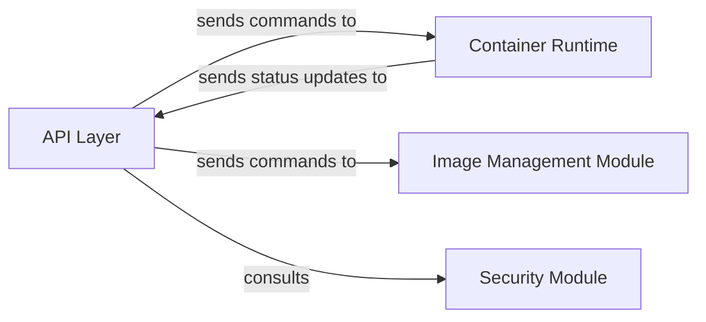

## Details

One paragraph explaining the functionality which is represented by this graph. What the main flow is and what is its purpose.

### API Layer
The API Layer serves as the external interface for Moby, providing a stable and programmatic API (e.g., REST, gRPC) through which external clients (such as the CLI and SDKs) interact with the platform. It is responsible for receiving incoming requests, validating them, and translating them into appropriate calls to the core internal components of Moby. This ensures a consistent and well-defined interaction model for accessing the platform's capabilities.

**Related Classes/Methods**: _None_

### Container Runtime
The Container Runtime is responsible for managing the lifecycle of containers, including operations such as starting, stopping, pausing, resuming, and deleting containers. It interacts with the underlying operating system to isolate and execute containerized applications.

**Related Classes/Methods**: _None_

### Image Management Module
The Image Management Module handles the storage, retrieval, and lifecycle of container images. This includes pulling images from registries, building new images, and managing local image caches.

**Related Classes/Methods**: _None_

### Security Module
The Security Module is responsible for enforcing security policies, managing access control, and handling isolation mechanisms within the Moby platform. It ensures that containers operate within defined security boundaries and that access to resources is properly controlled.

**Related Classes/Methods**: _None_

### [FAQ](https://github.com/CodeBoarding/GeneratedOnBoardings/tree/main?tab=readme-ov-file#faq)