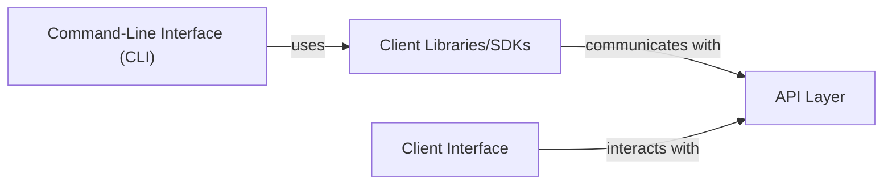

## Details

Overview of Moby platform components and their relationships.

### Client Interface [[Expand]](./Client_Interface.md)
The Client Interface serves as the primary gateway for users and external applications to interact with the Moby platform. It provides both a user-friendly command-line interface (CLI) for direct human interaction and programmatic client libraries/SDKs for developers to integrate Moby functionalities into their own applications. This component abstracts the underlying complexities of the Moby API, offering a consistent and accessible means of control and data exchange.

**Related Classes/Methods**: _None_

### Command-Line Interface (CLI)
This sub-component provides an interactive, text-based interface for users to execute commands, manage containers, images, networks, and volumes directly from their terminal. It parses user input, translates it into structured requests, and presents the Moby API's responses in a human-readable format.

**Related Classes/Methods**:

- `cli/cli.go` (1:1)
- `cli/build/build.go` (1:1)

### Client Libraries/SDKs
This sub-component offers language-specific bindings and high-level abstractions that allow developers to programmatically interact with the Moby API. It handles the low-level details of API communication, including request serialization, response deserialization, error handling, and network communication.

**Related Classes/Methods**:

- `client/client.go` (1:1)
- `client/client_interfaces.go` (1:1)
- `client/container_create.go` (1:1)
- `client/image_build.go` (1:1)

### API Layer
The API Layer provides the core programmatic interface for the Moby platform. It defines the set of operations and data structures that external clients (including the CLI and client libraries) use to interact with the Moby daemon. This layer is responsible for receiving requests, validating them, and orchestrating the underlying Moby components to perform the requested actions.

**Related Classes/Methods**:

- `api/common.go` (1:1)
- `api/docs/v1.27.yaml` (1:1)

### [FAQ](https://github.com/CodeBoarding/GeneratedOnBoardings/tree/main?tab=readme-ov-file#faq)