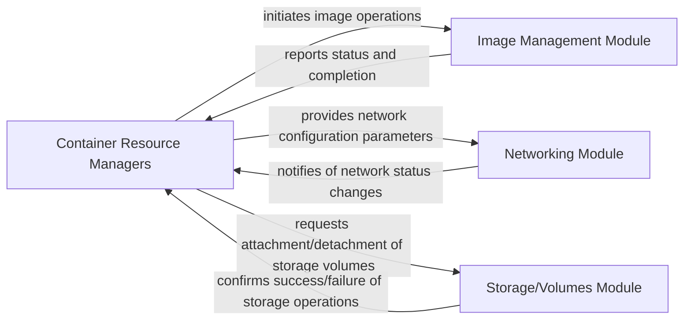

## Details

One paragraph explaining the functionality which is represented by this graph. What the main flow is and what is its purpose.

### Container Resource Managers [[Expand]](./Container_Resource_Managers.md)
The `Container Resource Managers` acts as the central orchestrator for managing the fundamental resources required by containers: images, networks, and persistent storage. It coordinates and delegates specific resource lifecycle operations to specialized internal modules, ensuring that containers have the necessary environment to run effectively. This component is critical for the provisioning and operational stability of containerized applications within the platform.

**Related Classes/Methods**: _None_

### Image Management Module
This module is responsible for the complete lifecycle management of container images. Its functionalities include pulling images from remote registries, building new images from source definitions (e.g., Dockerfiles), and efficiently storing and caching images locally. It ensures that the correct and up-to-date image blueprints are readily available for container instantiation.

**Related Classes/Methods**: _None_

### Networking Module
The `Networking Module` handles all aspects of container network configuration and management. This includes the creation and management of virtual networks, dynamic assignment of IP addresses to containers, setting up network interfaces, and enforcing network policies to facilitate secure and efficient communication. It enables inter-container communication as well as connectivity between containers and external services or the host system.

**Related Classes/Methods**: _None_

### Storage/Volumes Module
This module provides robust mechanisms for persistent data storage for containers, ensuring that application data can endure beyond the lifespan of individual containers. Its responsibilities include managing volumes, bind mounts, and potentially integrating with various external storage backends. It ensures data durability, accessibility, and consistency for stateful applications.

**Related Classes/Methods**: _None_

### [FAQ](https://github.com/CodeBoarding/GeneratedOnBoardings/tree/main?tab=readme-ov-file#faq)