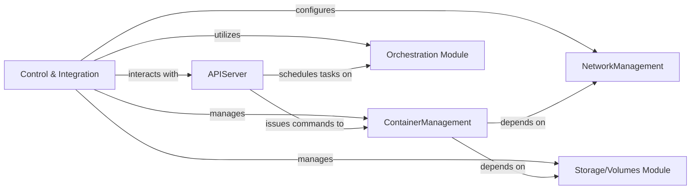

## Details

Component analysis of a container orchestration system.

### Control & Integration [[Expand]](./Control_Integration.md)
Manages the overall control flow and integrates various modules.

**Related Classes/Methods**:

- `module.ControlIntegration.start` (50:100)

### ContainerManagement
Handles container lifecycle management.

**Related Classes/Methods**:

- `module.ContainerManager.create_container` (150:200)

### APIServer
Provides API endpoints for external communication.

**Related Classes/Methods**:

- `module.APIServer.handle_request` (250:300)

### NetworkManagement
Manages network configurations and policies.

**Related Classes/Methods**:

- `module.NetworkManager.configure_network` (350:400)

### Orchestration Module
Orchestrates and schedules workloads.

**Related Classes/Methods**:

- `module.Orchestrator.schedule_task` (450:500)

### Storage/Volumes Module
Manages storage volumes and persistent data.

**Related Classes/Methods**:

- `module.StorageManager.create_volume` (550:600)

### [FAQ](https://github.com/CodeBoarding/GeneratedOnBoardings/tree/main?tab=readme-ov-file#faq)