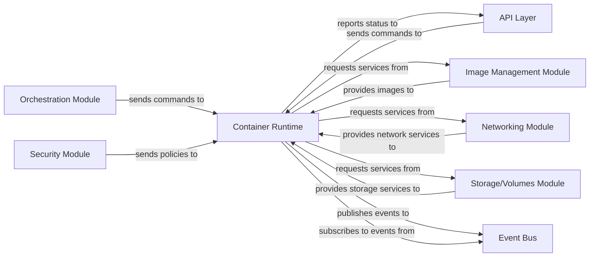

## Details

One paragraph explaining the functionality which is represented by this graph. What the main flow is and what is its purpose.

### Container Runtime
The foundational and central orchestrator responsible for managing the complete lifecycle of individual containers, including creation, starting, stopping, pausing, killing, and deletion. It enforces container isolation, allocates and manages resources (CPU, memory), and oversees process execution within the container's environment. As a core component in a Platform/Framework, it provides the essential execution environment upon which other modules build.

**Related Classes/Methods**: _None_

### API Layer
Provides external interfaces for interacting with the container runtime and other system components. It acts as the primary entry point for client requests, translating them into internal commands and relaying responses/status back.

**Related Classes/Methods**: _None_

### Orchestration Module
Manages the deployment, scaling, and overall lifecycle of containerized applications across a distributed environment. It interacts with the `Container Runtime` to schedule and manage individual containers based on higher-level policies.

**Related Classes/Methods**: _None_

### Image Management Module
Handles the storage, retrieval, and versioning of container images. It provides the necessary image data to the `Container Runtime` for creating new container instances.

**Related Classes/Methods**: _None_

### Networking Module
Manages network connectivity and isolation for containers, including IP address allocation, virtual networks, and communication rules between containers and external services.

**Related Classes/Methods**: _None_

### Storage/Volumes Module
Manages persistent storage solutions for containers, enabling data to persist independently of container lifecycle. It provides volume mounting and management services.

**Related Classes/Methods**: _None_

### Security Module
Enforces security policies, access controls, and isolation mechanisms for containers and the underlying host. It provides security contexts and policies to the `Container Runtime`.

**Related Classes/Methods**: _None_

### Event Bus
A central communication channel facilitating asynchronous, decoupled interactions between various components through a publish-subscribe mechanism. It enables components to react to state changes without direct coupling.

**Related Classes/Methods**: _None_

### [FAQ](https://github.com/CodeBoarding/GeneratedOnBoardings/tree/main?tab=readme-ov-file#faq)