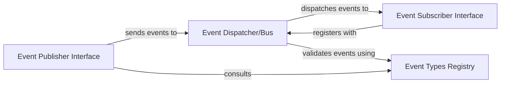

## Details

The following components are abstract architectural concepts and do not have direct, singular source code references. They represent conceptual roles and interfaces within a system's design and are implemented through various classes, modules, and design patterns across a codebase. The analysis focuses on their responsibilities and interactions at an architectural level.

### Event Dispatcher/Bus
This is the core of the eventing system, acting as a central hub. It is responsible for managing event subscriptions, receiving published events, and efficiently dispatching them to all registered and relevant listeners. It ensures that events are routed correctly across the system.

**Related Classes/Methods**: _None_

### Event Types Registry
This component defines and maintains a canonical, system-wide list of all available event types. It ensures consistency in event naming, structure, and payload definitions, which is vital for interoperability between publishers and subscribers.

**Related Classes/Methods**: _None_

### Event Publisher Interface
Provides a standardized API that any component within {project_name} can use to generate and publish events to the Event Dispatcher/Bus. This interface abstracts the underlying eventing mechanism, allowing components to publish events without needing to know the specifics of the bus implementation.

**Related Classes/Methods**: _None_

### Event Subscriber Interface
Defines the contract that components must implement to become event listeners. Components wishing to receive and process specific system events register themselves with the Event Dispatcher/Bus via this interface, allowing them to react to relevant system occurrences.

**Related Classes/Methods**: _None_

### [FAQ](https://github.com/CodeBoarding/GeneratedOnBoardings/tree/main?tab=readme-ov-file#faq)