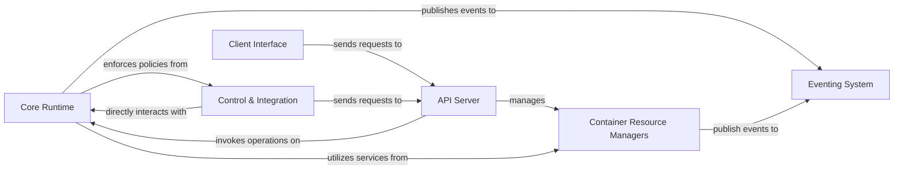

## Details

One paragraph explaining the functionality which is represented by this graph. What the main flow is and what is its purpose.

### Core Runtime [[Expand]](./Core_Runtime.md)
The foundational layer responsible for container lifecycle management, execution, and resource isolation. It acts as the central orchestrator for low-level container operations.

**Related Classes/Methods**: _None_

### API Server [[Expand]](./API_Server.md)
Provides the external interface for Moby, exposing its functionalities through a well-defined API (e.g., REST). It handles incoming requests and translates them into calls to the core components.

**Related Classes/Methods**: _None_

### Container Resource Managers [[Expand]](./Container_Resource_Managers.md)
Manages all aspects of container images (pulling, building, storage), configures and manages container networks, and provides mechanisms for persistent data storage (volumes, bind mounts).

**Related Classes/Methods**: _None_

### Client Interface [[Expand]](./Client_Interface.md)
Provides both a user-friendly command-line interface and programmatic client libraries/SDKs for interacting with the Moby API.

**Related Classes/Methods**: _None_

### Control & Integration [[Expand]](./Control_Integration.md)
Enforces security policies, manages access control, implements container isolation mechanisms, and provides primitives and integration points for higher-level orchestration systems.

**Related Classes/Methods**: _None_

### Eventing System [[Expand]](./Eventing_System.md)
A central event bus that facilitates loose coupling between components by allowing them to publish and subscribe to system events (e.g., container started, image pulled).

**Related Classes/Methods**: _None_

### [FAQ](https://github.com/CodeBoarding/GeneratedOnBoardings/tree/main?tab=readme-ov-file#faq)