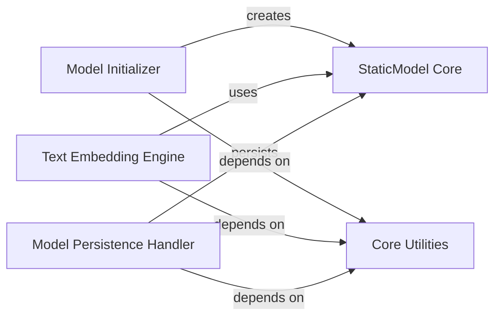

## Details

The `Core Model Management` subsystem primarily encompasses the `model2vec.model` and `model2vec.utils` modules. Its core responsibility revolves around the lifecycle and fundamental operations of the `StaticModel`, including its initialization, the transformation of text into embeddings, and its persistence mechanisms.

### StaticModel Core
This is the foundational data structure representing the learned model. It encapsulates the model's state and provides the primary interface for its operations, serving as the central entity around which all other components in this subsystem revolve.

**Related Classes/Methods**:

- <a href="https://github.com/MinishLab/model2vec/blob/main/model2vec/model.py#L23-L474" target="_blank" rel="noopener noreferrer">`model2vec.model.StaticModel`:23-474</a>

### Model Initializer
Responsible for the instantiation and initial setup of `StaticModel` instances. This includes any necessary pre-processing or normalization steps required before the model becomes operational.

**Related Classes/Methods**:

- <a href="https://github.com/MinishLab/model2vec/blob/main/model2vec/model.py#L24-L72" target="_blank" rel="noopener noreferrer">`model2vec.model.__init__`:24-72</a>

### Text Embedding Engine
Manages the transformation of raw text input into numerical embeddings using the `StaticModel`. Its responsibilities include handling tokenization, efficient batch processing, and managing the dimensions of the generated embeddings.

**Related Classes/Methods**:

- <a href="https://github.com/MinishLab/model2vec/blob/main/model2vec/model.py#L346-L407" target="_blank" rel="noopener noreferrer">`model2vec.model.encode`:346-407</a>
- <a href="https://github.com/MinishLab/model2vec/blob/main/model2vec/model.py#L270-L332" target="_blank" rel="noopener noreferrer">`model2vec.model.encode_as_sequence`:270-332</a>
- <a href="https://github.com/MinishLab/model2vec/blob/main/model2vec/model.py#L409-L424" target="_blank" rel="noopener noreferrer">`model2vec.model._encode_batch`:409-424</a>
- <a href="https://github.com/MinishLab/model2vec/blob/main/model2vec/model.py#L334-L344" target="_blank" rel="noopener noreferrer">`model2vec.model._encode_batch_as_sequence`:334-344</a>

### Model Persistence Handler
Oversees the saving and loading of `StaticModel` instances to and from various storage locations. This includes local file systems and remote repositories such as the HuggingFace Hub, ensuring model reusability and distribution.

**Related Classes/Methods**:

- <a href="https://github.com/MinishLab/model2vec/blob/main/model2vec/model.py#L431-L449" target="_blank" rel="noopener noreferrer">`model2vec.model.push_to_hub`:431-449</a>
- <a href="https://github.com/MinishLab/model2vec/blob/main/model2vec/model.py#L99-L118" target="_blank" rel="noopener noreferrer">`model2vec.model.save_pretrained`:99-118</a>
- <a href="https://github.com/MinishLab/model2vec/blob/main/model2vec/model.py#L451-L474" target="_blank" rel="noopener noreferrer">`model2vec.model.load_local`:451-474</a>
- <a href="https://github.com/MinishLab/model2vec/blob/main/model2vec/utils.py#L107-L128" target="_blank" rel="noopener noreferrer">`model2vec.utils.load_local_model`:107-128</a>
- <a href="https://github.com/MinishLab/model2vec/blob/main/model2vec/utils.py#L57-L59" target="_blank" rel="noopener noreferrer">`model2vec.utils.get_tensor`:57-59</a>

### Core Utilities
Provides essential, reusable support functions that are critical for the operations of other components within this subsystem. This includes general data normalization, text tokenization, dimension retrieval, and batching mechanisms.

**Related Classes/Methods**:

- <a href="https://github.com/MinishLab/model2vec/blob/main/model2vec/model.py" target="_blank" rel="noopener noreferrer">`model2vec.model.normalize`</a>
- <a href="https://github.com/MinishLab/model2vec/blob/main/model2vec/model.py#L120-L148" target="_blank" rel="noopener noreferrer">`model2vec.model.tokenize`:120-148</a>
- <a href="https://github.com/MinishLab/model2vec/blob/main/model2vec/model.py#L74-L77" target="_blank" rel="noopener noreferrer">`model2vec.model.dim`:74-77</a>
- <a href="https://github.com/MinishLab/model2vec/blob/main/model2vec/model.py#L426-L429" target="_blank" rel="noopener noreferrer">`model2vec.model._batch`:426-429</a>

### [FAQ](https://github.com/CodeBoarding/GeneratedOnBoardings/tree/main?tab=readme-ov-file#faq)