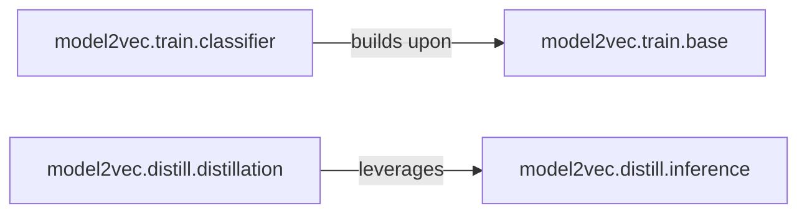

## Details

The `Model Lifecycle (Training & Distillation)` subsystem is a critical part of `model2vec`, focusing on the refinement and optimization of machine learning models. It encompasses functionalities for training new models, fine-tuning existing ones, and orchestrating the knowledge distillation process to create more efficient student models from larger teacher models. This subsystem consumes and produces model instances, implying an interaction with a `Core Model Management` component for persistence and retrieval.

### model2vec.train.base
This component provides the foundational functionalities for model training and fine-tuning. It includes generic mechanisms for constructing model heads, loading pre-trained models, and utilities for preparing data (e.g., converting to dataloaders). It serves as the abstract base for more specialized training components, embodying the "Model Training/Fine-tuning Module" pattern.

**Related Classes/Methods**:

- <a href="https://github.com/MinishLab/model2vec/blob/main/model2vec/train/base.py" target="_blank" rel="noopener noreferrer">`model2vec.train.base`</a>

### model2vec.train.classifier
This component specializes in the complete lifecycle of training, prediction, and evaluation specifically for classification models. It extends and builds upon the generic functionalities provided by `model2vec.train.base` to offer a comprehensive solution for developing and refining classification models, representing a specialized part of the "Model Training/Fine-tuning Module."

**Related Classes/Methods**:

- <a href="https://github.com/MinishLab/model2vec/blob/main/model2vec/train/classifier.py" target="_blank" rel="noopener noreferrer">`model2vec.train.classifier`</a>

### model2vec.distill.inference
This component provides essential functionalities for generating numerical embeddings from models. These embeddings are crucial intermediate representations, particularly within the distillation process (e.g., for comparing teacher and student outputs) and for general inference tasks. It supports the "Core Inference Engine" aspect within the context of the model lifecycle.

**Related Classes/Methods**:

- <a href="https://github.com/MinishLab/model2vec/blob/main/model2vec/distill/inference.py" target="_blank" rel="noopener noreferrer">`model2vec.distill.inference`</a>

### model2vec.distill.distillation
This component serves as the core orchestrator for knowledge distillation. It manages the process of transferring learned knowledge from a larger "teacher" model to a smaller, more efficient "student" model, embodying the "Model Distillation Module" pattern. It consumes and produces model instances, interacting with a `Core Model Management` component (not detailed here) for persistence.

**Related Classes/Methods**:

- <a href="https://github.com/MinishLab/model2vec/blob/main/model2vec/distill/distillation.py" target="_blank" rel="noopener noreferrer">`model2vec.distill.distillation`</a>

### [FAQ](https://github.com/CodeBoarding/GeneratedOnBoardings/tree/main?tab=readme-ov-file#faq)