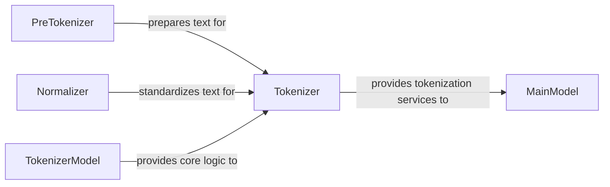

## Details

The `model2vec.tokenizer` subsystem is dedicated to transforming raw textual data into numerical representations, a crucial step for machine learning models. At its core, the `Tokenizer` acts as the central orchestrator, managing the entire tokenization pipeline. This process begins with the `PreTokenizer`, which handles the initial segmentation of raw text, followed by the `Normalizer`, responsible for standardizing text and vocabulary. The `TokenizerModel` encapsulates the complex algorithmic logic for tokenization, including aspects like token weighting and subword processing, providing these capabilities to the `Tokenizer`. Ultimately, the `Tokenizer` delivers its processed output, in the form of tokenized data, to the `MainModel` (representing `model2vec.model`), which is the primary consumer of these services within the broader `model2vec` project.

### Tokenizer
This is the central orchestrator of the tokenization pipeline within the `model2vec.tokenizer` subsystem. It manages the overall flow, including vocabulary creation, text cleaning, token replacement, and converting tokens into numerical IDs. It serves as the primary public interface for the subsystem.

**Related Classes/Methods**:

- <a href="https://github.com/MinishLab/model2vec/blob/main/model2vec/tokenizer/tokenizer.py" target="_blank" rel="noopener noreferrer">`model2vec.tokenizer.tokenizer`</a>

### PreTokenizer
Responsible for the initial segmentation of raw text. It breaks down the input text into preliminary tokens or chunks, typically handling basic operations like splitting by whitespace or punctuation before more complex tokenization rules are applied.

**Related Classes/Methods**:

- <a href="https://github.com/MinishLab/model2vec/blob/main/model2vec/tokenizer/pretokenizer.py" target="_blank" rel="noopener noreferrer">`model2vec.tokenizer.pretokenizer`</a>

### Normalizer
Ensures consistency in text and token formatting. It standardizes the text to improve the accuracy and reliability of the tokenization process, including operations like lowercasing, Unicode normalization, or removing diacritics. It also normalizes vocabulary tokens.

**Related Classes/Methods**:

- <a href="https://github.com/MinishLab/model2vec/blob/main/model2vec/tokenizer/normalizer.py" target="_blank" rel="noopener noreferrer">`model2vec.tokenizer.normalizer`</a>

### TokenizerModel
Implements the core algorithmic logic for tokenization within the `model2vec.tokenizer` subsystem. This component is responsible for specific tokenization algorithms, such as calculating token weights (e.g., unigram probabilities) and handling the processing of individual unigrams or subword units.

**Related Classes/Methods**:

- <a href="https://github.com/MinishLab/model2vec/blob/main/model2vec/tokenizer/model.py" target="_blank" rel="noopener noreferrer">`model2vec.tokenizer.model`</a>

### MainModel
Represents the primary `model2vec` model (corresponding to `model2vec.model`) that consumes the tokenization services provided by the `model2vec.tokenizer` subsystem. It relies on the `Tokenizer` to convert raw text into a format suitable for its internal processing.

**Related Classes/Methods**:

- <a href="https://github.com/MinishLab/model2vec/blob/main/" target="_blank" rel="noopener noreferrer">`model2vec.model`</a>

### [FAQ](https://github.com/CodeBoarding/GeneratedOnBoardings/tree/main?tab=readme-ov-file#faq)