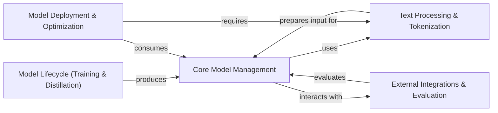

## Details

The `model2vec` project is structured as a modular ML toolkit designed to streamline the lifecycle of static models, from creation to deployment and evaluation. At its heart, the **Core Model Management** component encapsulates the `StaticModel`, serving as the central data artifact. This core model relies on the **Text Processing & Tokenization** module for preparing input data. Models are developed and refined within the **Model Lifecycle (Training & Distillation)** component, which produces optimized `StaticModel` instances. For real-world application, the **Model Deployment & Optimization** component handles inference, applies efficiency techniques like quantization, and facilitates export to deployment-friendly formats. Complementing these core functionalities, the **External Integrations & Evaluation** component provides essential utilities for interacting with external model hubs (e.g., HuggingFace) and for comprehensive performance benchmarking. This clear component separation and defined data flow make `model2vec` an efficient and extensible library for managing and deploying machine learning models.

### Core Model Management [[Expand]](./Core_Model_Management.md)
Manages the fundamental `StaticModel` lifecycle, including initialization, text encoding into embeddings, and basic persistence operations (saving/loading locally or to HuggingFace Hub). This is the central entity representing the learned model.

**Related Classes/Methods**:

- <a href="https://github.com/MinishLab/model2vec/blob/main/model2vec/model.py" target="_blank" rel="noopener noreferrer">`model2vec.model`</a>
- <a href="https://github.com/MinishLab/model2vec/blob/main/model2vec/utils.py" target="_blank" rel="noopener noreferrer">`model2vec.utils`</a>

### Text Processing & Tokenization [[Expand]](./Text_Processing_Tokenization.md)
Handles all aspects of text tokenization, vocabulary management, and pre-processing required for model input. It ensures text is in the correct format for the `Core Model Management`.

**Related Classes/Methods**:

- <a href="https://github.com/MinishLab/model2vec/blob/main/model2vec/tokenizer/tokenizer.py" target="_blank" rel="noopener noreferrer">`model2vec.tokenizer.tokenizer`</a>
- <a href="https://github.com/MinishLab/model2vec/blob/main/model2vec/tokenizer/model.py" target="_blank" rel="noopener noreferrer">`model2vec.tokenizer.model`</a>
- <a href="https://github.com/MinishLab/model2vec/blob/main/model2vec/tokenizer/normalizer.py" target="_blank" rel="noopener noreferrer">`model2vec.tokenizer.normalizer`</a>
- <a href="https://github.com/MinishLab/model2vec/blob/main/model2vec/tokenizer/pretokenizer.py" target="_blank" rel="noopener noreferrer">`model2vec.tokenizer.pretokenizer`</a>

### Model Lifecycle (Training & Distillation) [[Expand]](./Model_Lifecycle_Training_Distillation_.md)
Provides functionalities for training and fine-tuning models (especially classifiers) and orchestrates the distillation process from teacher to student models. This module consumes and produces `Core Model Management` instances.

**Related Classes/Methods**:

- <a href="https://github.com/MinishLab/model2vec/blob/main/model2vec/distill/distillation.py" target="_blank" rel="noopener noreferrer">`model2vec.distill.distillation`</a>
- <a href="https://github.com/MinishLab/model2vec/blob/main/model2vec/distill/inference.py" target="_blank" rel="noopener noreferrer">`model2vec.distill.inference`</a>
- <a href="https://github.com/MinishLab/model2vec/blob/main/model2vec/train/base.py" target="_blank" rel="noopener noreferrer">`model2vec.train.base`</a>
- <a href="https://github.com/MinishLab/model2vec/blob/main/model2vec/train/classifier.py" target="_blank" rel="noopener noreferrer">`model2vec.train.classifier`</a>

### Model Deployment & Optimization [[Expand]](./Model_Deployment_Optimization.md)
Manages the loading, prediction, and evaluation of trained models for real-world inference tasks. It also includes functionalities for optimizing models through quantization and exporting them to formats like ONNX for efficient deployment.

**Related Classes/Methods**:

- <a href="https://github.com/MinishLab/model2vec/blob/main/model2vec/inference/model.py" target="_blank" rel="noopener noreferrer">`model2vec.inference.model`</a>
- <a href="https://github.com/MinishLab/model2vec/blob/main/model2vec/quantization.py" target="_blank" rel="noopener noreferrer">`model2vec.quantization`</a>
- <a href="https://github.com/MinishLab/model2vec/blob/main/scripts/export_to_onnx.py" target="_blank" rel="noopener noreferrer">`scripts.export_to_onnx`</a>

### External Integrations & Evaluation
Provides utilities for seamless interaction with external ecosystems like HuggingFace Hub for model persistence and loading. It also includes scripts for benchmarking model performance and generating analytical plots.

**Related Classes/Methods**:

- <a href="https://github.com/MinishLab/model2vec/blob/main/model2vec/hf_utils.py" target="_blank" rel="noopener noreferrer">`model2vec.hf_utils`</a>
- <a href="https://github.com/MinishLab/model2vec/blob/main/results/make_speed_vs_mteb_plot.py" target="_blank" rel="noopener noreferrer">`results.make_speed_vs_mteb_plot`</a>

### [FAQ](https://github.com/CodeBoarding/GeneratedOnBoardings/tree/main?tab=readme-ov-file#faq)