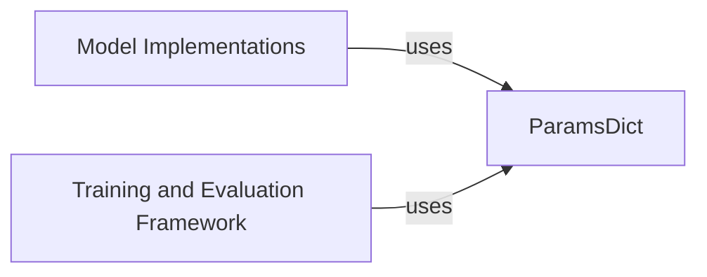

## Details

The core of this subsystem revolves around `ParamsDict`, which acts as the central configuration manager for the entire project. `ParamsDict` provides a standardized and validated interface for handling model hyperparameters and training configurations. Both `Model Implementations`, which define the neural network architectures, and the `Training and Evaluation Framework`, responsible for orchestrating the learning process, critically depend on `ParamsDict` to retrieve their operational settings. This design ensures consistency, reproducibility, and ease of management for all configurable aspects of the models and their training lifecycle.

### ParamsDict
A central component providing a robust, dictionary-like interface for managing model hyperparameters and configurations. It is responsible for parsing, validating, and overriding parameters, ensuring consistent and well-defined settings across various model implementations and training processes.

**Related Classes/Methods**:

- <a href="https://github.com/tensorflow/models/blob/master/official/modeling/hyperparams/params_dict.py#L65-L329" target="_blank" rel="noopener noreferrer">`official.modeling.hyperparams.params_dict.ParamsDict`:65-329</a>

### Model Implementations
Represents the various neural network models and their specific architectures within the project. These implementations rely on `ParamsDict` to retrieve and apply their configuration settings, such as layer sizes, activation functions, and other model-specific hyperparameters.

**Related Classes/Methods**: _None_

### Training and Evaluation Framework
Encompasses the modules and processes responsible for training, evaluating, and fine-tuning models. This framework utilizes `ParamsDict` to access global training parameters, optimization settings, and evaluation metrics, ensuring consistent experimental setups.

**Related Classes/Methods**: _None_

### [FAQ](https://github.com/CodeBoarding/GeneratedOnBoardings/tree/main?tab=readme-ov-file#faq)