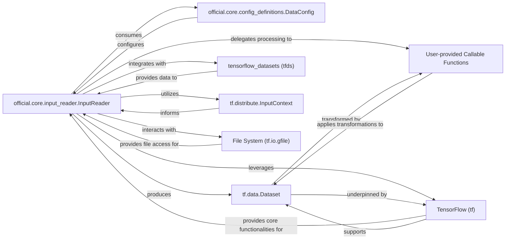

## Details

The official.core.input_reader subsystem is a critical component for efficient data handling, designed to abstract and streamline the process of preparing data for machine learning models. At its core, the InputReader orchestrates the data pipeline, consuming DataConfig objects to define pipeline parameters. It produces and manipulates tf.data.Dataset objects, which serve as the primary data structure for the pipeline. The InputReader integrates with tensorflow_datasets for accessing pre-defined datasets and dynamically incorporates User-provided Callable Functions for custom data transformations. For distributed training scenarios, it utilizes tf.distribute.InputContext to manage data sharding. File I/O operations are handled through tf.io.gfile, ensuring robust interaction with various file systems. The entire subsystem heavily leverages the foundational capabilities of TensorFlow (tf), which provides the underlying operations and structures for all data processing. This design ensures a flexible, scalable, and performant data input pipeline.

### official.core.input_reader.InputReader
The primary orchestrator of the data pipeline. It manages the entire data lifecycle, including reading, decoding, preprocessing, augmentation, and efficient batching. It is highly configurable and designed to produce tf.data.Dataset objects.

**Related Classes/Methods**:

- <a href="https://github.com/tensorflow/models/blob/master/official/core/input_reader.py#L214-L599" target="_blank" rel="noopener noreferrer">`official.core.input_reader.InputReader`:214-599</a>

### official.core.config_definitions.DataConfig
A configuration object that defines parameters and settings for the data pipeline, such as input file patterns, batch sizes, preprocessing options, and sharding strategies. It is consumed by the InputReader to configure its behavior.

**Related Classes/Methods**:

- <a href="https://github.com/tensorflow/models/blob/master/official/core/config_definitions.py#L27-L136" target="_blank" rel="noopener noreferrer">`official.core.config_definitions.DataConfig`:27-136</a>

### tf.data.Dataset
TensorFlow's high-level API for building scalable and performant input pipelines. It represents a sequence of elements, where each element typically consists of one or more tensors. InputReader produces and manipulates these objects as the core data structure for the pipeline.

**Related Classes/Methods**: _None_

### tensorflow_datasets (tfds)
A library that provides a collection of ready-to-use datasets for TensorFlow. InputReader integrates with tfds to load pre-defined datasets efficiently, abstracting away data download and preparation.

**Related Classes/Methods**: _None_

### User-provided Callable Functions
Placeholder for custom Python functions provided by the user to perform specific data processing steps, such as decoding, parsing, transforming, or augmenting data within the tf.data.Dataset pipeline. These functions are dynamically integrated by the InputReader.

**Related Classes/Methods**: _None_

### tf.distribute.InputContext
Provides information about the input context for distributed training, enabling the data pipeline to shard data across multiple workers or devices to ensure each worker processes a unique subset of the data. InputReader utilizes this context for distributed data handling.

**Related Classes/Methods**: _None_

### File System (tf.io.gfile)
TensorFlow's file I/O utility, used by the InputReader to interact with various file systems (local, GCS, HDFS, etc.) to read raw input files. It provides a unified interface for file operations.

**Related Classes/Methods**: _None_

### TensorFlow (tf)
The foundational machine learning framework that provides all the core operations, data structures, and APIs leveraged by the InputReader and the entire data pipeline for tensor manipulation, graph execution, and dataset operations. It underpins the functionality of all TensorFlow-related components.

**Related Classes/Methods**: _None_

### [FAQ](https://github.com/CodeBoarding/GeneratedOnBoardings/tree/main?tab=readme-ov-file#faq)