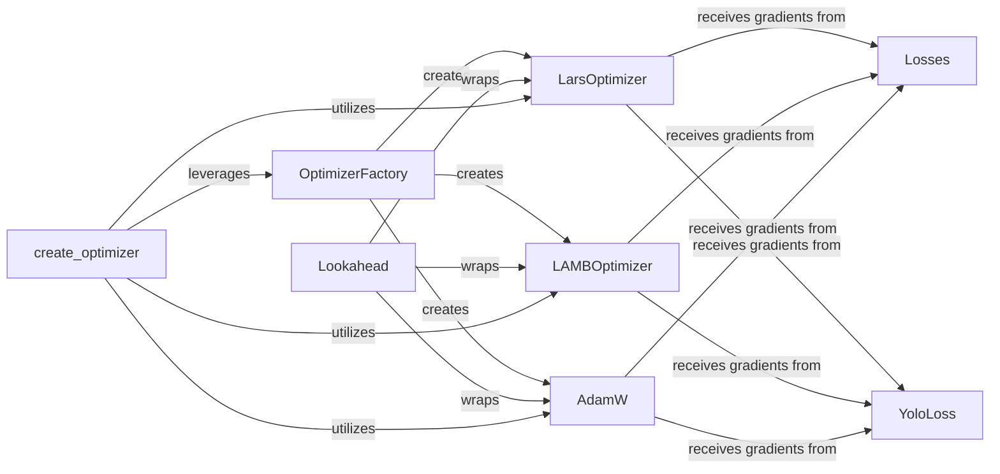

## Details

This subsystem focuses on the core mechanisms for model optimization and loss calculation within the project. It centralizes the creation of various optimizers through an `OptimizerFactory`, allowing for flexible integration of algorithms like `LarsOptimizer`, `LAMBOptimizer`, and `AdamW`. A `Lookahead` meta-optimizer can wrap these to enhance performance. These optimizers are responsible for updating model parameters based on gradients derived from loss functions. The system includes general `Losses` for quantifying prediction errors and specialized functions like `YoloLoss` for domain-specific tasks. The `create_optimizer` utility further streamlines optimizer setup, often incorporating learning rate schedules, demonstrating how optimization is integrated into specific application domains.

### OptimizerFactory
Acts as the central factory for instantiating various optimization algorithms, abstracting the creation process and providing a unified interface for creating different optimizer instances. This is crucial for a toolkit, promoting reusability and extensibility by centralizing optimizer creation.

**Related Classes/Methods**:

- <a href="https://github.com/tensorflow/models/blob/master/official/legacy/detection/modeling/optimizers.py#L26-L49" target="_blank" rel="noopener noreferrer">`OptimizerFactory`:26-49</a>

### LarsOptimizer
Implements the Layer-wise Adaptive Rate Scaling (LARS) optimization algorithm, responsible for updating model parameters based on computed gradients. Represents a specific, high-performance optimizer often used in large-batch training.

**Related Classes/Methods**:

- <a href="https://github.com/tensorflow/models/blob/master/official/modeling/optimization/lars.py" target="_blank" rel="noopener noreferrer">`LarsOptimizer`</a>

### LAMBOptimizer
Implements the Layer-wise Adaptive Moments (LAMB) optimization algorithm, optimized for large-batch training, responsible for updating model parameters based on computed gradients. Another key optimizer for scalable deep learning.

**Related Classes/Methods**:

- <a href="https://github.com/tensorflow/models/blob/master/official/modeling/optimization/lamb.py" target="_blank" rel="noopener noreferrer">`LAMBOptimizer`</a>

### AdamW
Implements the AdamW optimization algorithm, known for decoupled weight decay, responsible for updating model parameters based on computed gradients. A widely adopted and robust optimizer, essential for a general-purpose ML toolkit.

**Related Classes/Methods**:

- <a href="https://github.com/tensorflow/models/blob/master/official/modeling/optimization/configs/optimization_config.py" target="_blank" rel="noopener noreferrer">`AdamW`</a>

### Lookahead
A meta-optimizer that enhances other optimizers by looking ahead in the optimization trajectory, acting as a wrapper to improve convergence and stability. Its inclusion highlights advanced optimization strategies within the toolkit.

**Related Classes/Methods**:

- <a href="https://github.com/tensorflow/models/blob/master/official/legacy/image_classification/optimizer_factory.py#L36-L183" target="_blank" rel="noopener noreferrer">`Lookahead`:36-183</a>

### Losses
A composite loss function specifically designed for object detection models, combining multiple loss components and quantifying the error between model predictions and actual targets. Represents a general-purpose, domain-specific loss function.

**Related Classes/Methods**:

- <a href="https://github.com/tensorflow/models/blob/master/official/core/base_task.py#L169-L187" target="_blank" rel="noopener noreferrer">`Losses`:169-187</a>

### YoloLoss
Computes the total loss for YOLO object detection models, showcasing domain-specific loss implementations and quantifying the error between model predictions and actual targets. Its specialization demonstrates the toolkit's depth in specific ML domains.

**Related Classes/Methods**:

- <a href="https://github.com/tensorflow/models/blob/master/official/projects/yolo/configs/yolo.py#L165-L185" target="_blank" rel="noopener noreferrer">`YoloLoss`:165-185</a>

### create_optimizer
A utility function within the NLP domain for creating optimizers, often incorporating learning rate schedules, simplifying the creation process and potentially integrating NLP-specific configurations. This component shows how optimizers are integrated into specific application domains.

**Related Classes/Methods**:

- <a href="https://github.com/tensorflow/models/blob/master/official/core/base_task.py#L72-L111" target="_blank" rel="noopener noreferrer">`create_optimizer`:72-111</a>

### [FAQ](https://github.com/CodeBoarding/GeneratedOnBoardings/tree/main?tab=readme-ov-file#faq)