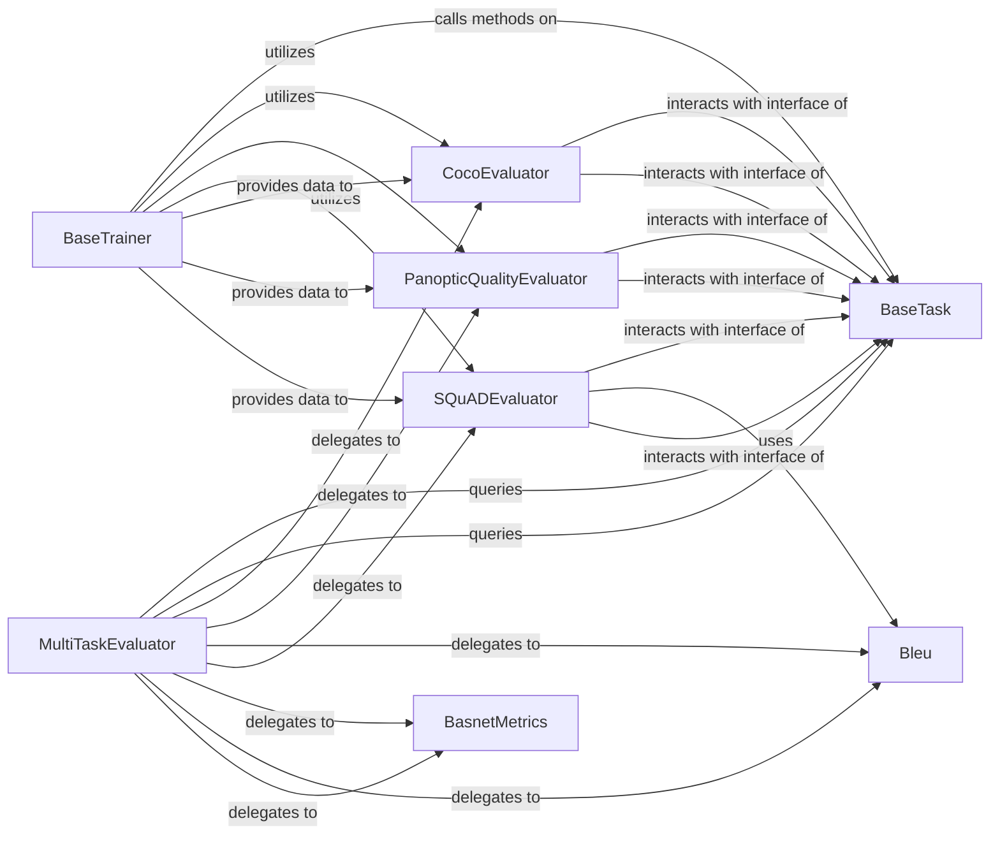

## Details

The Metrics & Reporting subsystem is responsible for the collection, computation, and reporting of evaluation metrics for machine learning models. Its boundaries encompass components that define metric interfaces, orchestrate evaluation processes, implement specific evaluation algorithms for various data types (e.g., object detection, segmentation, NLP), and provide granular metric calculation functions. The core functionality revolves around transforming model predictions and ground truth data into quantifiable performance indicators.

### BaseTask
Serves as the abstract base for defining task-specific interfaces, including how metrics are processed and exposed. It provides a standardized contract for evaluation across different ML tasks.

**Related Classes/Methods**:

- <a href="https://github.com/tensorflow/models/blob/master/official/core/base_task.py" target="_blank" rel="noopener noreferrer">`official.core.base_task`</a>

### BaseTrainer
Orchestrates the overall training and evaluation loops, initiating and managing the metric collection and evaluation process by interacting with various evaluators.

**Related Classes/Methods**:

- <a href="https://github.com/tensorflow/models/blob/master/official/core/base_trainer.py" target="_blank" rel="noopener noreferrer">`official.core.base_trainer`</a>

### CocoEvaluator
A concrete, specialized evaluator for COCO dataset metrics (e.g., mAP for object detection and instance segmentation). It encapsulates the logic for computing these specific computer vision metrics.

**Related Classes/Methods**:

- <a href="https://github.com/tensorflow/models/blob/master/official/legacy/detection/evaluation/coco_evaluator.py" target="_blank" rel="noopener noreferrer">`official.legacy.detection.evaluation.coco_evaluator`</a>

### MultiTaskEvaluator
Handles evaluation for models that perform multiple tasks simultaneously, demonstrating the system's ability to manage complex evaluation scenarios by delegating to individual evaluators.

**Related Classes/Methods**:

- <a href="https://github.com/tensorflow/models/blob/master/official/modeling/multitask/evaluator.py" target="_blank" rel="noopener noreferrer">`official.modeling.multitask.evaluator`</a>

### PanopticQualityEvaluator
Another specialized evaluator, focusing on panoptic segmentation metrics. It highlights the modularity and extensibility for different computer vision evaluation needs beyond bounding box detection.

**Related Classes/Methods**:

- <a href="https://github.com/tensorflow/models/blob/master/official/vision/evaluation/panoptic_quality_evaluator.py" target="_blank" rel="noopener noreferrer">`official.vision.evaluation.panoptic_quality_evaluator`</a>

### Bleu
A specific metric calculation component for natural language generation tasks, such as machine translation. It provides the granular implementation for computing the BLEU score.

**Related Classes/Methods**:

- <a href="https://github.com/tensorflow/models/blob/master/official/nlp/metrics/bleu.py" target="_blank" rel="noopener noreferrer">`official.nlp.metrics.bleu`</a>

### SQuADEvaluator
A dataset-specific evaluator for the SQuAD (Stanford Question Answering Dataset), similar to `CocoEvaluator` but tailored for NLP question-answering tasks.

**Related Classes/Methods**:

- <a href="https://github.com/tensorflow/models/blob/master/official/nlp/tools/squad_evaluate_v1_1.py" target="_blank" rel="noopener noreferrer">`official.nlp.tools.squad_evaluate_v1_1`</a>

### BasnetMetrics
Project-specific metrics for salient object detection, demonstrating the extensibility of the system to incorporate custom evaluation needs for research projects.

**Related Classes/Methods**:

- <a href="https://github.com/tensorflow/models/blob/master/official/projects/basnet/evaluation/metrics.py" target="_blank" rel="noopener noreferrer">`official.projects.basnet.evaluation.metrics`</a>

### [FAQ](https://github.com/CodeBoarding/GeneratedOnBoardings/tree/main?tab=readme-ov-file#faq)