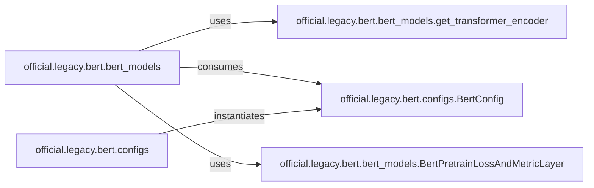

## Details

The `Model Definition` subsystem is primarily responsible for the construction and configuration of BERT-based neural network architectures. Its boundaries are defined by the core model assembly logic found in `official/legacy/bert/bert_models.py` and the configuration definitions in `official/legacy/bert/configs.py`.

### official.legacy.bert.bert_models
This component acts as the central orchestrator for assembling diverse BERT-based neural network architectures. It provides methods to construct models for various tasks (e.g., pre-training, SQuAD, classification) by integrating reusable backbones and task-specific heads. It embodies the "Model Implementations" and "Reusability and Extensibility" patterns by offering a flexible factory for model creation.

**Related Classes/Methods**:

- <a href="https://github.com/tensorflow/models/blob/master/official/legacy/bert/bert_models.py" target="_blank" rel="noopener noreferrer">`official.legacy.bert.bert_models`</a>

### official.legacy.bert.bert_models.get_transformer_encoder
This component provides a generic and configurable implementation of the Transformer Encoder architecture. It serves as a foundational, reusable backbone that can be integrated into different BERT models, directly promoting modularity and extensibility within the model definition process.

**Related Classes/Methods**:

- <a href="https://github.com/tensorflow/models/blob/master/official/legacy/bert/bert_models.py#L100-L169" target="_blank" rel="noopener noreferrer">`official.legacy.bert.bert_models.get_transformer_encoder`:100-169</a>

### official.legacy.bert.configs.BertConfig
This component defines the configuration and hyperparameters (e.g., hidden layer sizes, number of attention heads, vocabulary size) for BERT models. It acts as a blueprint, allowing for flexible instantiation and configuration of models without modifying the core architecture code, aligning with "Best Practices" for configurable models and supporting "Reusability."

**Related Classes/Methods**:

- <a href="https://github.com/tensorflow/models/blob/master/official/legacy/bert/configs.py#L24-L104" target="_blank" rel="noopener noreferrer">`official.legacy.bert.configs.BertConfig`:24-104</a>

### official.legacy.bert.bert_models.BertPretrainLossAndMetricLayer
This component encapsulates the specific loss calculation and metric tracking required for the BERT pre-training objective (e.g., Masked Language Model and Next Sentence Prediction losses). While part of the model definition for pre-training, it represents a task-specific head or layer, demonstrating how different components can be combined for specific lifecycle stages.

**Related Classes/Methods**:

- <a href="https://github.com/tensorflow/models/blob/master/official/legacy/bert/bert_models.py#L27-L97" target="_blank" rel="noopener noreferrer">`official.legacy.bert.bert_models.BertPretrainLossAndMetricLayer`:27-97</a>

### official.legacy.bert.configs
This package is responsible for managing and instantiating BERT configuration objects, primarily `BertConfig`. It provides the organizational structure for defining and accessing model hyperparameters.

**Related Classes/Methods**:

- <a href="https://github.com/tensorflow/models/blob/master/official/legacy/bert/configs.py" target="_blank" rel="noopener noreferrer">`official.legacy.bert.configs`</a>

### [FAQ](https://github.com/CodeBoarding/GeneratedOnBoardings/tree/main?tab=readme-ov-file#faq)