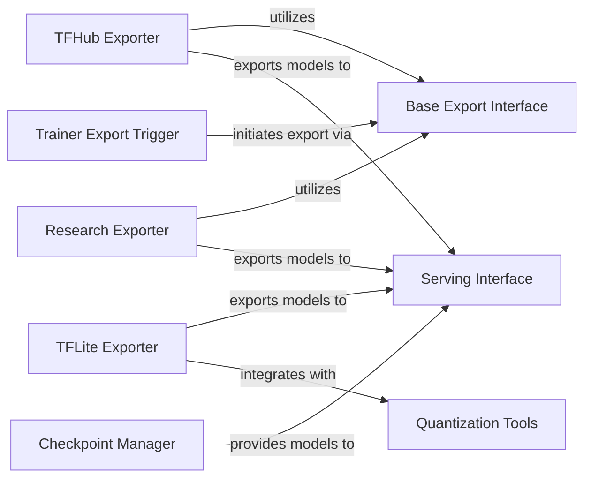

## Details

The Model Export & Serving subsystem is crucial for transitioning trained machine learning models from development to deployment. It encompasses functionalities for saving models in various formats, optimizing them for different environments, and providing interfaces for efficient inference. The subsystem is defined by components responsible for standardizing the model export process, converting models into deployment-ready formats, managing model persistence and retrieval, and providing interfaces for running inference on new data. The core of this subsystem revolves around official/core/export_base.py, which establishes the foundational interfaces for model export.

### Base Export Interface
Defines the fundamental interface and common utilities for initiating and managing the model export process. It establishes the contract for how models should be prepared for deployment, including defining inference signatures. This component is architecturally important as it provides the necessary abstraction and standardization for all model export operations within the toolkit.

**Related Classes/Methods**:

- <a href="https://github.com/tensorflow/models/blob/master/official/core/export_base.py" target="_blank" rel="noopener noreferrer">`official.core.export_base`</a>

### TFHub Exporter
Specializes in converting trained models into the TensorFlow Hub format, enabling easy sharing and reusability of models within the TensorFlow ecosystem. This component is vital for promoting model discoverability and reuse, a key aspect of an ML toolkit.

**Related Classes/Methods**:

- <a href="https://github.com/tensorflow/models/blob/master/official/legacy/bert/export_tfhub.py" target="_blank" rel="noopener noreferrer">`official.legacy.bert.export_tfhub`</a>
- <a href="https://github.com/tensorflow/models/blob/master/official/nlp/tools/export_tfhub_lib.py" target="_blank" rel="noopener noreferrer">`official.nlp.tools.export_tfhub_lib`</a>
- <a href="https://github.com/tensorflow/models/blob/master/official/projects/labse/export_tfhub.py" target="_blank" rel="noopener noreferrer">`official.projects.labse.export_tfhub`</a>

### TFLite Exporter
Converts research-specific models into the TFLite format, often involving specialized graph transformations for on-device deployment. This component is critical for enabling efficient inference on mobile and edge devices, broadening the applicability of models developed within the toolkit.

**Related Classes/Methods**:

- <a href="https://github.com/tensorflow/models/blob/master/research/lstm_object_detection/export_tflite_lstd_graph_lib.py" target="_blank" rel="noopener noreferrer">`research.lstm_object_detection.export_tflite_lstd_graph_lib`</a>
- <a href="https://github.com/tensorflow/models/blob/master/research/object_detection/export_tflite_ssd_graph_lib.py" target="_blank" rel="noopener noreferrer">`research.object_detection.export_tflite_ssd_graph_lib`</a>
- <a href="https://github.com/tensorflow/models/blob/master/research/object_detection/export_tflite_graph_lib_tf2.py" target="_blank" rel="noopener noreferrer">`research.object_detection.export_tflite_graph_lib_tf2`</a>
- <a href="https://github.com/tensorflow/models/blob/master/research/seq_flow_lite/export_to_tflite.py" target="_blank" rel="noopener noreferrer">`research.seq_flow_lite.export_to_tflite`</a>

### Research Exporter
Provides general export utilities within research projects for creating inference graphs or SavedModels, catering to diverse research-specific export needs. This component ensures flexibility for experimental models that might not fit standard export pipelines, supporting the toolkit's research-oriented nature.

**Related Classes/Methods**:

- <a href="https://github.com/tensorflow/models/blob/master/research/object_detection/exporter.py" target="_blank" rel="noopener noreferrer">`research.object_detection.exporter`</a>

### Serving Interface
Offers standardized interfaces for running inference on new data. This includes handling input preprocessing, model execution, and output post-processing, abstracting the underlying model format. This is the ultimate destination for exported models, making it a core component for practical model deployment.

**Related Classes/Methods**:

- <a href="https://github.com/tensorflow/models/blob/master/official/legacy/bert/serving.py" target="_blank" rel="noopener noreferrer">`official.legacy.bert.serving`</a>
- <a href="https://github.com/tensorflow/models/blob/master/official/nlp/serving/serving_modules.py" target="_blank" rel="noopener noreferrer">`official.nlp.serving.serving_modules`</a>
- <a href="https://github.com/tensorflow/models/blob/master/official/vision/serving/detection.py" target="_blank" rel="noopener noreferrer">`official.vision.serving.detection`</a>

### Checkpoint Manager
Manages the saving and loading of SavedModel checkpoints, ensuring model persistence and retrieval for deployment and serving. This component is fundamental for the reliability and continuity of model serving, allowing models to be loaded and used consistently.

**Related Classes/Methods**:

- <a href="https://github.com/tensorflow/models/blob/master/official/core/savedmodel_checkpoint_manager.py" target="_blank" rel="noopener noreferrer">`official.core.savedmodel_checkpoint_manager`</a>

### Quantization Tools
Optimizes models (e.g., for TFLite) through quantization, reducing model size and improving inference speed, crucial for efficient deployment. This component addresses performance and resource constraints, which are common challenges in real-world ML deployments.

**Related Classes/Methods**:

- <a href="https://github.com/tensorflow/models/blob/master/official/projects/movinet/tools/quantize_movinet.py" target="_blank" rel="noopener noreferrer">`official.projects.movinet.tools.quantize_movinet`</a>

### Trainer Export Trigger
An example component within a training pipeline that initiates the export of a trained model, bridging the training phase with the deployment phase. This component highlights the integration of the export process directly into the model lifecycle, demonstrating best practices for end-to-end ML workflows.

**Related Classes/Methods**:

- <a href="https://github.com/tensorflow/models/blob/master/official/legacy/image_classification/classifier_trainer.py#L408-L420" target="_blank" rel="noopener noreferrer">`official.legacy.image_classification.classifier_trainer.export`:408-420</a>

### [FAQ](https://github.com/CodeBoarding/GeneratedOnBoardings/tree/main?tab=readme-ov-file#faq)