```mermaid
graph LR
    Data_Pipeline["Data Pipeline"]
    Model_Definition["Model Definition"]
    Training_Evaluation_Orchestration["Training & Evaluation Orchestration"]
    Loss_Functions_Optimizers["Loss Functions & Optimizers"]
    Metrics_Reporting["Metrics & Reporting"]
    Model_Export_Serving["Model Export & Serving"]
    Configuration_Utilities["Configuration & Utilities"]
    Data_Pipeline -- "Provides processed data" --> Model_Definition
    Configuration_Utilities -- "Configures and supports" --> Data_Pipeline
    Configuration_Utilities -- "Configures and supports" --> Model_Definition
    Configuration_Utilities -- "Configures and supports" --> Training_Evaluation_Orchestration
    Configuration_Utilities -- "Configures and supports" --> Loss_Functions_Optimizers
    Configuration_Utilities -- "Configures and supports" --> Metrics_Reporting
    Configuration_Utilities -- "Configures and supports" --> Model_Export_Serving
    Model_Definition -- "Defines model for" --> Training_Evaluation_Orchestration
    Training_Evaluation_Orchestration -- "Applies losses and updates via" --> Loss_Functions_Optimizers
    Loss_Functions_Optimizers -- "Updates parameters of" --> Model_Definition
    Training_Evaluation_Orchestration -- "Triggers evaluation and sends results to" --> Metrics_Reporting
    Metrics_Reporting -- "Reports performance of" --> Model_Definition
    Model_Definition -- "Provides trained models for" --> Model_Export_Serving
    Model_Export_Serving -- "May use preprocessing for inference" --> Data_Pipeline
    click Data_Pipeline href "https://github.com/CodeBoarding/GeneratedOnBoardings/blob/main/models/Data_Pipeline.md" "Details"
    click Model_Definition href "https://github.com/CodeBoarding/GeneratedOnBoardings/blob/main/models/Model_Definition.md" "Details"
    click Loss_Functions_Optimizers href "https://github.com/CodeBoarding/GeneratedOnBoardings/blob/main/models/Loss_Functions_Optimizers.md" "Details"
    click Metrics_Reporting href "https://github.com/CodeBoarding/GeneratedOnBoardings/blob/main/models/Metrics_Reporting.md" "Details"
    click Model_Export_Serving href "https://github.com/CodeBoarding/GeneratedOnBoardings/blob/main/models/Model_Export_Serving.md" "Details"
    click Configuration_Utilities href "https://github.com/CodeBoarding/GeneratedOnBoardings/blob/main/models/Configuration_Utilities.md" "Details"
```

## Details

The project's architecture is designed around a modular and extensible structure, facilitating the development and deployment of machine learning models. The `Data Pipeline` efficiently handles data ingestion and preprocessing, feeding into the `Model Definition` component, which encapsulates various neural network architectures. The `Training & Evaluation Orchestration` component manages the entire training lifecycle, leveraging `Loss Functions & Optimizers` for model parameter updates and `Metrics & Reporting` for performance monitoring. `Configuration & Utilities` provides foundational support across all components, ensuring consistent parameter management and utility functions. Finally, `Model Export & Serving` handles the deployment of trained models. This clear separation of concerns allows for independent development, testing, and scaling of each architectural piece, promoting maintainability and reusability.

### Data Pipeline [[Expand]](./Data_Pipeline.md)
Manages the entire data lifecycle, from raw input reading and decoding to advanced preprocessing, augmentation, and efficient batching for model consumption. It supports various data formats and distributed data handling.

**Related Classes/Methods**:

- <a href="https://github.com/tensorflow/models/blob/master/official/core/input_reader.py#L1-L9999" target="_blank" rel="noopener noreferrer">`official/core/input_reader.py`:1-9999</a>

### Model Definition [[Expand]](./Model_Definition.md)
Encapsulates the construction and definition of diverse neural network architectures. This includes reusable backbones (e.g., ResNet, Transformer Encoders), task-specific heads (e.g., classification, detection), and custom layers, promoting modularity and extensibility.

**Related Classes/Methods**:

- <a href="https://github.com/tensorflow/models/blob/master/official/legacy/bert/bert_models.py#L1-L9999" target="_blank" rel="noopener noreferrer">`official/legacy/bert/bert_models.py`:1-9999</a>

### Training & Evaluation Orchestration
Manages the overarching training and evaluation workflow. This component handles the iterative training steps, coordinates distributed training strategies, manages checkpoints, and triggers periodic evaluations.

**Related Classes/Methods**:

- <a href="https://github.com/tensorflow/models/blob/master/official/core/base_trainer.py#L1-L9999" target="_blank" rel="noopener noreferrer">`official/core/base_trainer.py`:1-9999</a>

### Loss Functions & Optimizers [[Expand]](./Loss_Functions_Optimizers.md)
Provides a comprehensive set of loss functions tailored for various machine learning tasks (e.g., classification, regression, object detection) and implements optimization algorithms (e.g., Adam, SGD, LAMB) responsible for updating model parameters based on computed gradients.

**Related Classes/Methods**:

- <a href="https://github.com/tensorflow/models/blob/master/official/modeling/optimization/optimizer_factory.py#L103-L267" target="_blank" rel="noopener noreferrer">`official.modeling.optimization.optimizer_factory.OptimizerFactory`:103-267</a>

### Metrics & Reporting [[Expand]](./Metrics_Reporting.md)
Focuses on collecting model predictions and ground truth data, computing a wide range of evaluation metrics (e.g., accuracy, F1-score, mAP, BLEU, Panoptic Quality), and providing mechanisms for logging and reporting these results.

**Related Classes/Methods**:

- <a href="https://github.com/tensorflow/models/blob/master/official/legacy/detection/evaluation/coco_evaluator.py#L1-L9999" target="_blank" rel="noopener noreferrer">`official/legacy/detection/evaluation/coco_evaluator.py`:1-9999</a>

### Model Export & Serving [[Expand]](./Model_Export_Serving.md)
Facilitates the saving of trained models into various deployment-ready formats (e.g., TensorFlow SavedModel, TFLite, TFHub modules) and provides standardized interfaces for running inference on new data.

**Related Classes/Methods**:

- <a href="https://github.com/tensorflow/models/blob/master/official/core/export_base.py#L1-L9999" target="_blank" rel="noopener noreferrer">`official/core/export_base.py`:1-9999</a>

### Configuration & Utilities [[Expand]](./Configuration_Utilities.md)
A foundational component providing a robust framework for managing model configurations, hyperparameters, and common utility functions. This includes parsing configurations, overriding parameters, managing checkpoints, and setting up distribution strategies.

**Related Classes/Methods**:

- <a href="https://github.com/tensorflow/models/blob/master/official/modeling/hyperparams/params_dict.py#L1-L9999" target="_blank" rel="noopener noreferrer">`official/modeling/hyperparams/params_dict.py`:1-9999</a>

### [FAQ](https://github.com/CodeBoarding/GeneratedOnBoardings/tree/main?tab=readme-ov-file#faq)