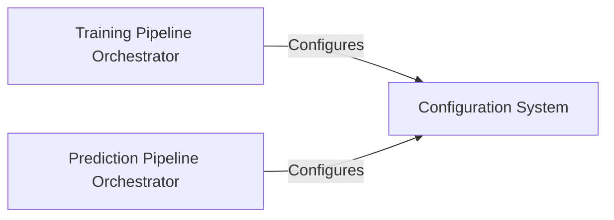

## Details

The Configuration System is a cornerstone of this project's architecture, embodying the "Configuration-Driven Design" principle. It centralizes all configurable parameters, ensuring that settings for data processing, model architecture, and training/inference hyperparameters are managed systematically and are easily modifiable. This system leverages Hydra, enabling structured configuration, composition, and overriding of settings, which is crucial for reproducibility and experimentation in deep learning projects.

### Configuration System [[Expand]](./Configuration_System.md)
Manages and provides access to all project-wide configuration parameters. It uses Hydra to load, compose, and validate configurations from various YAML files, making them accessible to other components. This system is fundamental for defining hyperparameters, model architectures, data paths, and training/inference settings.

**Related Classes/Methods**: _None_

### Training Pipeline Orchestrator
Orchestrates the entire training workflow, from data loading and preprocessing to model training, evaluation, and logging. It consumes configurations provided by the Configuration System to set up the training environment, initialize models, define training parameters, and manage experiment tracking.

**Related Classes/Methods**: _None_

### Prediction Pipeline Orchestrator
Manages the inference workflow, including loading trained models, preparing input data, performing predictions, and potentially post-processing results. It relies on the Configuration System to retrieve model paths, inference-specific parameters, and data handling settings.

**Related Classes/Methods**: _None_

### [FAQ](https://github.com/CodeBoarding/GeneratedOnBoardings/tree/main?tab=readme-ov-file#faq)