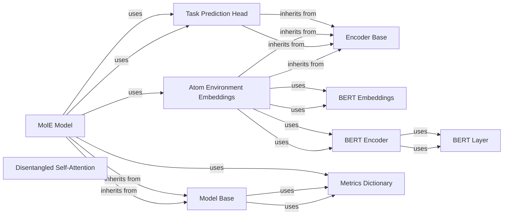

## Details

The Deep Learning Models subsystem is the core of the mole project, encapsulating the fundamental neural network architectures and components essential for molecular property prediction. It adheres to a modular design, separating concerns into abstract base models, specific model implementations, and reusable neural network building blocks. This structure facilitates extensibility, maintainability, and the integration of various deep learning techniques.

### Model Base
This is the foundational abstract class (mole.training.models.base.Model) for all trainable deep learning models. It establishes a standardized interface and common lifecycle methods (e.g., training_step, validation_step, test_step), ensuring consistency across different model implementations. It also integrates with the Metrics Dictionary for performance tracking.

**Related Classes/Methods**:

- <a href="https://github.com/recursionpharma/mole_public/blob/trunk/mole/training/models/base.py#L22-L218" target="_blank" rel="noopener noreferrer">`mole.training.models.base.Model` (22:218)</a>

### MolE Model
The primary deep learning model (mole.training.models.mole.MolE) implemented in this project, specifically designed for molecular tasks. It extends Model Base and orchestrates the integration of various neural network components, such as Atom Environment Embeddings and Task Prediction Head, to perform end-to-end molecular property prediction. It encapsulates the full forward pass, loss calculation, and metric logging for training and validation steps.

**Related Classes/Methods**:

- <a href="https://github.com/recursionpharma/mole_public/blob/trunk/mole/training/models/mole.py#L226-L326" target="_blank" rel="noopener noreferrer">`mole.training.models.mole.MolE` (226:326)</a>

### Encoder Base
An abstract base class (mole.training.models.encoder.Encoder) providing a common interface or base functionality for various encoder components within the deep learning models. This promotes reusability and a consistent structure for modules responsible for generating representations.

**Related Classes/Methods**:

- <a href="https://github.com/recursionpharma/mole_public/blob/trunk/mole/training/models/encoder.py#L95-L143" target="_blank" rel="noopener noreferrer">`mole.training.models.encoder.Encoder` (95:143)</a>

### Atom Environment Embeddings
A specialized component (mole.training.models.mole.AtomEnvEmbeddings) responsible for generating contextualized embeddings for atomic environments within molecules. It leverages BERT Embeddings and BERT Encoder to capture rich, local chemical information, forming crucial input representations for downstream tasks.

**Related Classes/Methods**:

- <a href="https://github.com/recursionpharma/mole_public/blob/trunk/mole/training/models/mole.py#L30-L136" target="_blank" rel="noopener noreferrer">`mole.training.models.mole.AtomEnvEmbeddings` (30:136)</a>

### BERT Embeddings
Implements the initial embedding layer (mole.training.nn.bert.BertEmbeddings) for BERT-like models. It converts input tokens (e.g., atom features or indices) into dense vector representations, which serve as the starting point for the transformer encoder.

**Related Classes/Methods**:

- <a href="https://github.com/recursionpharma/mole_public/blob/trunk/mole/training/nn/bert.py#L309-L370" target="_blank" rel="noopener noreferrer">`mole.training.nn.bert.BertEmbeddings` (309:370)</a>

### BERT Layer
A fundamental building block (mole.training.nn.bert.BertLayer) that encapsulates a single transformer layer. It typically includes self-attention mechanisms (like BERT Attention) and feed-forward networks, processing input sequences to generate higher-level representations.

**Related Classes/Methods**:

- <a href="https://github.com/recursionpharma/mole_public/blob/trunk/mole/training/nn/bert.py#L111-L144" target="_blank" rel="noopener noreferrer">`mole.training.nn.bert.BertLayer` (111:144)</a>

### BERT Encoder
The core transformer encoder block (mole.training.nn.bert.BertEncoder), similar to the architecture found in BERT models. It consists of multiple BERT Layer instances and processes the input embeddings through self-attention mechanisms and feed-forward networks to generate higher-level, context-aware representations.

**Related Classes/Methods**:

- <a href="https://github.com/recursionpharma/mole_public/blob/trunk/mole/training/nn/bert.py#L183-L306" target="_blank" rel="noopener noreferrer">`mole.training.nn.bert.BertEncoder` (183:306)</a>

### Disentangled Self-Attention
A specialized attention mechanism (mole.training.nn.disentangled_attention.DisentangledSelfAttention) used within the BERT Attention component of the BERT Encoder. It aims to improve representation learning by separating different aspects of attention (e.g., content-based vs. position-based), leading to more robust and interpretable models.

**Related Classes/Methods**:

- <a href="https://github.com/recursionpharma/mole_public/blob/trunk/mole/training/nn/disentangled_attention.py#L18-L347" target="_blank" rel="noopener noreferrer">`mole.training.nn.disentangled_attention.DisentangledSelfAttention` (18:347)</a>

### Task Prediction Head
A neural network module (mole.training.nn.bert.TaskPredictionHead) responsible for taking the learned representations from the BERT Encoder (or other encoders) and transforming them into final predictions for specific downstream molecular tasks (e.g., property regression, classification).

**Related Classes/Methods**:

- <a href="https://github.com/recursionpharma/mole_public/blob/trunk/mole/training/nn/bert.py#L373-L412" target="_blank" rel="noopener noreferrer">`mole.training.nn.bert.TaskPredictionHead` (373:412)</a>

### Metrics Dictionary
A utility class (mole.training.utils.metrics.MetricsDict) for managing and updating various performance metrics during model training and validation. It aggregates and organizes metrics for easy access, logging, and evaluation.

**Related Classes/Methods**:

- <a href="https://github.com/recursionpharma/mole_public/blob/trunk/mole/training/utils/metrics.py#L17-L43" target="_blank" rel="noopener noreferrer">`mole.training.utils.metrics.MetricsDict` (17:43)</a>

### [FAQ](https://github.com/CodeBoarding/GeneratedOnBoardings/tree/main?tab=readme-ov-file#faq)