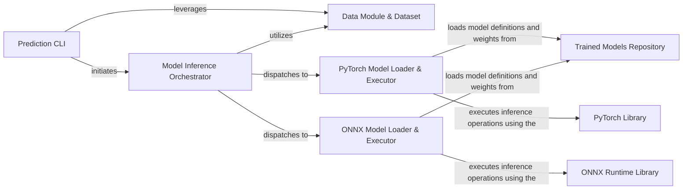

## Details

The `Prediction Service` within the `mole` project is a critical component designed to manage the entire prediction workflow for molecular data. It acts as the public-facing API for inference, intelligently dispatching prediction requests based on the model format (PyTorch checkpoint or ONNX export). Its core purpose is to handle model loading, input data preparation, and the execution of forward passes to generate predictions.

### Prediction CLI
The primary command-line interface and public API for initiating prediction workflows. It parses user arguments (e.g., model path, input data) and orchestrates the overall prediction process by dispatching to the appropriate internal inference logic.

**Related Classes/Methods**:

- <a href="https://github.com/recursionpharma/mole_public/blob/trunk/mole/cli/mole_predict.py#L188-L229" target="_blank" rel="noopener noreferrer">`mole.cli.mole_predict:predict` (188:229)</a>

### Data Module & Dataset
Responsible for handling the entire data pipeline for prediction. This includes loading raw input data (e.g., SMILES strings), performing necessary preprocessing (e.g., converting SMILES to graph representations), and preparing data in batches suitable for model input. It ensures consistent data formatting across different models.

**Related Classes/Methods**:

- <a href="https://github.com/recursionpharma/mole_public/blob/trunk/mole/training/data/data_modules.py#L11-L207" target="_blank" rel="noopener noreferrer">`mole.training.data.data_modules:MolDataModule` (11:207)</a>
- <a href="https://github.com/recursionpharma/mole_public/blob/trunk/mole/training/data/datasets.py#L15-L125" target="_blank" rel="noopener noreferrer">`mole.training.data.datasets:MolDataset` (15:125)</a>

### Model Inference Orchestrator
Manages the high-level logic for model loading and execution. It abstracts away the specifics of different model formats (PyTorch vs. ONNX) and decides which specialized inference engine to use based on the provided model type.

**Related Classes/Methods**:

- <a href="https://github.com/recursionpharma/mole_public/blob/trunk/mole/cli/mole_predict.py#L188-L229" target="_blank" rel="noopener noreferrer">`mole.cli.mole_predict:predict` (188:229)</a>
- <a href="https://github.com/recursionpharma/mole_public/blob/trunk/mole/cli/mole_predict.py#L104-L139" target="_blank" rel="noopener noreferrer">`mole.cli.mole_predict:predict_onnx` (104:139)</a>
- <a href="https://github.com/recursionpharma/mole_public/blob/trunk/mole/cli/mole_predict.py#L142-L185" target="_blank" rel="noopener noreferrer">`mole.cli.mole_predict:predict_ckpt` (142:185)</a>

### PyTorch Model Loader & Executor
Specializes in loading trained PyTorch model checkpoints and executing forward passes using the `torch` library. It handles the specific requirements for running inference with PyTorch-based models.

**Related Classes/Methods**:

- <a href="https://github.com/recursionpharma/mole_public/blob/trunk/mole/cli/mole_predict.py#L142-L185" target="_blank" rel="noopener noreferrer">`mole.cli.mole_predict:predict_ckpt` (142:185)</a>

### ONNX Model Loader & Executor
Specializes in loading ONNX (Open Neural Network Exchange) exported models and executing forward passes using the `onnxruntime` library. This component is crucial for leveraging optimized and portable model formats.

**Related Classes/Methods**:

- <a href="https://github.com/recursionpharma/mole_public/blob/trunk/mole/cli/mole_predict.py#L104-L139" target="_blank" rel="noopener noreferrer">`mole.cli.mole_predict:predict_onnx` (104:139)</a>

### Trained Models Repository
Contains the definitions of the trained deep learning models (e.g., `MolE`, `Encoder`) and serves as the source for loading model architectures and their trained weights. It represents the intellectual property of the project in terms of learned representations.

**Related Classes/Methods**:

- <a href="https://github.com/recursionpharma/mole_public/blob/trunk/mole/training/models/mole.py" target="_blank" rel="noopener noreferrer">`mole.training.models.mole`</a>
- <a href="https://github.com/recursionpharma/mole_public/blob/trunk/mole/training/models/encoder.py#L23-L92" target="_blank" rel="noopener noreferrer">`mole.training.models.encoder` (23:92)</a>
- <a href="https://github.com/recursionpharma/mole_public/blob/trunk/mole/training/models/base.py" target="_blank" rel="noopener noreferrer">`mole.training.models.base`</a>

### PyTorch Library
An external deep learning framework providing fundamental tensor operations, neural network modules, and optimization algorithms. It is essential for defining, training, and inferring with PyTorch-based models.

**Related Classes/Methods**: _None_

### ONNX Runtime Library
An external high-performance inference engine for ONNX models. It enables efficient execution of ONNX graphs across various hardware and operating systems, often with performance optimizations.

**Related Classes/Methods**: _None_

### [FAQ](https://github.com/CodeBoarding/GeneratedOnBoardings/tree/main?tab=readme-ov-file#faq)