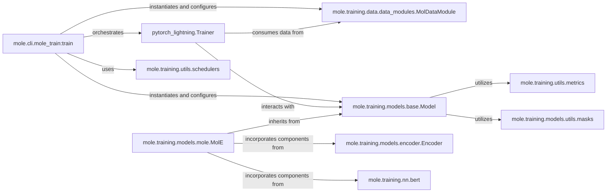

## Details

The `Training & Evaluation Manager` subsystem is the core of the `mole` project's deep learning capabilities, embodying a Pipeline Architecture and Configuration-Driven Design. It orchestrates the entire lifecycle of model training and evaluation, from data preparation to model deployment.

### mole.cli.mole_train:train
This function serves as the primary entry point and orchestrator for the entire training and evaluation pipeline. It is responsible for reading the configuration (likely via Hydra), instantiating the `PyTorch Lightning Trainer`, the `MolDataModule`, and the specific `Model` to be trained. It also handles crucial setup steps like seeding for reproducibility, preparing data, calculating learning rate schedules, logging hyperparameters, and finally initiating the training process via `trainer.fit()`. It's fundamental as the high-level control flow manager.

**Related Classes/Methods**:

- <a href="https://github.com/recursionpharma/mole_public/blob/trunk/mole/cli/mole_train.py#L64-L105" target="_blank" rel="noopener noreferrer">`mole.cli.mole_train:train` (64:105)</a>

### pytorch_lightning.Trainer
This is the central execution engine provided by PyTorch Lightning. It abstracts away the complexities of the training loop, handling forward and backward passes, optimization, logging, checkpointing, and distributed training. It interacts directly with the `Model` and `DataModule` to execute the training and validation steps. It's fundamental because it provides the robust and scalable infrastructure for deep learning training.

**Related Classes/Methods**: _None_

### mole.training.data.data_modules.MolDataModule
This component is responsible for managing the entire data pipeline, including loading, preprocessing, and batching of molecular data. It provides `DataLoader` instances for training, validation, and testing phases to the `Trainer`. It also encapsulates data preparation logic, such as downloading datasets if necessary. It's fundamental for implementing a Data-Centric Architecture, ensuring efficient and consistent data flow.

**Related Classes/Methods**:

- <a href="https://github.com/recursionpharma/mole_public/blob/trunk/mole/training/data/data_modules.py#L11-L207" target="_blank" rel="noopener noreferrer">`mole.training.data.data_modules.MolDataModule` (11:207)</a>

### mole.training.models.base.Model
This serves as the abstract base class for all deep learning models within the `mole.training` framework. It defines a consistent interface for common model operations, including `training_step`, `validation_step`, `test_step`, and metric logging. Concrete model implementations inherit from this class, ensuring architectural consistency and extensibility. It's fundamental for defining the "Model" aspect of the conceptual MVC pattern.

**Related Classes/Methods**:

- <a href="https://github.com/recursionpharma/mole_public/blob/trunk/mole/training/models/base.py#L22-L218" target="_blank" rel="noopener noreferrer">`mole.training.models.base.Model` (22:218)</a>

### mole.training.models.mole.MolE
This is a concrete implementation of a molecular deep learning model, inheriting from `mole.training.models.base.Model`. It encapsulates the specific neural network architecture and forward pass logic for molecular embeddings and predictions. It represents the actual deep learning model being trained and evaluated. It's fundamental as the specific "subject" of the training process.

**Related Classes/Methods**:

- <a href="https://github.com/recursionpharma/mole_public/blob/trunk/mole/training/models/mole.py#L226-L326" target="_blank" rel="noopener noreferrer">`mole.training.models.mole.MolE` (226:326)</a>

### mole.training.models.encoder.Encoder
This component likely serves as a base or abstract class for various encoder architectures used within the `MolE` model or other molecular models. Encoders are crucial for transforming raw molecular data into meaningful numerical representations that the neural network can process. It's fundamental as a reusable building block for complex model architectures.

**Related Classes/Methods**:

- <a href="https://github.com/recursionpharma/mole_public/blob/trunk/mole/training/models/encoder.py#L95-L143" target="_blank" rel="noopener noreferrer">`mole.training.models.encoder.Encoder` (95:143)</a>

### mole.training.nn.bert
This module contains various BERT-like neural network components (e.g., `BertAttention`, `BertEmbeddings`, `BertEncoder`, `TaskPredictionHead`). These components are fundamental building blocks for constructing advanced molecular models, especially those leveraging transformer-like architectures for sequence or graph data. They provide the core neural network layers for learning complex representations.

**Related Classes/Methods**:

- <a href="https://github.com/recursionpharma/mole_public/blob/trunk/mole/training/nn/bert.py" target="_blank" rel="noopener noreferrer">`mole.training.nn.bert`</a>

### mole.training.utils.metrics
This utility module provides functions and classes for calculating, aggregating, and reporting various evaluation metrics (e.g., regression metrics, classification metrics). It's crucial for monitoring model performance during training and evaluation, enabling informed decisions about model optimization. It's fundamental for the "Evaluation" aspect of the pipeline.

**Related Classes/Methods**:

- <a href="https://github.com/recursionpharma/mole_public/blob/trunk/mole/training/utils/metrics.py" target="_blank" rel="noopener noreferrer">`mole.training.utils.metrics`</a>

### mole.training.utils.schedulers
This utility module contains helper functions for managing learning rate schedules, such as calculating the number of warmup steps based on the total training steps. Learning rate scheduling is a critical optimization technique for stable and efficient model training. It's fundamental for fine-tuning the training process.

**Related Classes/Methods**:

- <a href="https://github.com/recursionpharma/mole_public/blob/trunk/mole/training/utils/schedulers.py" target="_blank" rel="noopener noreferrer">`mole.training.utils.schedulers`</a>

### mole.training.models.utils.masks
This utility module provides functions for creating or manipulating masks. Masks are often used in attention mechanisms within molecular models to handle variable-length inputs, pad sequences, or focus on specific parts of a molecular graph. It's fundamental for correctly processing and interpreting complex molecular data within the neural network.

**Related Classes/Methods**:

- <a href="https://github.com/recursionpharma/mole_public/blob/trunk/mole/training/models/utils/masks.py" target="_blank" rel="noopener noreferrer">`mole.training.models.utils.masks`</a>

### [FAQ](https://github.com/CodeBoarding/GeneratedOnBoardings/tree/main?tab=readme-ov-file#faq)