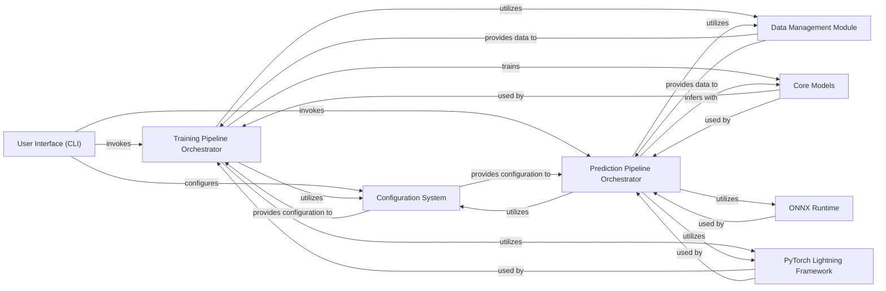

## Details

The `User Interface (CLI)` component serves as the primary user-facing entry point for the `mole_public` application. It is designed as a thin wrapper, responsible for parsing command-line arguments and orchestrating the execution of core training and prediction workflows by delegating to specialized managers.

### User Interface (CLI) [[Expand]](./User_Interface_CLI_.md)
This component provides the command-line interfaces for users to interact with the `mole_public` application. It parses user inputs and acts as the orchestrator, initiating either model training or prediction/embedding generation by invoking the appropriate pipeline orchestrators.

**Related Classes/Methods**:

- `cli_entry_point` (1:1)
- `cli_entry_point` (1:1)

### Configuration System [[Expand]](./Configuration_System.md)
Manages application configurations using Hydra. It provides a structured way to define and load parameters for models, data, training, and inference, enabling a "Configuration-Driven Design."

**Related Classes/Methods**:

- `configuration_management` (1:1)
- `configuration_management` (1:1)

### Training Pipeline Orchestrator
Encapsulates the end-to-end logic for model training. It receives commands from the CLI, loads configurations, sets up the data module, instantiates the model, and initiates the training process using PyTorch Lightning. It embodies the "Pipeline Architecture" for training.

**Related Classes/Methods**:

- <a href="https://github.com/recursionpharma/mole_public/blob/trunk/mole/cli/mole_train.py#L64-L105" target="_blank" rel="noopener noreferrer">`mole/cli/mole_train.py:train` (64:105)</a>

### Prediction Pipeline Orchestrator
Manages the inference workflow, supporting both ONNX and PyTorch Lightning checkpoint-based predictions, as well as embedding generation. It receives commands from the CLI, sets up the data module for prediction, and invokes the appropriate inference logic. It embodies the "Pipeline Architecture" for inference.

**Related Classes/Methods**:

- <a href="https://github.com/recursionpharma/mole_public/blob/trunk/mole/cli/mole_predict.py#L53-L101" target="_blank" rel="noopener noreferrer">`mole/cli/mole_predict.py:encode` (53:101)</a>
- <a href="https://github.com/recursionpharma/mole_public/blob/trunk/mole/cli/mole_predict.py#L104-L139" target="_blank" rel="noopener noreferrer">`mole/cli/mole_predict.py:predict_onnx` (104:139)</a>
- <a href="https://github.com/recursionpharma/mole_public/blob/trunk/mole/cli/mole_predict.py#L142-L185" target="_blank" rel="noopener noreferrer">`mole/cli/mole_predict.py:predict_ckpt` (142:185)</a>

### Data Management Module
Handles all aspects of data loading, preprocessing, and batching for both training and prediction. It ensures data is correctly prepared for the deep learning models.

**Related Classes/Methods**:

- <a href="https://github.com/recursionpharma/mole_public/blob/trunk/mole/training/data/data_modules.py#L11-L207" target="_blank" rel="noopener noreferrer">`mole/training/data/data_modules.py:MolDataModule` (11:207)</a>

### Core Models
Contains the actual deep learning model architectures used for training and inference, such as the base `Model` and `Encoder`. These are the "brains" of the application, performing the core computational tasks.

**Related Classes/Methods**:

- `model_definition` (1:1)
- `model_definition` (1:1)

### PyTorch Lightning Framework
A high-level PyTorch framework that simplifies the deep learning training and prediction loops. It provides abstractions for trainers, models, and data modules, promoting organized and reproducible research.

**Related Classes/Methods**: _None_

### ONNX Runtime
An open-source cross-platform machine learning inferencing accelerator. It is used by the Prediction Pipeline Orchestrator to perform highly optimized inference with ONNX-exported models.

**Related Classes/Methods**: _None_

### [FAQ](https://github.com/CodeBoarding/GeneratedOnBoardings/tree/main?tab=readme-ov-file#faq)