```mermaid
graph LR
    User_Interface_CLI_["User Interface (CLI)"]
    Configuration_System["Configuration System"]
    Data_Pipeline["Data Pipeline"]
    Deep_Learning_Models["Deep Learning Models"]
    Training_Evaluation_Manager["Training & Evaluation Manager"]
    Prediction_Service["Prediction Service"]
    User_Interface_CLI_ -- "Invokes" --> Training_Evaluation_Manager
    User_Interface_CLI_ -- "Invokes" --> Prediction_Service
    User_Interface_CLI_ -- "Accesses" --> Configuration_System
    Configuration_System -- "Configures" --> Data_Pipeline
    Configuration_System -- "Configures" --> Deep_Learning_Models
    Configuration_System -- "Configures" --> Training_Evaluation_Manager
    Configuration_System -- "Configures" --> Prediction_Service
    Data_Pipeline -- "Provides Data To" --> Training_Evaluation_Manager
    Data_Pipeline -- "Provides Data To" --> Prediction_Service
    Deep_Learning_Models -- "Used By" --> Training_Evaluation_Manager
    Deep_Learning_Models -- "Used By" --> Prediction_Service
    Training_Evaluation_Manager -- "Trains" --> Deep_Learning_Models
    Training_Evaluation_Manager -- "Receives Data From" --> Data_Pipeline
    Prediction_Service -- "Executes" --> Deep_Learning_Models
    Prediction_Service -- "Receives Data From" --> Data_Pipeline
    click User_Interface_CLI_ href "https://github.com/CodeBoarding/GeneratedOnBoardings/blob/main/mole_public/User_Interface_CLI_.md" "Details"
    click Configuration_System href "https://github.com/CodeBoarding/GeneratedOnBoardings/blob/main/mole_public/Configuration_System.md" "Details"
    click Deep_Learning_Models href "https://github.com/CodeBoarding/GeneratedOnBoardings/blob/main/mole_public/Deep_Learning_Models.md" "Details"
    click Training_Evaluation_Manager href "https://github.com/CodeBoarding/GeneratedOnBoardings/blob/main/mole_public/Training_Evaluation_Manager.md" "Details"
    click Prediction_Service href "https://github.com/CodeBoarding/GeneratedOnBoardings/blob/main/mole_public/Prediction_Service.md" "Details"
```

## Details

Final Architecture Analysis for `mole_public`

### User Interface (CLI) [[Expand]](./User_Interface_CLI_.md)
Serves as the primary user-facing entry point, parsing command-line arguments and orchestrating the execution of training and prediction workflows. It acts as a thin wrapper, delegating core logic to specialized managers.

**Related Classes/Methods**:

- <a href="https://github.com/recursionpharma/mole_public/blob/trunk/mole/cli/mole_predict.py#L1-L1" target="_blank" rel="noopener noreferrer">`mole.cli.mole_predict` (1:1)</a>
- <a href="https://github.com/recursionpharma/mole_public/blob/trunk/mole/cli/mole_train.py#L1-L1" target="_blank" rel="noopener noreferrer">`mole.cli.mole_train` (1:1)</a>

### Configuration System [[Expand]](./Configuration_System.md)
Centralizes and manages all configurable parameters for the project, encompassing settings for data processing, model architecture, and training/inference hyperparameters, leveraging Hydra for structured configuration.

**Related Classes/Methods**:

- <a href="https://github.com/recursionpharma/mole_public/blob/trunk/mole/training/models/mole.py#L1-L1" target="_blank" rel="noopener noreferrer">`mole.training.configs` (1:1)</a>

### Data Pipeline
Manages all aspects of data handling, including loading raw molecular data, preprocessing (e.g., tokenization, graph construction), vocabulary management, and generating PyTorch Lightning DataModules and Datasets for efficient batching during training and inference.

**Related Classes/Methods**:

- <a href="https://github.com/recursionpharma/mole_public/blob/trunk/mole/training/data/data_modules.py#L1-L1" target="_blank" rel="noopener noreferrer">`mole.training.data.data_modules` (1:1)</a>
- <a href="https://github.com/recursionpharma/mole_public/blob/trunk/mole/training/data/datasets.py#L1-L1" target="_blank" rel="noopener noreferrer">`mole.training.data.datasets` (1:1)</a>
- <a href="https://github.com/recursionpharma/mole_public/blob/trunk/mole/training/data/utils.py#L1-L1" target="_blank" rel="noopener noreferrer">`mole.training.data.utils` (1:1)</a>
- `mole.training.data.vocabularies` (1:1)

### Deep Learning Models [[Expand]](./Deep_Learning_Models.md)
Encapsulates the core deep learning architectures, including a foundational abstract base model, the specific MolE model, generic encoders, and fundamental neural network building blocks (e.g., BERT-like components, attention mechanisms).

**Related Classes/Methods**:

- <a href="https://github.com/recursionpharma/mole_public/blob/trunk/mole/training/models/base.py#L1-L1" target="_blank" rel="noopener noreferrer">`mole.training.models.base` (1:1)</a>
- <a href="https://github.com/recursionpharma/mole_public/blob/trunk/mole/training/models/mole.py#L1-L1" target="_blank" rel="noopener noreferrer">`mole.training.models.mole` (1:1)</a>
- <a href="https://github.com/recursionpharma/mole_public/blob/trunk/mole/training/models/encoder.py#L23-L92" target="_blank" rel="noopener noreferrer">`mole.training.models.encoder` (23:92)</a>
- <a href="https://github.com/recursionpharma/mole_public/blob/trunk/mole/training/nn/bert.py#L1-L1" target="_blank" rel="noopener noreferrer">`mole.training.nn.bert` (1:1)</a>
- <a href="https://github.com/recursionpharma/mole_public/blob/trunk/mole/training/nn/disentangled_attention.py#L1-L1" target="_blank" rel="noopener noreferrer">`mole.training.nn.disentangled_attention` (1:1)</a>

### Training & Evaluation Manager [[Expand]](./Training_Evaluation_Manager.md)
Coordinates the entire model training and evaluation pipeline. It initializes models and data loaders, executes the training loop (largely driven by PyTorch Lightning's Trainer), handles logging, checkpointing, and calculates various performance metrics.

**Related Classes/Methods**:

- <a href="https://github.com/recursionpharma/mole_public/blob/trunk/mole/cli/mole_train.py#L64-L105" target="_blank" rel="noopener noreferrer">`mole.cli.mole_train:train` (64:105)</a>
- <a href="https://github.com/recursionpharma/mole_public/blob/trunk/mole/training/utils/metrics.py#L1-L1" target="_blank" rel="noopener noreferrer">`mole.training.utils.metrics` (1:1)</a>
- <a href="https://github.com/recursionpharma/mole_public/blob/trunk/mole/training/utils/schedulers.py#L1-L1" target="_blank" rel="noopener noreferrer">`mole.training.utils.schedulers` (1:1)</a>
- <a href="https://github.com/recursionpharma/mole_public/blob/trunk/mole/training/models/utils/masks.py#L1-L1" target="_blank" rel="noopener noreferrer">`mole.training.models.utils.masks` (1:1)</a>

### Prediction Service [[Expand]](./Prediction_Service.md)
Manages the prediction workflow. It loads trained models (either PyTorch checkpoints or ONNX exports), prepares input data, and performs forward passes to generate predictions for new molecular data.

**Related Classes/Methods**:

- <a href="https://github.com/recursionpharma/mole_public/blob/trunk/mole/cli/mole_predict.py#L188-L229" target="_blank" rel="noopener noreferrer">`mole.cli.mole_predict:predict` (188:229)</a>

### [FAQ](https://github.com/CodeBoarding/GeneratedOnBoardings/tree/main?tab=readme-ov-file#faq)