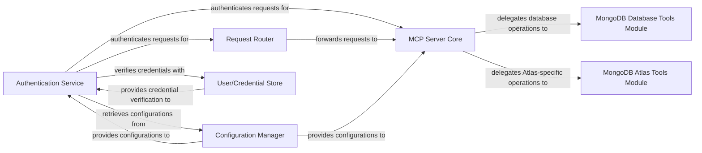

## Details

Component structure overview for the mongodb_mcp_server project, focusing on key components and their interactions within a Specialized Backend Service/API Server pattern.

### Authentication Service [[Expand]](./Authentication_Service.md)
Handles all aspects of client authentication and authorization. It validates client credentials, manages user sessions, and ensures that requests are authorized to access specific resources or perform certain operations. This service acts as a critical gatekeeper, ensuring only authorized requests proceed through the system before command validation and execution.

**Related Classes/Methods**:

- `mongodb_mcp_server.AuthenticationService`

### MCP Server Core
The central module of the backend service, responsible for orchestrating the main business logic, processing authenticated requests, and coordinating with other modules to fulfill client operations. It acts as the primary handler for validated commands.

**Related Classes/Methods**:

- `mongodb_mcp_server.Server`
- `mongodb_mcp_server.CoreLogic`

### Request Router
Directs incoming client requests to the appropriate internal handlers or services based on the request's path and method. It acts as an initial entry point for requests after authentication, ensuring they reach the correct processing component.

**Related Classes/Methods**:

- `mongodb_mcp_server.RequestRouter`

### Configuration Manager
Manages and provides centralized access to application configurations, settings, and environment-specific parameters. It ensures that various components can retrieve necessary operational data consistently and securely.

**Related Classes/Methods**:

- `mongodb_mcp_server.ConfigurationManager`

### User/Credential Store
Securely stores and manages user credentials and authentication-related data. It provides an interface for the Authentication Service to verify user identities and retrieve necessary authorization information.

**Related Classes/Methods**:

- `mongodb_mcp_server.UserStore`
- `mongodb_mcp_server.CredentialRepository`

### MongoDB Database Tools Module
Encapsulates functionalities for interacting with generic MongoDB databases, including common operations like data retrieval, insertion, updates, and deletions. It abstracts the underlying database interactions from the core business logic.

**Related Classes/Methods**:

- `mongodb_mcp_server.MongoDBTools`
- `mongodb_mcp_server.DatabaseOperations`

### MongoDB Atlas Tools Module
Provides specialized functionalities and integrations for managing and interacting with MongoDB Atlas cloud database services. This module leverages Atlas-specific APIs and features to support cloud-native database operations.

**Related Classes/Methods**:

- `mongodb_mcp_server.AtlasTools`
- `mongodb_mcp_server.AtlasIntegration`

### [FAQ](https://github.com/CodeBoarding/GeneratedOnBoardings/tree/main?tab=readme-ov-file#faq)