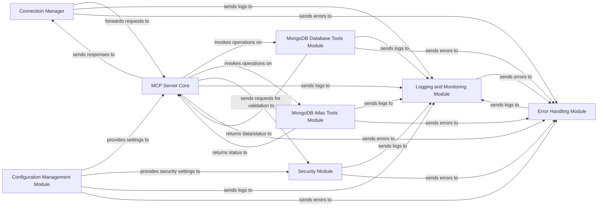

## Details

One paragraph explaining the functionality which is represented by this graph. What the main flow is and what is its purpose.

### Connection Manager [[Expand]](./Connection_Manager.md)
Manages the lifecycle of client connections, including establishing, maintaining, and terminating connections. It serves as the initial entry point for all incoming client requests, handling the network communication layer.

**Related Classes/Methods**:

- `mongodb_mcp_server.ConnectionHandler` (1:1)

### MCP Server Core
Encapsulates the primary business logic and request processing for the server. It receives requests from the Connection Manager, orchestrates interactions with other modules, and applies core application logic before generating responses.

**Related Classes/Methods**:

- `mongodb_mcp_server.Server` (1:1)

### MongoDB Database Tools Module
Provides an abstraction layer for interacting with standard MongoDB databases. It encapsulates database-specific commands, queries, and data manipulation logic, acting as an adapter for direct MongoDB operations.

**Related Classes/Methods**:

- `mongodb_mcp_server.database_tools` (1:1)

### MongoDB Atlas Tools Module
Manages interactions specific to MongoDB Atlas cloud services. This includes functionalities like provisioning, scaling, and utilizing cloud-specific APIs, acting as an adapter for Atlas-specific features.

**Related Classes/Methods**:

- `mongodb_mcp_server.atlas_tools` (1:1)

### Configuration Management Module
Responsible for loading, parsing, and providing access to application configurations. This includes server settings, database credentials, and operational parameters, ensuring the server operates according to defined settings.

**Related Classes/Methods**:

- `mongodb_mcp_server.config` (1:1)

### Security Module
Implements authentication, authorization, and data encryption mechanisms. It secures client connections and controls data access within the server, ensuring compliance and protecting sensitive information.

**Related Classes/Methods**:

- `mongodb_mcp_server.security` (1:1)

### Logging and Monitoring Module
Handles the recording of system events, errors, and operational metrics. It provides insights into server performance, aids in debugging, and supports operational monitoring.

**Related Classes/Methods**:

- `mongodb_mcp_server.logging` (1:1)

### Error Handling Module
Centralizes the management and reporting of errors across the application. It ensures graceful degradation, consistent error responses to clients, and proper logging of exceptions.

**Related Classes/Methods**:

- `mongodb_mcp_server.errors` (1:1)

### [FAQ](https://github.com/CodeBoarding/GeneratedOnBoardings/tree/main?tab=readme-ov-file#faq)