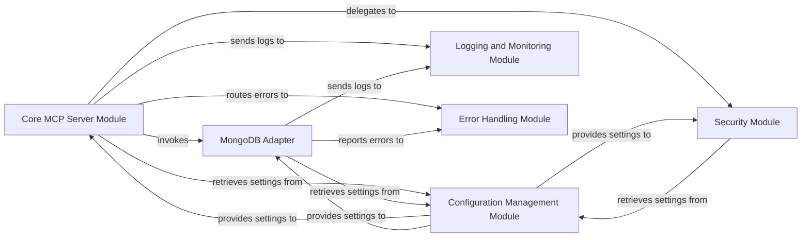

## Details

The MongoDB Adapter subsystem is a critical part of the overall mongodb_mcp_server project, which functions as a Specialized Backend Service/API Server (Proxy/Adapter) for database management. This subsystem, along with other core components, ensures modularity, security, and extensibility.

### Core MCP Server Module
The central orchestrator and entry point for the service. It handles incoming API requests, routes them to the appropriate modules, and manages the overall request-response lifecycle. It acts as the primary API Gateway/Proxy.

**Related Classes/Methods**:

- `mongodb_mcp_server` (1:1)
- `mongodb_mcp_server.server` (1:1)

### MongoDB Adapter [[Expand]](./MongoDB_Adapter.md)
Provides a standardized and unified interface for interacting with both core MongoDB database operations (on-premise) and MongoDB Atlas cloud services. This component abstracts the underlying driver details and specific API calls for both environments, embodying the Adapter Pattern.

**Related Classes/Methods**:

- `mongodb_mcp_server.DatabaseManager` (1:1)
- `mongodb_mcp_server.AtlasTools` (1:1)
- `mongodb_mcp_server.DatabaseManager.connect` (1:1)
- `mongodb_mcp_server.DatabaseManager.disconnect` (1:1)
- `mongodb_mcp_server.DatabaseManager.read_data` (1:1)
- `mongodb_mcp_server.DatabaseManager.write_data` (1:1)
- `mongodb_mcp_server.AtlasTools.manage_cluster` (1:1)
- `mongodb_mcp_server.AtlasTools.provision_database` (1:1)

### Configuration Management Module
Responsible for loading, parsing, and providing configuration settings to other modules across the application. This includes database connection strings, API keys, server ports, and other environment-specific parameters.

**Related Classes/Methods**:

- `mongodb_mcp_server.config` (1:1)

### Security Module
Handles all aspects of security, including authentication, authorization, and potentially data encryption/decryption for sensitive operations. It ensures that only authorized requests are processed and data integrity is maintained.

**Related Classes/Methods**:

- `mongodb_mcp_server.security` (1:1)

### Logging and Monitoring Module
Centralizes the logging of application events, errors, and performance metrics. It provides insights into the system's health, operational status, and aids in debugging and performance optimization.

**Related Classes/Methods**:

- `mongodb_mcp_server.logging` (1:1)
- `mongodb_mcp_server.monitoring` (1:1)

### Error Handling Module
Provides a centralized mechanism for detecting, processing, and reporting errors and exceptions consistently across the application. It ensures graceful degradation and provides meaningful error responses to clients.

**Related Classes/Methods**:

- `mongodb_mcp_server.errors` (1:1)

### [FAQ](https://github.com/CodeBoarding/GeneratedOnBoardings/tree/main?tab=readme-ov-file#faq)