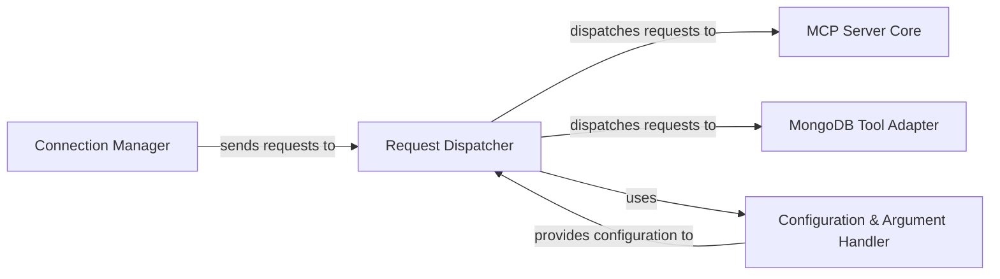

## Details

One paragraph explaining the functionality which is represented by this graph. What the main flow is and what is its purpose.

### Connection Manager [[Expand]](./Connection_Manager.md)
This component is responsible for establishing and managing incoming client connections. It receives raw client requests and forwards them to the Request Dispatcher for further processing. It acts as the initial entry point for all external communications.

**Related Classes/Methods**: _None_

### Request Dispatcher [[Expand]](./Request_Dispatcher.md)
As a central routing and orchestration layer, the Request Dispatcher receives raw client requests from the Connection Manager. It parses these requests using `parse_request` and dispatches them to the appropriate internal service or handler (e.g., MCP Server Core, MongoDB Tool Adapter) based on the request type and content, leveraging `process_request`. It ensures requests are directed to the correct functional component.

**Related Classes/Methods**:

- `mongodb_mcp_server.RequestProcessor.process_request`
- `mongodb_mcp_server.RequestProcessor.parse_request`

### MCP Server Core
This component encapsulates the primary business logic and core functionalities of the MCP server. It processes requests that are specific to the server's main operations, acting as the central processing unit for the server's unique services.

**Related Classes/Methods**: _None_

### MongoDB Tool Adapter
This component acts as an adapter or proxy, providing a standardized interface for interacting with various MongoDB database tools. It translates requests received from the Request Dispatcher into commands or operations understood by MongoDB tools and manages their execution, abstracting the complexities of direct tool interaction.

**Related Classes/Methods**: _None_

### Configuration & Argument Handler
This component is responsible for managing the application's configuration settings and processing command-line arguments. It provides essential configuration data to other components, influencing their operational behavior and ensuring the system runs with the correct parameters.

**Related Classes/Methods**: _None_

### [FAQ](https://github.com/CodeBoarding/GeneratedOnBoardings/tree/main?tab=readme-ov-file#faq)