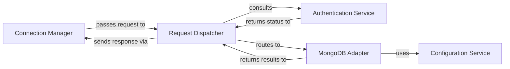

## Details

The `mongodb-mcp-server` operates as a specialized backend service and API proxy, designed to manage and adapt interactions with MongoDB databases, including MongoDB Atlas cloud services.

### Connection Manager [[Expand]](./Connection_Manager.md)
Manages the lifecycle of client connections, including establishing, maintaining, and terminating connections. It serves as the initial entry point for all incoming client requests.

**Related Classes/Methods**:

- `mongodb_mcp_server.ConnectionHandler.start`
- `mongodb_mcp_server.ConnectionHandler.stop`
- `mongodb_mcp_server.ConnectionHandler.handle_connection`

### Request Dispatcher [[Expand]](./Request_Dispatcher.md)
Receives raw client requests from the Connection Manager, parses them, and dispatches them to the appropriate internal service or handler based on the request type and content. It acts as a central routing and orchestration layer.

**Related Classes/Methods**:

- `mongodb_mcp_server.RequestProcessor.process_request`
- `mongodb_mcp_server.RequestProcessor.parse_request`

### Authentication Service [[Expand]](./Authentication_Service.md)
Handles all aspects of client authentication and authorization. It validates client credentials, manages user sessions, and ensures that requests are authorized to access specific resources or perform certain operations.

**Related Classes/Methods**:

- `mongodb_mcp_server.AuthenticationService.authenticate`
- `mongodb_mcp_server.AuthenticationService.create_session`
- `mongodb_mcp_server.AuthenticationService.validate_session`

### MongoDB Adapter [[Expand]](./MongoDB_Adapter.md)
Provides a standardized and unified interface for interacting with both core MongoDB database operations (on-premise) and MongoDB Atlas cloud services. This component abstracts the underlying driver details and specific API calls for both environments.

**Related Classes/Methods**:

- `mongodb_mcp_server.DatabaseManager.connect`
- `mongodb_mcp_server.DatabaseManager.disconnect`
- `mongodb_mcp_server.DatabaseManager.read_data`
- `mongodb_mcp_server.DatabaseManager.write_data`
- `mongodb_mcp_server.AtlasTools.manage_cluster`
- `mongodb_mcp_server.AtlasTools.provision_database`

### Configuration Service
Responsible for loading, parsing, and providing access to application configurations. This includes database connection strings, API keys, security settings, and other operational parameters required by other components.

**Related Classes/Methods**:

- `mongodb_mcp_server.ConfigLoader.load_config`
- `mongodb_mcp_server.ConfigLoader.get_setting`

### [FAQ](https://github.com/CodeBoarding/GeneratedOnBoardings/tree/main?tab=readme-ov-file#faq)