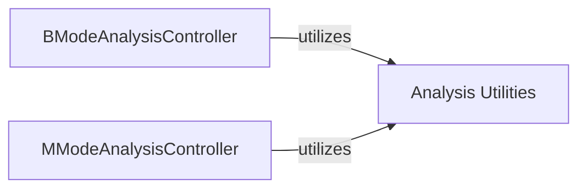

## Details

Component Overview: Analysis Utilities

### Analysis Utilities [[Expand]](./Analysis_Utilities.md)
This component serves as a foundational utility layer, providing a shared collection of specialized helper functions and algorithms. Its primary purpose is to support general image manipulation, analysis, and data handling, with specific functionalities tailored for both B-mode and M-mode processing. It acts as a common toolkit that the respective Analysis Cores (B-mode and M-mode) leverage for their specialized operations. This aligns with a Layered Architecture pattern, where common utilities are abstracted into a dedicated layer.

**Related Classes/Methods**:

- <a href="https://github.com/pfizer-opensource/mouse-echo-neural-net/blob/main/util_bmode.py#L1-L1" target="_blank" rel="noopener noreferrer">`util_bmode.py` (1:1)</a>
- <a href="https://github.com/pfizer-opensource/mouse-echo-neural-net/blob/main/util_mmode.py#L1-L1" target="_blank" rel="noopener noreferrer">`util_mmode.py` (1:1)</a>

### [FAQ](https://github.com/CodeBoarding/GeneratedOnBoardings/tree/main?tab=readme-ov-file#faq)