```mermaid
graph LR
    B_mode_Data_Acquisition["B-mode Data Acquisition"]
    B_mode_Image_Preprocessing["B-mode Image Preprocessing"]
    B_mode_Segmentation_Inference["B-mode Segmentation Inference"]
    B_mode_Mask_Post_processing["B-mode Mask Post-processing"]
    B_mode_Cardiac_Cycle_Analysis["B-mode Cardiac Cycle Analysis"]
    B_mode_Results_Reporting["B-mode Results Reporting"]
    B_mode_Analysis_Core -- "Orchestrates" --> B_mode_Data_Acquisition
    B_mode_Analysis_Core -- "Orchestrates" --> B_mode_Image_Preprocessing
    B_mode_Analysis_Core -- "Orchestrates" --> B_mode_Segmentation_Inference
    B_mode_Analysis_Core -- "Orchestrates" --> B_mode_Mask_Post_processing
    B_mode_Analysis_Core -- "Orchestrates" --> B_mode_Cardiac_Cycle_Analysis
    B_mode_Analysis_Core -- "Orchestrates" --> B_mode_Results_Reporting
    B_mode_Data_Acquisition -- "Provides Raw Data" --> B_mode_Image_Preprocessing
    B_mode_Image_Preprocessing -- "Provides Prepared Data" --> B_mode_Segmentation_Inference
    B_mode_Segmentation_Inference -- "Generates Raw Masks" --> B_mode_Mask_Post_processing
    B_mode_Mask_Post_processing -- "Provides Refined Masks" --> B_mode_Cardiac_Cycle_Analysis
    B_mode_Cardiac_Cycle_Analysis -- "Computes Metrics" --> B_mode_Results_Reporting
```

## Details

The B-mode Analysis Core component, primarily encapsulated within echoanalysis_main.py, serves as the central orchestrator for the entire B-mode echocardiography image analysis pipeline. Its purpose is to automate the process from raw DICOM image input to the generation of quantitative cardiac metrics and visual quality control reports.

### B-mode Data Acquisition
This component is responsible for the initial ingestion of B-mode echocardiography data. It handles the reading and parsing of DICOM files, extracting the raw pixel arrays, and retrieving essential metadata such as image resolution, which is crucial for accurate metric calculations.

**Related Classes/Methods**:

- <a href="https://github.com/pfizer-opensource/mouse-echo-neural-net/blob/main/echoanalysis_main.py#L1-L1" target="_blank" rel="noopener noreferrer">`echoanalysis_main.py` (1:1)</a>
- `getRes_rawDICOM` (1:1)
- `getRes` (1:1)

### B-mode Image Preprocessing
This unit prepares the raw B-mode images for optimal performance with the deep learning model. Its tasks include DICOM-specific preprocessing (e.g., dicom_preprocess), resizing images to the fixed input dimensions required by the neural network (e.g., 256x256), and standardizing pixel intensities based on pre-defined metrics from the training dataset.

**Related Classes/Methods**:

- <a href="https://github.com/pfizer-opensource/mouse-echo-neural-net/blob/main/echoanalysis_main.py#L1-L1" target="_blank" rel="noopener noreferrer">`echoanalysis_main.py:resize` (1:1)</a>
- `dicom_preprocess` (1:1)

### B-mode Segmentation Inference
This component embodies the deep learning aspect of the analysis. It is responsible for loading the pre-trained U-Net model specifically designed for B-mode echocardiogram segmentation and executing the inference process on the preprocessed images to generate raw segmentation masks.

**Related Classes/Methods**:

- `get_unet` (1:1)
- <a href="https://github.com/pfizer-opensource/mouse-echo-neural-net/blob/main/echoanalysis_main.py#L1-L1" target="_blank" rel="noopener noreferrer">`echoanalysis_main.py:model.predict` (1:1)</a>

### B-mode Mask Post-processing
Following the neural network's output, this component refines the raw segmentation masks. It applies various image processing techniques, such as morphological operations, to clean up any artifacts, fill small holes, or smooth boundaries, ensuring the masks are anatomically plausible and clinically usable.

**Related Classes/Methods**:

- `postprocess_masks` (1:1)

### B-mode Cardiac Cycle Analysis
This unit focuses on extracting physiological insights from the processed segmentation masks. It identifies key cardiac phases, specifically systole (contraction) and diastole (relaxation), from the time-series of masks. Subsequently, it calculates B-mode specific cardiac metrics, including end-systolic area, end-diastolic area, corresponding volumes, and the ejection fraction.

**Related Classes/Methods**:

- `findcardiacpeaks` (1:1)
- `computeMetrics` (1:1)

### B-mode Results Reporting
The final stage of the pipeline, this component is responsible for compiling and presenting the analysis outcomes. It generates structured output reports, typically in CSV format, containing all computed cardiac metrics. Additionally, it creates visual quality control (QC) reports, such as segmented images overlaid with original frames, which are often compiled into a PDF document for easy review.

**Related Classes/Methods**:

- <a href="https://github.com/pfizer-opensource/mouse-echo-neural-net/blob/main/echoanalysis_main.py#L1-L1" target="_blank" rel="noopener noreferrer">`echoanalysis_main.py:PandasDataFrame` (1:1)</a>
- <a href="https://github.com/pfizer-opensource/mouse-echo-neural-net/blob/main/echoanalysis_main.py#L1-L1" target="_blank" rel="noopener noreferrer">`echoanalysis_main.py:MatplotlibPdfPages` (1:1)</a>
- <a href="https://github.com/pfizer-opensource/mouse-echo-neural-net/blob/main/echoanalysis_main.py#L1-L1" target="_blank" rel="noopener noreferrer">`echoanalysis_main.py:mark_boundaries` (1:1)</a>

### [FAQ](https://github.com/CodeBoarding/GeneratedOnBoardings/tree/main?tab=readme-ov-file#faq)