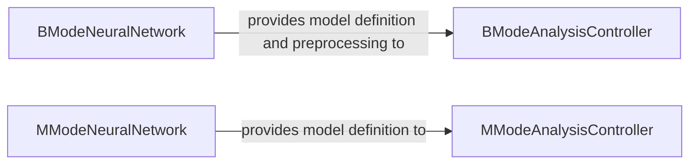

## Details

The Deep Learning Integration subsystem is the core engine for applying pre-trained neural network models to echocardiogram images. Its primary purpose is to encapsulate all functionalities related to deep learning, including model definition, loading, inference execution, and image preprocessing tailored for the specific input requirements of the models. This subsystem acts as a crucial interface between the raw image data and the advanced segmentation capabilities provided by the neural networks. The subsystem adheres to a modular design, separating concerns for B-mode and M-mode image processing, which aligns with the "Layered Architecture" and "Pipeline Architecture" patterns by providing distinct, specialized processing units.

### BModeNeuralNetwork
This component is solely responsible for defining the architecture of the U-Net deep learning models used for B-mode echocardiogram segmentation. It includes functions to construct various 2D and 3D U-Net models (get_unet, get_unet_deeper, get_unet3D), along with their specific loss and metric functions (e.g., dice_coef, dice_coef_loss). It also provides the necessary preprocess function to prepare B-mode images for model inference by resizing them to the required input dimensions.

**Related Classes/Methods**: _None_

### MModeNeuralNetwork
This component defines the U-Net deep learning model architecture specifically for M-mode echocardiogram segmentation. It supports multi-label segmentation, as indicated by functions like dice_coef_multilabel and the numLabels parameter in get_unet. Similar to its B-mode counterpart, it defines the U-Net architecture and its relevant loss/metric functions tailored for M-mode analysis.

**Related Classes/Methods**: _None_

### [FAQ](https://github.com/CodeBoarding/GeneratedOnBoardings/tree/main?tab=readme-ov-file#faq)